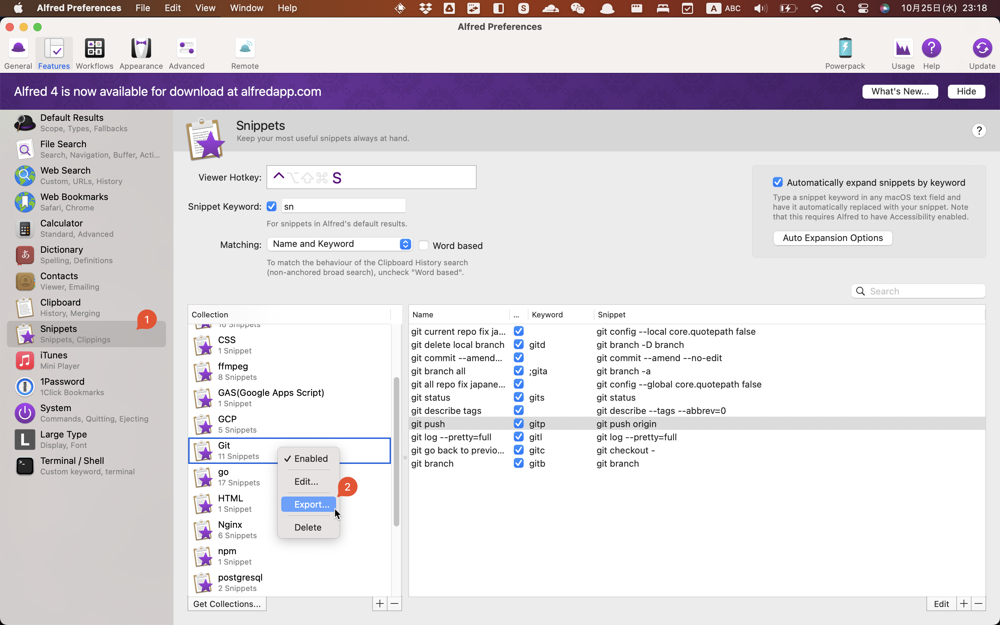

## 0. 背景

之前一直用[Alfred 3](https://www.alfredapp.com/)的snippets功能，但是`Alfred`的snippets功能是收费的。

最近发现了[Raycast](https://www.raycast.com/)，`Raycast`的snippets功能是免费的，而且`Raycast`的snippets功能是开源的，可以自己写。

所以打算把`Alfred`的snippets迁移到`Raycast`上。

## 1. 迁移Alfred的snippets到Raycast

`Alfred` 的 snippets 文件的格式与 `Raycast` 的 snippets 文件的格式不同，
所以需要先将 `Alfred` 的 snippets 文件转换成 `Raycast` 的 snippets 文件。


### 1.1 Get Alfred Snippets Files

打开`Alfred`的`Snippets`功能，点击`Export`按钮，导出`Alfred`的snippets文件。
Alfred 3 的 collections 不支持批量导出，所以需要一个一个导出。:dog:



### 1.2 Convert Alfred Snippets to Raycast Snippets

新建一个文件夹，把导出的 `Alfred`的snippets文件放到这个文件夹里面。

然后在这个文件夹里面新建一个 `convert-alfred-snippets-to-raycast-snippets.sh` 文件，内容如下：

<details>

<summary>convert-alfred-snippets-to-raycast-snippets.sh</summary>

```bash
#!/bin/sh -e
# Script for converting Alfred snippets to Raycast snippets
# Usage: chmod +x convert-alfred-snippets-to-raycast-snippets.sh; ./convert-alfred-snippets-to-raycast-snippets.sh
# NOTE: Install jq before running this script

# List up all *.alfredsnippets files and rename them to *.zip
for file in *.alfredsnippets; do
    mv "$file" "${file%.alfredsnippets}.zip"
done

# Unzip all *.zip files and get the folders name
for file in *.zip; do
    unzip -o "$file" # -o: overwrite existing files without prompting
done


# Merge all *.json files to one file for Raycast snippets
jq -s 'map(.alfredsnippet | {name, keyword, text: .snippet})' *.json > ./output.json

# Clean up all files except output.json
for file in *.json; do
    if [ "$file" = "output.json" ]; then
        continue
    fi
    rm "$file"
done

for file in *.zip; do
    rm "$file"
done

for file in *.plist; do
    rm "$file"
done

# You can now import the output.json file to Raycast

echo "Done! 🎉 You can now import the output.json file to Raycast -> Import Snippets"
```
</details>

也可以从Github gist: [convert-alfred-snippets-to-raycast-snippets.sh](https://gist.github.com/wifecooky/399dd58809778286c857566d8c93b937) 下载。

:::note
该脚本执行需要先安装`jq`，`jq`是一个命令行下的`JSON`处理工具。

`jq`的mac的安装方法： `brew install jq`。
也可以参考[官网](https://stedolan.github.io/jq/download/)。
:::

执行下面的命令：

```bash
chmod +x convert-alfred-snippets-to-raycast-snippets.sh
./convert-alfred-snippets-to-raycast-snippets.sh
```

会在当前文件夹生成一个 `output.json` 文件。

### 1.3 Import Raycast Snippets

打开`Raycast`，然后点击`Import Snippets`，
选择上一步生成的`output.json`文件，导入`Raycast`的snippets。

## Reference

[Migrating Alfred Snippets to Raycast](https://xavd.id/blog/post/migrating-alfred-snippets-to-raycast/)
