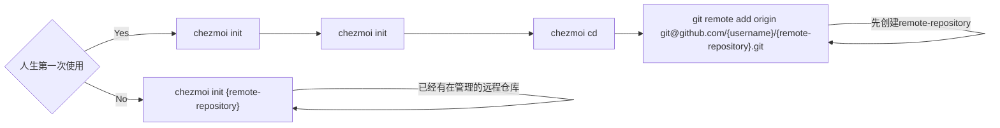
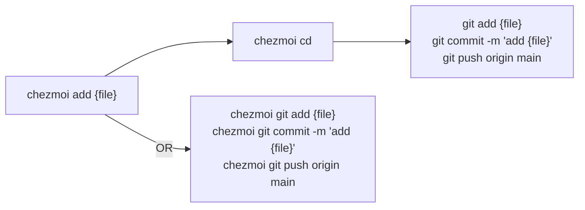
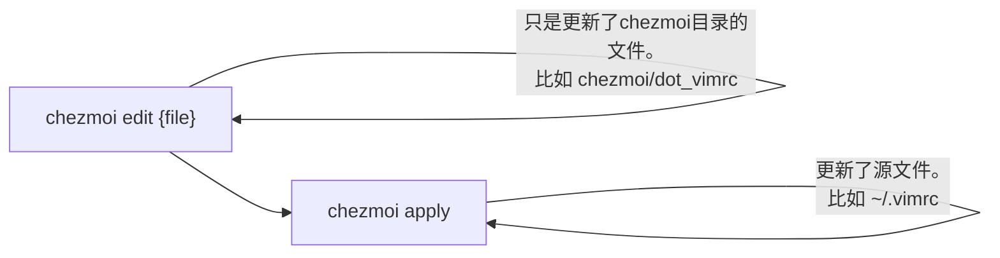

## 0. 背景

换电脑的时候，需要把一些配置文件从旧电脑迁移到新电脑上，比如 `.zshrc`、`.vimrc`、`.gitconfig` 等等。
有些文件不一定放在 `home` 目录下，比如 `.ssh/config`、`.config/.starship.yaml` , 这些文件手动迁移的话，比较麻烦。
所以需要一个工具来管理这些配置文件。

## 1. 具体需求

* 支持多平台，比如 macOS、Linux、Windows。
* 支持版本管理，比如 git。
* 支持模版。

大概调研了一下，发现有这么几个工具可以管理 dotfiles：

* [chezmoi](https://www.chezmoi.io/)
  * Golang 写的
  * Github Star 10.2k
* [dotbot](https://github.com/anishathalye/dotbot)
  * Python 写的
  * Github Star 6.5k

`chezmoi` 满足要求，而且是用 `Golang` 写的，没有什么依赖，所以就用 `chezmoi` 了。

## 2. 安装

```bash
sh -c "$(curl -fsLS get.chezmoi.io)"
```

其他安装方式见 [Install](https://www.chezmoi.io/install/)

## 3. 使用

### 3.1 初始化



:::tip

初始化之后，会在 `home` 目录下生成一个 `~/.local/share/chezmoi` 目录(本地仓库)，用来存放 `chezmoi` 的配置文件。
可以通过 `chezmoi cd` 命令进入该目录。

:::

### 3.2 添加文件



### 3.3 更新文件



:::tip

更新了文件了之后，记得提交到远程仓库。可以参考上一节。

:::

### 3.4 从远程仓库拉取文件

远程仓库有更新了，需要拉取到本地。

```bash
chezmoi update
```

等价于

```bash
chezmoi git pull origin main
chezmoi apply
```

### 3.5 扩展使用

#### 3.5.1 模版

`chezmoi` 支持[模版](https://www.chezmoi.io/reference/templates/)，可以为不同的host生成不同的配置文件。

比如，我要为不同的电脑配置不同的账号名，可以这样做：

* 创建 `~/.account.json` 文件，内容如下：

```json title="~/.account.json"
{
  "name": "thewang"
}
```

* 在 `~/.config/chezmoi/chezmoi.toml` 中配置 `data` 字段。

```toml title="~/.config/chezmoi/chezmoi.toml"
[data]
  name = "thewang"
```

* 添加文件

```bash
chezmoi add --autotemplate ~/.account.json

{
  "name": "{{ .name }}"
}
```
