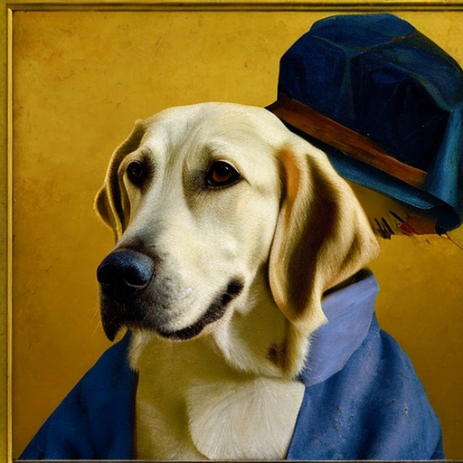
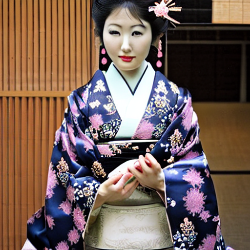
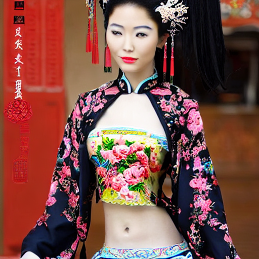
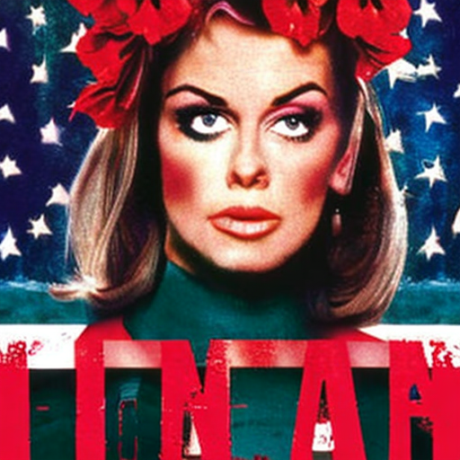

## 背景

[Diffuses App](https://apps.apple.com/us/app/diffusers/id1666309574) 是 [huggingface](https://huggingface.co/) 推出的一个 App。

## 结论

> 以下基于 Version 1.1 (20230222.140932) 进行介绍.

先说结论，让它画猫画狗可能还行，画人就惨不忍睹了。😄

而且除了默认提供的 5 个模型（选择后会自动下载），不能加载其他模型。

## 一些生成结果

### 画狗

* Prompt: Labrador in the style of Vermeer
* Model: `stabilityai/stable-diffusion-2-base`

### 画人

:::danger

下面的图片有点恐怖哦。。。 😨
而且我都是我重复多次，选相对好的结果。

:::

* Prompt: Japanese beauty
* Model: `stabilityai/stable-diffusion-2-base`

* Prompt: Chinese beauty
* Model: `stabilityai/stable-diffusion-2-base`

* Prompt: Korean beauty
* Model: `stabilityai/stable-diffusion-2-base`

* Prompt: American beauty
* Model: `stabilityai/stable-diffusion-2-base`

