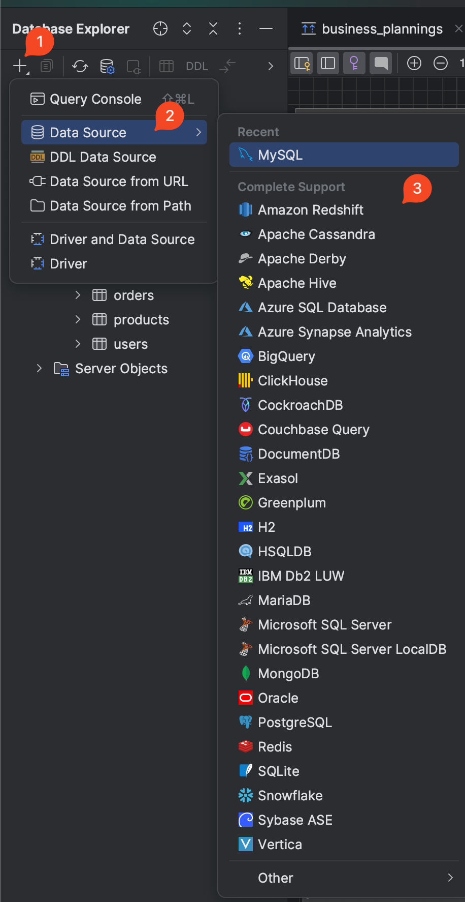
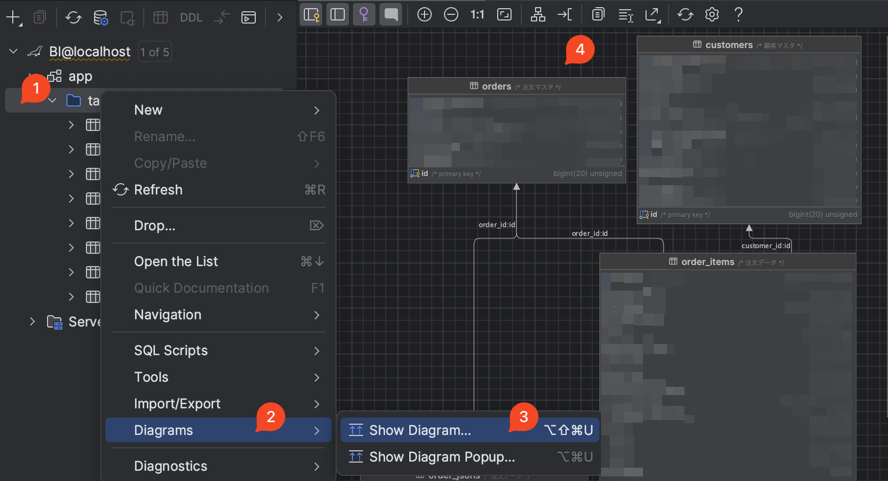

## 背景

刚加入新公司，接手了一个项目，什么资料也没有。 🥲

想要了解这个项目，一个比较直接的办法就是先看看数据库的ER图，手动画图太麻烦，

Google了下， 发现可以用 `JetBrains`的`DataGrip` 来导出ER图。

## 步骤

### 1. Connect to database

1️⃣. Click `+` button in the left panel

2️⃣. Select `Data Source` -> `MySQL(or other database)`

3️⃣. Fill in the your database information

### 2. Show diagram

1️⃣. Right click the database you want to show

2️⃣ 3️⃣. Select `Diagram` -> `Show Diagram`

4️⃣. Then you will see the ER diagram

## 扩展

DataGrip 还有很多功能，比如可以直接在里面写SQL，还可以直接导出SQL Script，等等。

点击[这里](https://www.jetbrains.com/datagrip/features/)查看更多功能。
