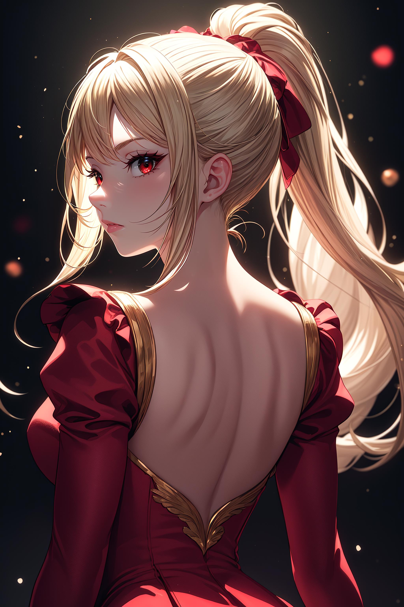
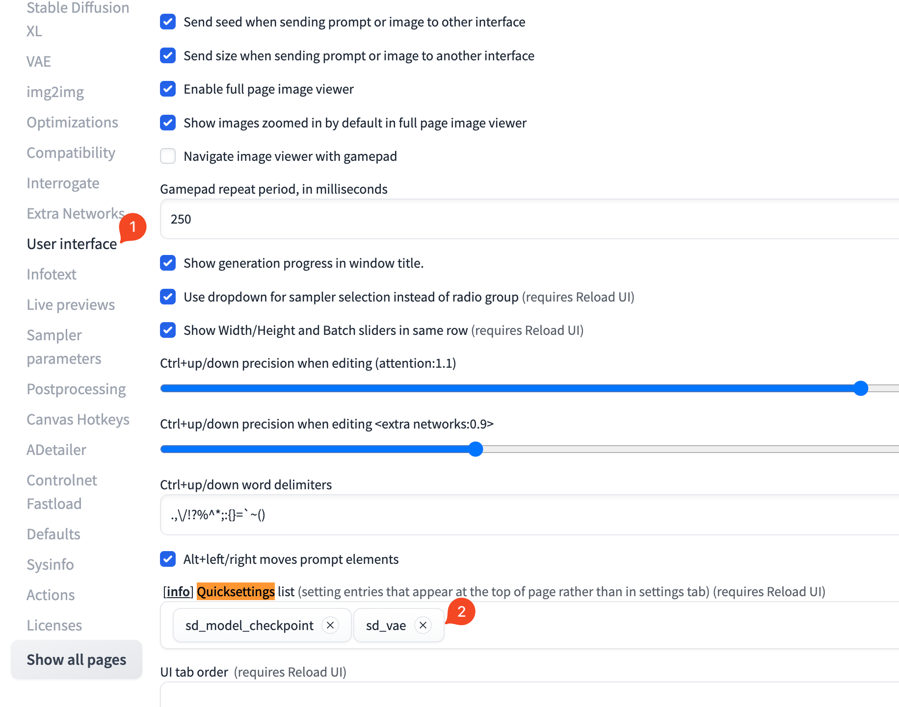
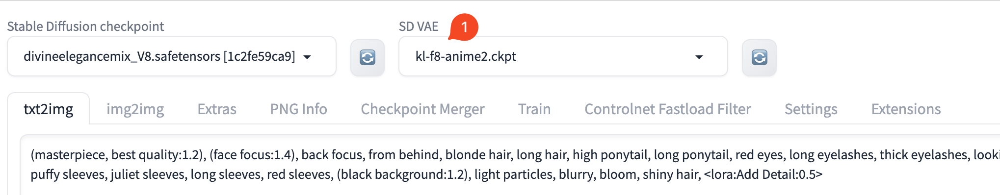
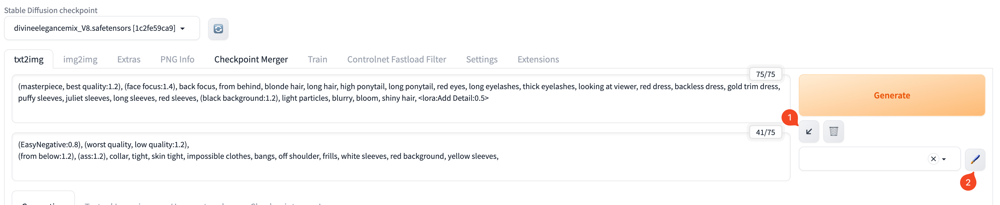
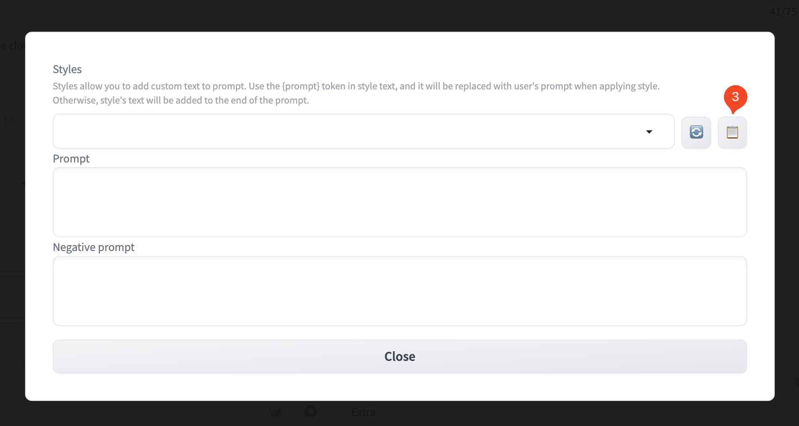
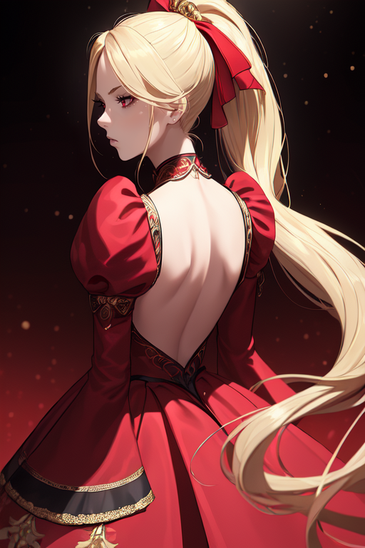
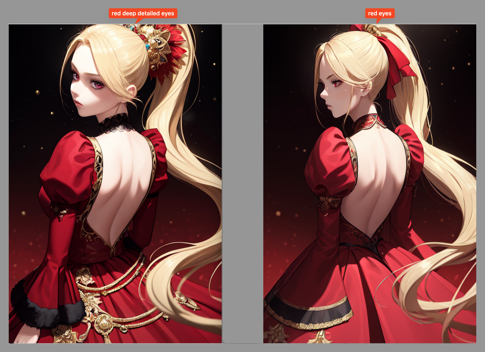
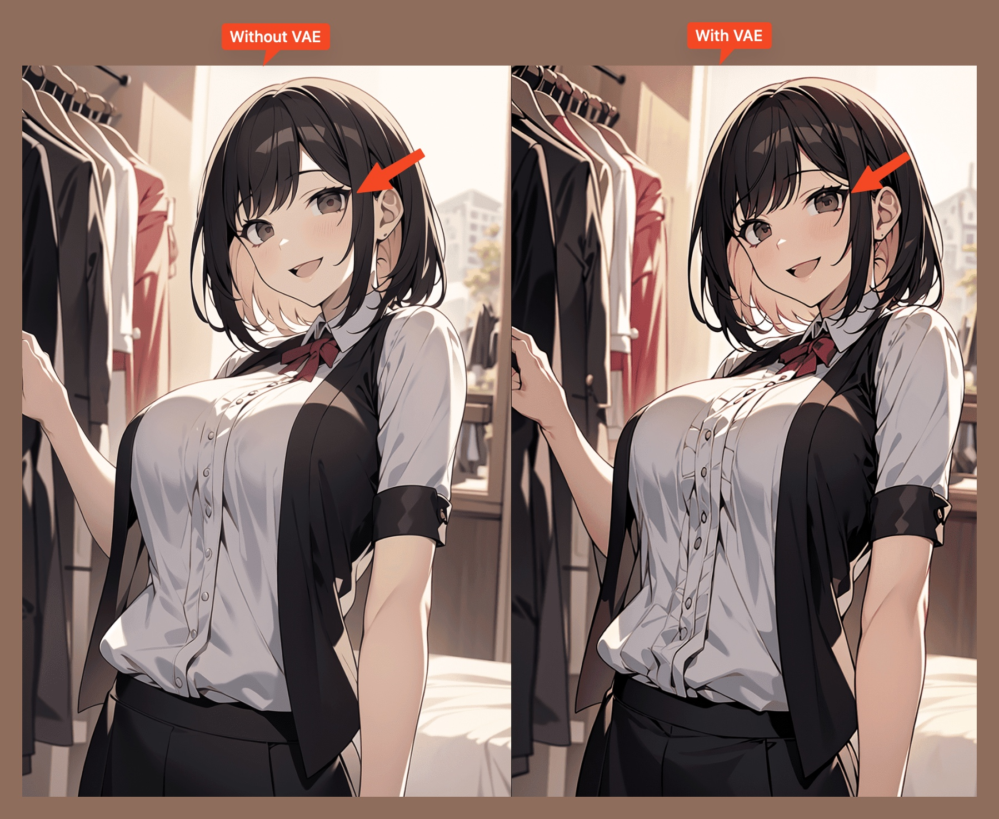

## Background

在 civitai 上看到 `DivineEleganceMix` [模型](https://civitai.com/models/6174?modelVersionId=202455) 生成的图片，感觉很美，

就想尝试用 `Stable Diffusion WebUI` 重现一下。(为了方便描述，以下用 `WebUI` 代替 `Stable Diffusion WebUI` )



## 过程

### 1. 获取 prompt 和参数

Prompts 等参数可以在 [这个页面](https://civitai.com/images/3222144) 点击 `Copy Generation data` 复制得到。

```text
(masterpiece, best quality:1.2), (face focus:1.4), back focus, from behind, blonde hair, long hair, high ponytail, long ponytail, red eyes, long eyelashes, thick eyelashes, looking at viewer, red dress, backless dress, gold trim dress, puffy sleeves, juliet sleeves, long sleeves, red sleeves, (black background:1.2), light particles, blurry, bloom, shiny hair, <lora:Add Detail:0.5>
Negative prompt: (EasyNegative:0.8), (worst quality, low quality:1.2),
(from below:1.2), (ass:1.2), collar, tight, skin tight, impossible clothes, bangs, off shoulder, frills, white sleeves, red background, yellow sleeves,
Steps: 30, VAE: kl-f8-anime2.vae.pt, Size: 512x768, Seed: 3842746991, Model: DivineEleganceMix8, "Module: canny, Sampler: Euler a, VAE hash: df3c506e51, CFG scale: 8, Clip skip: 2, Model hash: 4dbe20030f, ADetailer model: face_yolov8n.pt, ADetailer steps: 30, ADetailer sampler: Euler a, ADetailer version: 23.10.1, Denoising strength: 0.3, ADetailer CFG scale: 8.0, ADetailer CLIP skip: 2, ADetailer mask blur: 16, ADetailer confidence: 0.3, ADetailer dilate/erode: 32, ADetailer inpaint width: 768, ADetailer inpaint height: 768, ADetailer inpaint padding: 32, ADetailer mask merge/invert: Merge, ADetailer denoising strength: 0.3, ADetailer use separate steps: True, ADetailer inpaint only masked: True, ADetailer use separate sampler: True, ADetailer use separate CFG scale: True, ADetailer use separate CLIP skip: True, ADetailer use inpaint width/height: True
```

### 2. 安装插件

`Generation data` 中提到了 `VAE: kl-f8-anime2.vae.pt` 和 `Adetailer` 插件，需要先安装。

#### 2.1 安装 VAE:kl-f8-anime2.vae.pt

在 HuggingFace 上找到了 [kl-f8-anime2.vae.pt](https://huggingface.co/hakurei/waifu-diffusion-v1-4/blob/main/vae/kl-f8-anime2.ckpt) ，
下载到本地放到 `stable-diffusion-webui/models/VAE/` 里面。

stable-diffusion-webui 默认没有启用 `VAE`，需要手动启用。

如下图所示，在 stable-diffusion-webui 的 `Settings` 页面，点击 1️⃣ → 2️⃣ , 添加 `sd_vae` 后，

点击 `Apply settings` → `Reload UI` 。



如下图所示，刷新界面后就出现了 1️⃣ `SD VAE` 选项， 选择我们之前下载的 `kl-f8-anime2.ckpt` 。



#### 2.2 安装 Adetailer

到 stable-diffusion-webui 的 Extensions 页面，

按照 [Adetailer](https://github.com/Bing-su/adetailer） 的说明安装。

### 3. 导入参数

如下图所示，在 `WebUI` 的 `txt2img` 页面，点击 1️⃣ 的箭头按钮，粘贴 prompt。

然后点击 2️⃣ 的箭头按钮，在弹出窗口中点击 3️⃣ 按钮粘贴参数。




有些参数好像不能直接粘贴，需要手动修改一下。

比如 Height, `ADetailer` 的 `Enable` 选项等。

### 4. 生成图片

还不错，不过和模型作者的图片好像还是有差距，可能有些设置没改好，有时间再看看。


- 修改了下眼睛部分的 prompt，效果好了点。
  

## Appendix

- ADetailer 的作用是什么？
  - ADetailer 是一个插件，对模型生成的图片中的手部（比如 6 手指问题）、脸部的变形等问题进行处理，使得生成的图片更加真实。
- 为什么要用 VAE？

  - [VAE(Variational Autoencoder, 变分自编码器)](https://zh.wikipedia.org/wiki/变分自编码器) 是一种算法插件，**加强图片的清晰度和色彩饱和度**， 使得生成的图片更加有质感。
    比较一下用 VAE 和不用 VAE 的效果就能看出来。
    

  - 一些有名的 VAE
    - stability.ai 发布的 [vae-ft-mse-840000-ema.safetensors](https://huggingface.co/stabilityai/sd-vae-ft-mse-original)
      - 效果可以看看这里： https://civitai.com/images/1233747

## Reference

[WebUI の拡張機能で 手軽に CivitAI のモデルを利用する](https://note.com/astropomeai/n/n137a4d92d18c)
