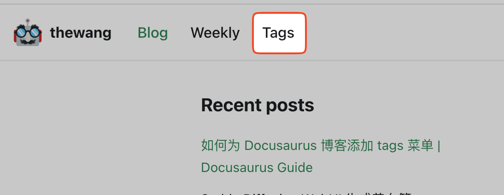

## 背景

当你的博客文章越来越多时，你可能会发现你的博客需要一个 tags 菜单，以便用户可以快速找到他们感兴趣的文章。

本文将介绍如何为 Docusaurus 博客添加 tags 菜单。



## 添加 tags 菜单

只需要在 `docusaurus.config.js` 配置文件中，添加如下配置即可：

```js {16-20} title="docusaurus.config.js" showLineNumbers
      navbar: {
        title: 'thewang',
        logo: {
          alt: 'thewang logo',
          src: 'img/logo.png',
        },
        items: [
          { to: '/blog', label: 'Blog', position: 'left' },
          // language dropdown menu
          {
            type: 'localeDropdown',
            position: 'right',
          },
...
          // tags menu
          {
            to: '/blog/tags',
            label: 'Tags',
            position: 'left',
          },
```
