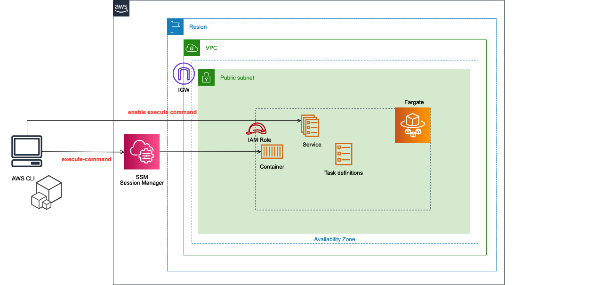
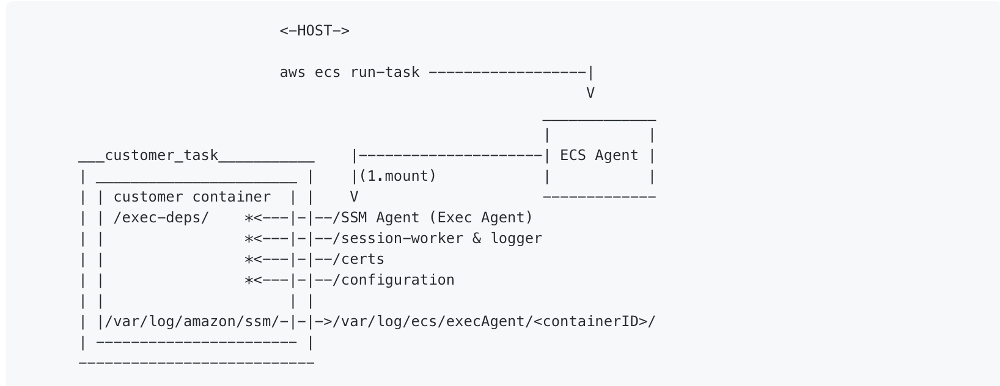

## 背景

最近参与的一个项目，需要经常地进入AWS ECS 的 Fargate 服务中的容器中。

使用 awscli 的 [ECS Exec](https://docs.aws.amazon.com/ja_jp/AmazonECS/latest/userguide/ecs-exec.html) 可以非常方便地连接到运行中的容器。



其大概的原理如下图所示：

ECS Exec 把 SSM Agent 绑定到容器，从而可以通过 Systems Manager （SSM） 的会话管理器（Session Manager）访问容器。



所以执行该命令，除了需要安装 AWS CLI 之外，还需要安装 [session-manager-plugin](https://docs.aws.amazon.com/zh_cn/systems-manager/latest/userguide/session-manager-working-with-install-plugin.html)。

对于团队里的一部分成员来说，安装这些工具还是比较麻烦的，所以我写了一个脚本，可以一键连接到 ECS 的容器中。

## 脚本

```bash {29-30} title="connect-to-aws-ecs.sh" showLineNumbers
#!/bin/bash -eu

###################################################
# macOS中连接到 AWS ECS Fargate 容器的脚本
###################################################

# check if aws-cli is installed
if ! type aws >/dev/null 2>&1; then
    echo "aws-cli is not installed"
    echo "installing aws-cli...."
    brew install awscli
    echo "aws-cli is installed successfully. please run this script again after set your credentials by 'aws configure' command"
    exit 1
fi

# check if session-manager-plugin is installed
if ! type session-manager-plugin >/dev/null 2>&1; then
    echo "session-manager-plugin is not installed"
    echo "installing session-manager-plugin...."
    # session-manager-pluginをダウンロードして解凍
    mkdir -p $HOME/session-manager-plugin/bin
    curl "https://s3.amazonaws.com/session-manager-downloads/plugin/latest/mac/sessionmanager-bundle.zip" -o "$HOME/session-manager-plugin/bin/sessionmanager-bundle.zip"
    unzip -d $HOME/session-manager-plugin/bin $HOME/session-manager-plugin/bin/sessionmanager-bundle.zip
    sudo $HOME/session-manager-plugin/bin/install -i /usr/local/sessionmanagerplugin -b /usr/local/bin/session-manager-plugin

    echo "session-manager-plugin is installed successfully."
fi

container_name="your-container-name"
cluster_name="your-ecs-cluster-name"

# Get the task ARN
task_arn=$(aws ecs list-tasks \
    --cluster $cluster_name \
    --desired-status RUNNING \
    --query 'taskArns[0]' \
    --output text)

# タスクIDを抽出
task_id=$(echo $task_arn | awk -F/ '{print $NF}')
echo "task_id: $task_id"

# Session Managerを使用してコンテナに入る
aws ecs execute-command \
    --cluster $cluster_name \
    --task $task_id \
    --container $container_name \
    --command "/bin/sh" \
    --interactive \
    --profile default
```

## 使用方法

1. 将上述脚本保存为 `connect-to-aws-ecs.sh` 文件
2. 执行 `chmod +x connect-to-aws-ecs.sh` 赋予脚本执行权限
3. 修改脚本中的 `container_name` 和 `cluster_name` 为你自己的值
4. 执行 `./connect-to-aws-ecs.sh` 即可连接到 ECS 的容器中

## Reference

[使用 ECS Exec 访问 Fargate 上的容器](https://qiita.com/okubot55/items/b1fb07b2de08c354275b)

[Amazon ECS Execを使ってみる](https://blog.serverworks.co.jp/ecs-exec)