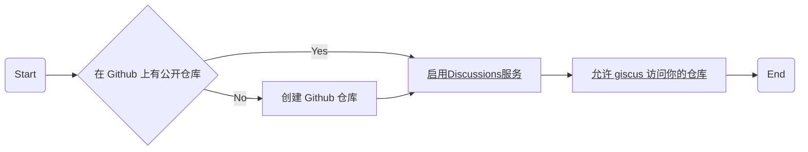
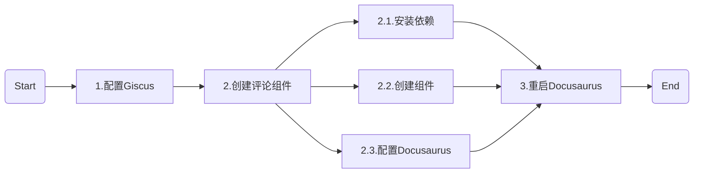

## 背景

Docusaurus默认没有集成评论系统。

在之前的博客中用过 [Giscus](https://giscus.app/) ,

它是一个基于 [GitHub Discussions](https://docs.github.com/en/discussions) 的评论系统，可以很方便地集成到 GitHub Pages、VuePress、Docusaurus 等静态网站生成器中。

这次打算把它添加到 Docusaurus。

:::tip

如果不想依存 Github 的服务，可以开卡 [Waline](https://waline.js.org/) 评论系统，可以添加自己的后端服务。

:::

## 准备工作



:::tip
可以点击流程图中带下划线的 node 跳转到相关页面
:::

## 步骤

* 流程图




### 1. 配置 Giscus

在 [Giscus](https://giscus.app/zh-CN#:~:text=%E4%B8%8A%E7%AE%A1%E7%90%86%E8%AF%84%E8%AE%BA%E3%80%82-,%E9%85%8D%E7%BD%AE,-%E8%AF%AD%E8%A8%80) 的网站上配置你的评论系统，并复制你的配置代码(高亮部分会在步骤 3 中用到)。

```js {2-3,5} title="giscus config" showLineNumbers
<script src="https://giscus.app/client.js"
        data-repo="your_org_name/your-repo"
        data-repo-id="your-repo-id"
        data-category="Announcements"
        data-category-id="your-category-id"
        ... // other options
        async>
</script>
```

### 2. 创建评论组件

#### 2.1. 安装依赖

```bash
npm install @giscus/react mitt

# or
yarn add @giscus/react mitt
```

#### 2.2. 创建组件

<details>
<summary>点击查看代码</summary>

```ts title="src/components/GiscusComments/index.tsx" showLineNumbers
import React from 'react'
import { useThemeConfig, useColorMode } from '@docusaurus/theme-common'
import useDocusaurusContext from '@docusaurus/useDocusaurusContext'
import { ThemeConfig } from '@docusaurus/preset-classic'
import BrowserOnly from '@docusaurus/BrowserOnly'
import Giscus, { GiscusProps } from '@giscus/react'

interface CustomThemeConfig extends ThemeConfig {
  giscus: GiscusProps & { darkTheme: string }
}

const defaultConfig: Partial<GiscusProps> & { darkTheme: string } = {
  id: 'comments',
  mapping: 'title',
  reactionsEnabled: '1',
  emitMetadata: '0',
  inputPosition: 'top',
  lang: 'zh-CN',
  theme: 'light',
  darkTheme: 'dark',
}

export default function Comment(): JSX.Element {
  const themeConfig = useThemeConfig() as CustomThemeConfig
  const { i18n } = useDocusaurusContext()

  // merge default config
  const giscus = { ...defaultConfig, ...themeConfig.giscus }

  if (!giscus.repo || !giscus.repoId || !giscus.categoryId) {
    throw new Error(
      'You must provide `repo`, `repoId`, and `categoryId` to `themeConfig.giscus`.',
    )
  }

  giscus.theme =
    useColorMode().colorMode === 'dark' ? giscus.darkTheme : giscus.theme
  giscus.lang = i18n.currentLocale

  return (
    <BrowserOnly fallback={<div>Loading Comments...</div>}>
      {() => <Giscus {...giscus} />}
    </BrowserOnly>
  )
}
```

</details>

用 Docusaurus 的 `swizzle` 命令对博客页面对应组件进行修改（添加前面创建的评论组件）。

```bash
npm run swizzle @docusaurus/theme-classic BlogPostPage -- --eject --typescript
# or
yarn run swizzle @docusaurus/theme-classic BlogPostPage -- --eject --typescript
```

以上命令会在 `src/theme/BlogPostPage/index.tsx` 中生成一些文件，我们只需要修改 `index.tsx` 文件即可。

以下高亮部分为修改代码：

<details>

<summary>点击查看代码</summary>

```ts {13,28,48} title="src/theme/BlogPostPage/index.tsx" showLineNumbers
import React, {type ReactNode} from 'react';
import clsx from 'clsx';
import {HtmlClassNameProvider, ThemeClassNames} from '@docusaurus/theme-common';
import {BlogPostProvider, useBlogPost} from '@docusaurus/theme-common/internal';
import BlogLayout from '@theme/BlogLayout';
import BlogPostItem from '@theme/BlogPostItem';
import BlogPostPaginator from '@theme/BlogPostPaginator';
import BlogPostPageMetadata from '@theme/BlogPostPage/Metadata';
import TOC from '@theme/TOC';
import type {Props} from '@theme/BlogPostPage';
import Unlisted from '@theme/Unlisted';
import type {BlogSidebar} from '@docusaurus/plugin-content-blog';
import Comment from '../../components/GiscusComments';

function BlogPostPageContent({
  sidebar,
  children,
}: {
  sidebar: BlogSidebar;
  children: ReactNode;
}): JSX.Element {
  const {metadata, toc} = useBlogPost();
  const {nextItem, prevItem, frontMatter, unlisted} = metadata;
  const {
    hide_table_of_contents: hideTableOfContents,
    toc_min_heading_level: tocMinHeadingLevel,
    toc_max_heading_level: tocMaxHeadingLevel,
    hide_comment: hideComment,
  } = frontMatter;
  return (
    <BlogLayout
      sidebar={sidebar}
      toc={
        !hideTableOfContents && toc.length > 0 ? (
          <TOC
            toc={toc}
            minHeadingLevel={tocMinHeadingLevel}
            maxHeadingLevel={tocMaxHeadingLevel}
          />
        ) : undefined
      }>
      {unlisted && <Unlisted />}
      <BlogPostItem>{children}</BlogPostItem>

      {(nextItem || prevItem) && (
        <BlogPostPaginator nextItem={nextItem} prevItem={prevItem} />
      )}
      {!hideComment && <Comment />}
    </BlogLayout>
  );
}

...

```

</details>

#### 2.3. 配置 Docusaurus

在 `docusaurus.config.js` 中添加配置项：

```js {5-11} title="docusaurus.config.js" showLineNumbers
module.exports = {
  ...
  themeConfig: {
    ...
      // giscus options
      giscus: {
        repo: 'your_org/your-blog', // edit this
        repoId: 'your_repo_id', // edit this
        category: 'Announcements',
        categoryId: 'your_category_id', // edit this
      }
    ...
  },
  ...
}
```

### 3. 重启 Docusaurus

```bash
npm start
# or
yarn start
```

## 参考

[Docusaurus 添加评论功能](https://www.alanwang.site/posts/blog-guides/docusaurus-comment)

[评论服务](https://kuizuo.cn/docs/docusaurus-comment)
