## 背景

以前经常用 [plantuml](https://plantuml.com/) 来生成各种示意图。

自从 Github 支持了 [mermaid](https://mermaid.js.org/) 语法后，就慢慢的转向了 mermaid。

今天就来记录一下如何使用 mermaid 来绘制 Gitflow 的示意图。

:::tip
Mermaid是一个基于JavaScript的图表绘制工具，

它使用简单的文本描述来定义图表，然后将文本转换为图表。

Mermaid支持流程图、序列图、类图、状态图、Git图、甘特图等多种图表。

官方还提供了一个[在线编辑器](https://mermaid.live/)。
:::

## 1. Gitflow的 Mermaid 代码

```js
gitGraph LR:
commit id: "1:init"
branch "hotfix/{ticket_number}" order: 1
branch "release/{x}" order: 2
branch develop order: 3
commit id: "2:init"
branch "feature/{ticket_number}" order: 4
checkout "feature/{ticket_number}"
commit id: "3:commit-x"
checkout develop
merge "feature/{ticket_number}" id: "4:merge-feat" type: HIGHLIGHT

# release
checkout "release/{x}"
merge develop id: "5:release-x"
checkout main
merge "release/{x}" id: "6:merge-release" tag: "v.1.0.0" type: HIGHLIGHT

# hotfix
checkout "hotfix/{ticket_number}"
commit id: "7:commit-hotfix"
checkout develop
merge "hotfix/{ticket_number}" id: "8:merge-hotfix" type: HIGHLIGHT
```


## 2. Mermaid 代码的渲染结果


似乎 本博客（ [Docusaurus](https://docusaurus.io/) ）的渲染结果 和[官方提供的在线编辑器](https://mermaid.live/) 生成的结果(↓)稍微有点不一样。

不过，大家可以通过修改 [Mermaid 的配置](https://mermaid.js.org/syntax/gitgraph.html#commit-labels-layout-rotated-or-horizontal) 调整显示效果。


