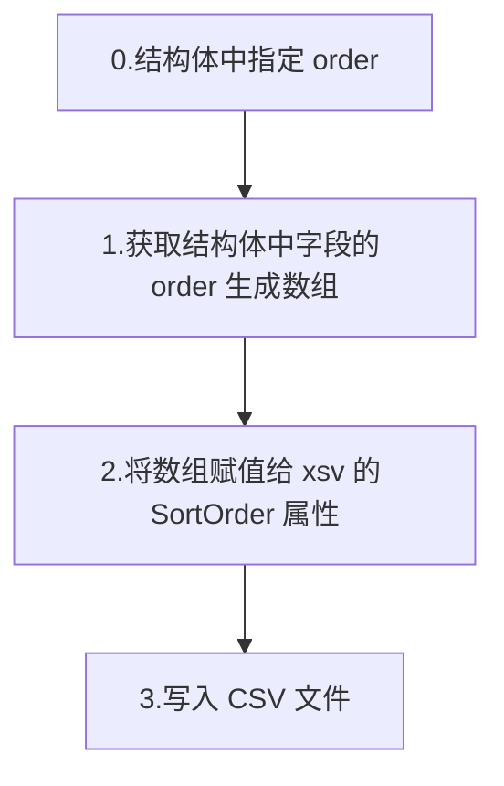

## 需求

- Golang 中将结构体的数组保存到 CSV 文件中
- CSV 文件的列顺序和结构体中的字段顺序不同

```go title="user.go"
type User struct {
    Name string
    Age  int
}
```

↓↓↓

| Age | Name   |
| --- | ------ |
| 20  | "Musk" |

## 调查

比较有人气的的 Golang CSV 库有：

- [gocarina/gocsv](https://github.com/gocarina/gocsv)
- [jszwec/csvutil](https://github.com/jszwec/csvutil)

但是两者都不支持指定结构体字段的顺序，而且也没有提供相应的 writer 接口，所以也无法自己覆盖接口实现。

本来想 fork 上面的其中一个库改造下，但搜索发现了 [shigetaichi/xsv](https://github.com/shigetaichi/xsv) 这个库，在 `gocsv` 的代码的基础上实现了指定结构体字段顺序的功能。

字段的顺序可以通过 `xsv` 的 `SortOrder` 属性指定一个数组，数组中的值是结构体中相应字段的索引（starting from 0)。

比如, 如果想要将结构体按照 `Age`, `Name` 的顺序输出，可以这样指定：

```go
type User struct {
    Name string `csv:"name"`
    Age  int    `csv:"age"`
}

xsvWrite.SortOrder = []int{1, 0}
```

但是个人觉得字段顺序的指定方式不太友好。 既然已经有了 `csv` tag，为什么不直接使用 `csv` tag 来指定字段的顺序呢？

比如：

```go
type User struct {
    Name string `csv:"name,order:1"`
    Age  int    `csv:"age,order:0"`
}
```

## 我的方案



### 代码

<details>
<summary>代码</summary>

```go
package main

import (
    "fmt"
    "log"
    "os"
    "reflect"
    "strconv"
    "strings"

    "github.com/shigetaichi/xsv"
)

type User struct {
    Name string `csv:"name, order:1"`
    Age  int    `csv:"age, order:0"`
}

func main() {
    users := []*User{
        {Name: "Alice", Age: 20},
        {Name: "Bob", Age: 30},
    }

    // Create a csv file to write
    file, err := os.OpenFile("users.csv", os.O_RDWR|os.O_CREATE|os.O_TRUNC, os.ModePerm)
    if err != nil {
        panic(err)
    }
    defer file.Close()

    xsvWrite := xsv.NewXsvWrite[*User]()
    // Get the order of the fields in the struct and set it to the writer
    orders := getOrderOfFields(reflect.TypeOf(User{}))
    xsvWrite.SortOrder = orders

    // Write the users to the csv file
    err = xsvWrite.SetFileWriter(file).Write(users)
    if err != nil {
        log.Println(err)
        return
    }
}

// Get the order of the fields in specified struct
func getOrderOfFields(structType reflect.Type) []int {
    // Create a slice of int with the same length as the number of fields in the struct
    var res []int
    // Iterate through the struct fields
    for i := 0; i < structType.NumField(); i++ {
        // Get the field
        field := structType.Field(i)

        // Get the "order" tag value
        order := getTagValue(field, "csv", "order")
        if order >= 0 {
            res = append(res, order)
        }
    }

    return res
}

// getTagValue は指定されたフィールドの指定されたタグの値を取得する
func getTagValue(field reflect.StructField, tag string, tagField string) int {
    tagValue, _ := field.Tag.Lookup(tag)
    // Split the tag string by ","
    tagParts := strings.Split(tagValue, ",")

    // Iterate through the tag parts to find the "order" value
    res := -1
    for _, part := range tagParts {
        part = strings.TrimSpace(part)
        // Check if the part starts with "order:"
        prefix := fmt.Sprintf("%s:", tagField)
        if strings.HasPrefix(part, prefix) {
            // Extract the numeric value after "order:"
            valueStr := strings.TrimPrefix(part, prefix)
            value, err := strconv.Atoi(valueStr)
            if err == nil {
                res = value
            }
            break
        }
    }

    return res
}
```

</details>

### 保存的 CSV 文件

| age | name  |
| --- | ----- |
| 20  | Alice |
| 30  | Bob   |
