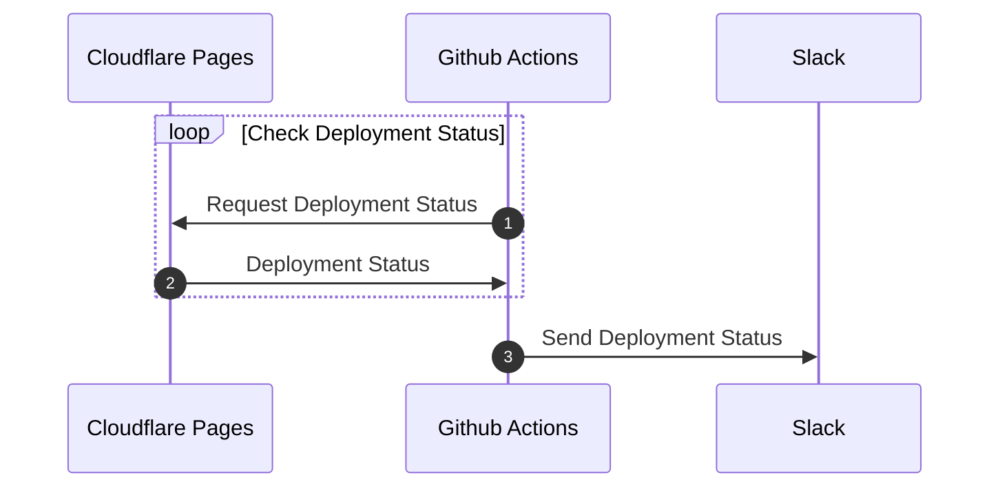
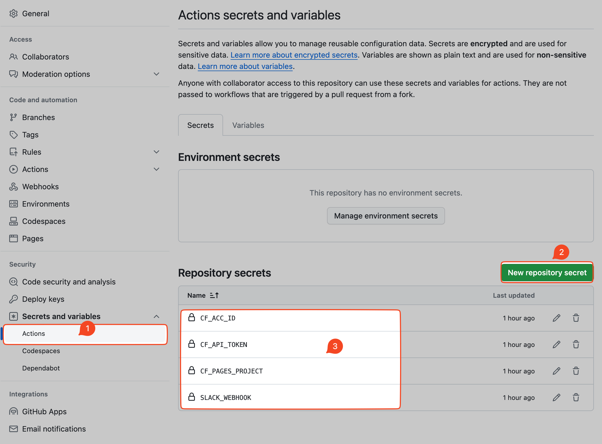
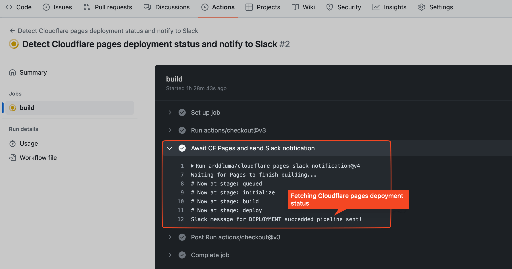
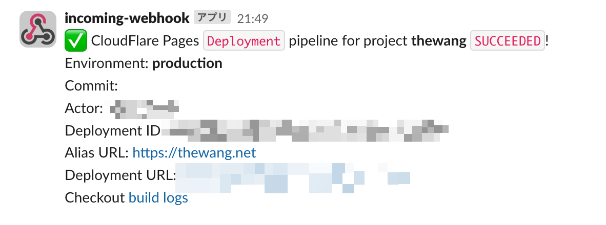

## 0. 背景&需求

我的博客是使用 [Cloudflare Pages](https://pages.cloudflare.com/) 部署的，

但是 Cloudflare Pages 并没有提供部署状态通知的功能，所以我想到了使用 Github Actions 来实现这个功能。

## 1. 前提

- 已经在 Github 上创建了你的网站的仓库
- 已经在 Cloudflare Pages 上设置好了你的 Github 仓库
  - 比如我是设置成了 `main` 分支更新时自动部署

## 2. 方法



## 3. 实现

[arddluma/cloudflare-pages-slack-notification](https://github.com/arddluma/cloudflare-pages-slack-notification) 这个 Github Action 已经实现这个了我们所要的功能。

我们只需要准备好这个 Github Action 中使用的变量。

```yaml
- name: Await CF Pages and send Slack notification
  uses: arddluma/cloudflare-pages-slack-notification@v4
  with:
    # Cloudflare API token
    apiToken: ${{ secrets.CF_API_TOKEN }}
    # CloudFlare account ID
    accountId: ${{ secrets.CF_ACC_ID  }}
    # CloudFlare Pages project name
    project: ${{ secrets.CF_PAGES_PROJECT  }}
    # Create Slack Incoming webhook and add as variable https://hooks.slack.com/...
    slackWebHook: ${{ secrets.SLACK_WEBHOOK  }}
    # Add this if you want to wait for a deployment triggered by a specfied commit
    commitHash: ${{ steps.push-changes.outputs.commit-hash }}
```

### 3.1 获得变量

- 1️⃣ **apiToken**:
  - Cloudflare API token. ([How to create Cloudflare API token](https://dash.cloudflare.com/profile/api-tokens))
- 2️⃣ **accountId**:
  - CloudFlare account ID. ( Access the [dashboard of Cloudflare](https://dash.cloudflare.com/) and you'll find the account ID in the URL)
- 3️⃣ **project**:
  - CloudFlare Pages project name. (You can find it here `https://dash.cloudflare.com/{your_account_id}/workers-and-pages` )
- 4️⃣ **slackWebHook**:
  - Create Slack Incoming webhook. ([How to create Slack Incoming webhook](https://api.slack.com/messaging/webhooks))

1️⃣ 2️⃣ 3️⃣ 是 Github Actions 通过 `Cloudflare Pages` 的 API 来获取部署状态所需要的参数。

4️⃣ 是 Github Actions 发送消息给 `Slack` 所需要的 webhook URL。

### 3.2 设置变量

在你的网站的 Github 仓库中，点击 `Settings` -> `Secrets and variables` -> `New repository secret`，然后设置上面的变量。



## 4. Github Actions 代码

```yaml {19-33} title="github/workflows/cloudflare-pages.yml" showLineNumbers=true
name: Detect Cloudflare pages deployment status and notify to Slack
on:
  push:
    branches:
      - main
    paths-ignore:
      - .github/**
  pull_request:
    branches:
      - main
    types: [closed]
    paths-ignore:
      - .github/**
  workflow_dispatch:
jobs:
  build:
    runs-on: ubuntu-latest
    steps:
      - uses: actions/checkout@v3
      - name: Await CF Pages and send Slack notification
        id: cf-pages
        uses: arddluma/cloudflare-pages-slack-notification@v4
        with:
          # Clouodflare API token
          apiToken: ${{ secrets.CF_API_TOKEN }}
          # CloudFlare account ID
          accountId: ${{ secrets.CF_ACC_ID  }}
          # CloudFlare Pages project name
          project: ${{ secrets.CF_PAGES_PROJECT  }}
          # Create Slack Incoming webhook and add as variable https://hooks.slack.com/...
          slackWebHook: ${{ secrets.SLACK_WEBHOOK  }}
          # Add this if you want to wait for a deployment triggered by a specfied commit
          commitHash: ${{ steps.push-changes.outputs.commit-hash }}
```

## 效果

- Github Action Build Progress:
  

- Slack notification:
  

## Reference

[Setup Cloudflare Pages Slack notifications](https://ardd.cloud/setup-cloudflare-pages-slack-notifications)
