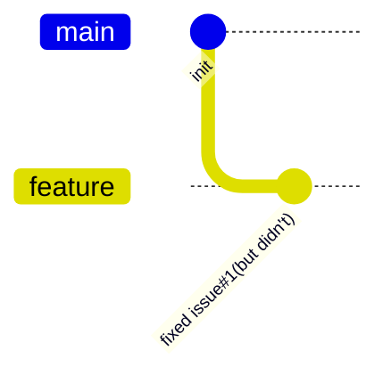
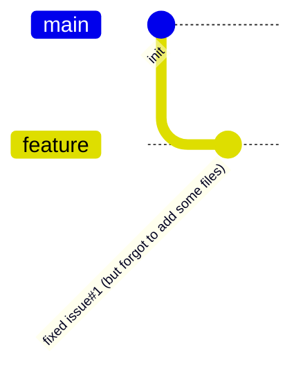

## `git commit --amend --no-edit`

当你觉得你已经把某个 issue 修改好了，可实际上你没能一次性修改好(也许只是有些 typo)；



**OR**

当你确实已经把某个 issue 修改好了，可你忘记了 add 一些文件时，



你可以这么做：

```bash
git add .
git commit --amend --no-edit # --no-edit 选项表示不修改 commit message。
git push -f # 如果你已经 push 过了，需要添加 -f  来强制 push。
```

:::note

其实我就是为了体验下 mermaidjs 的 gitGraph 功能而写的这篇文章 😄。

BTW, gitGraph 的 commit message 默认是 rotated 的。

如果你想要更改成水平的，需要在 docusaurus.config.js 中添加如下配置：

```js
+      mermaid: {
+        options: {
+          gitGraph: { rotateCommitLabel: false },
+        },
+      },
:::
```
