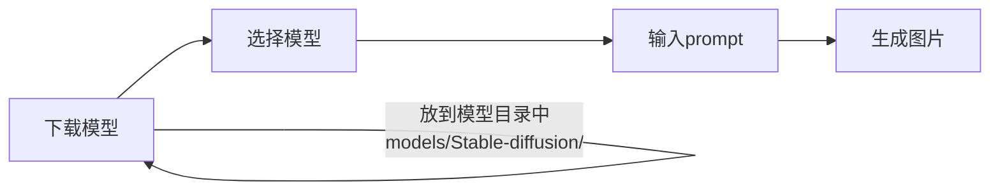
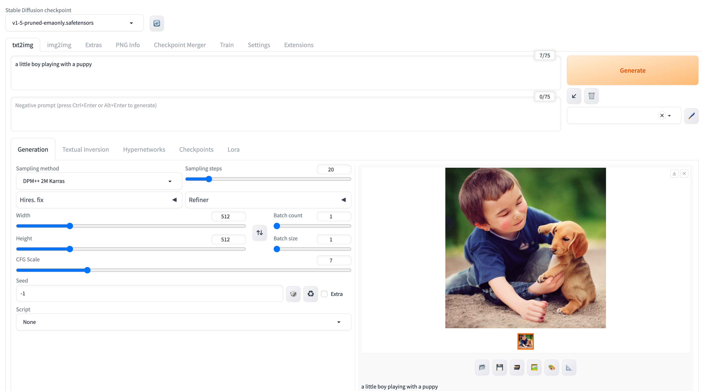
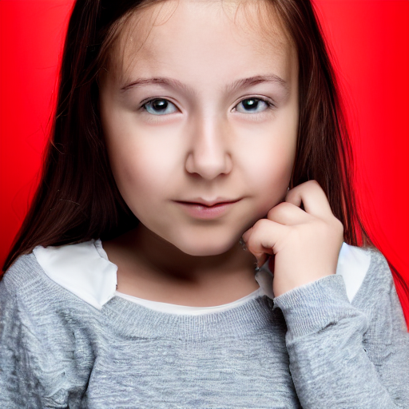
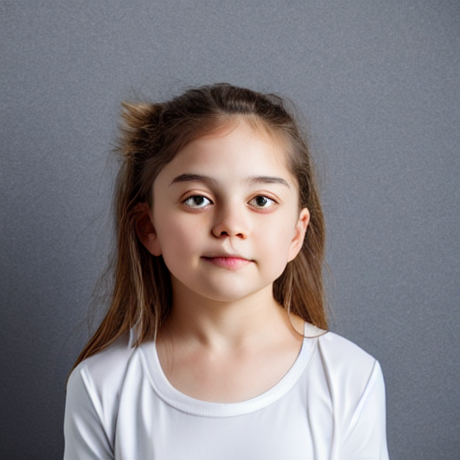
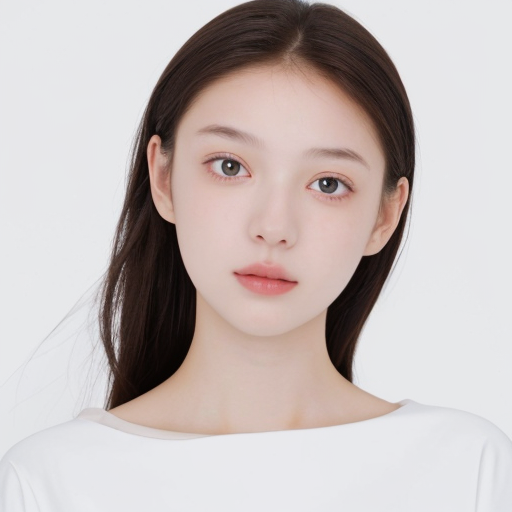

## Background

之前试了 Diffusers 等软件，生成的图片都不太理想（甚至难看 😸 ），

有些甚至不能选择模型，UI 也不太好用。

所以这次试试 [Stable Diffusion WebUI](https://github.com/AUTOMATIC1111/stable-diffusion-webui)，据说他的 UI 很好用。

## 我的环境

我的环境是 MacBook Pro M2 Pro。

```bash
$ system_profiler SPHardwareDataType

    Hardware Overview:
      Model Name: MacBook Pro
      Chip: Apple M2 Pro
      Total Number of Cores: 12 (8 performance and 4 efficiency)
      Memory: 16 GB
```

## 安装方法&运行

安装方法很简单，具体看[Github 的 readme](https://github.com/AUTOMATIC1111/stable-diffusion-webui/wiki/Installation-on-Apple-Silicon) 。

```bash
brew install cmake protobuf rust python@3.10 git wget # install dependencies
git clone https://github.com/AUTOMATIC1111/stable-diffusion-webui # clone the repo
cd stable-diffusion-webui # enter the directory
./weiui.sh # start the app
```

脚本运行后，会自动打开一个网页。

如果没有自动打开，可以手动打开 `http://127.0.0.1:7860/` , 就可以看到界面了。

## 使用方法



### 下载模型

:::tip
默认提供一个模型 `Stable Diffusion v1-5-pruned-emaonly.safetensors`，效果惨不忍睹。

建议直接从 [Hugging Face](https://huggingface.co/models) 或者 [Civitai](https://civitai.com/models) 下载。
:::

<details>
<summary>不相信我提示的可以点击这里看看😄</summary>

- 例 1: Prompts: `a little boy playing with a puppy`
  

- 例 2: Prompts: `1girl,face,white background`
  

- 例 3: Prompts: `1girl,face,white background`
- Negative Prompts: `(worst quality:2),(low quality:2),(normal quality:2),lowres,watermark`
  

</details>

我从 [Civitai](https://civitai.com/models) 下载了一个比较有人气的模型 [majicMIX realistic](https://civitai.com/models/43331/majicmix-realistic), 再用之前的 prompt 试了试，效果比默认的模型好太多了 😄。

### 生成结果

- Prompts: `1girl,face,white background`
  

- Prompts: `1girl,face,white background`

  Negative Prompts: `(worst quality:2),(low quality:2),(normal quality:2),lowres,watermark`
  

:::tip
`Negative Prompts` : 用来指定不想要的图片特征，比如 `lowres` 代表不想要低分辨率的图片。
:::

## Reference

[Stable Diffusion モデルの探し方](https://note.com/risa_chi/n/n6ecc5fc08a67)

[Stable Diffusion WebUI のおすすめモデル 10 選をご紹介！導入方法も解説](https://bocek.co.jp/media/exercise/stable-diffusion/5477/)
