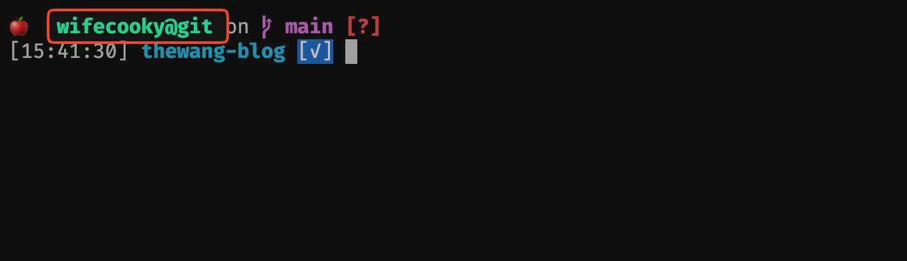

## 问题

当你在同一台电脑上使用多个 Git 用户的时候，你可能会遇到在 commit push 之后才发现自己没有切换到正确的用户的问题。

为了避免这种情况，我们可以在终端显示当前的 Git 用户信息。



## 解决方案

终端的显示信息(Shell Prompt) ，我推荐 [Starship](https://starship.rs/) 配置来实现。

安装 Starship 可以[参考官方文档](https://starship.rs/zh-cn/guide/), 这里就不再赘述。

## 配置

安装完后在 Starship 的配置文件 `~/.config/starship.toml` 中添加以下配置, 格式可以按照自己的喜好修改 `format =` 部分 。

```toml {3,6-10} title="~/.config/starship.toml" showLineNumbers=true
format = """
...
${custom.git_username}\
...

[custom.git_username]
command = "git config user.name"
when = "[ -d .git ] && echo .git || git rev-parse --git-dir > /dev/null 2>&1"
format = ' [$symbol($output)@git]($style) '
```
