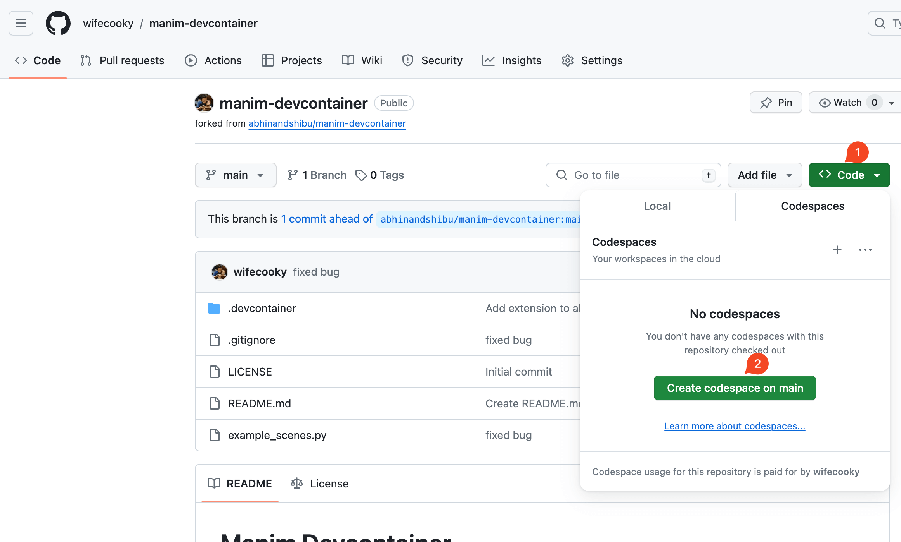
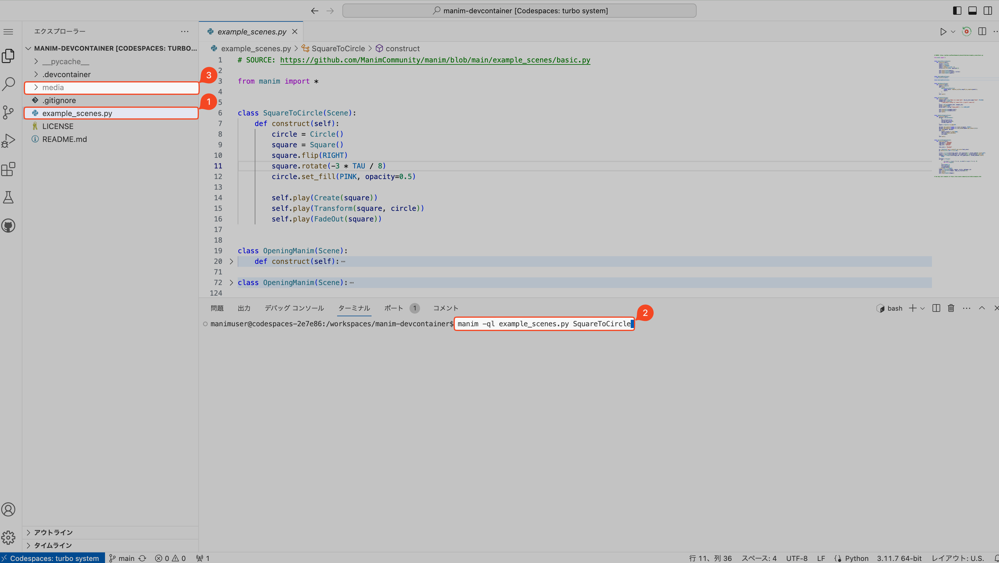
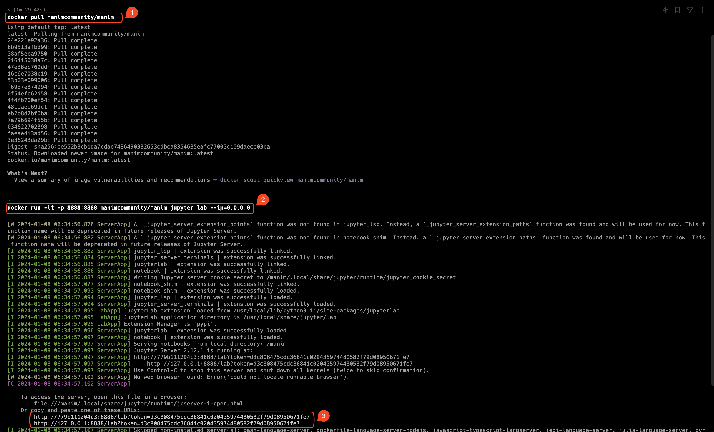
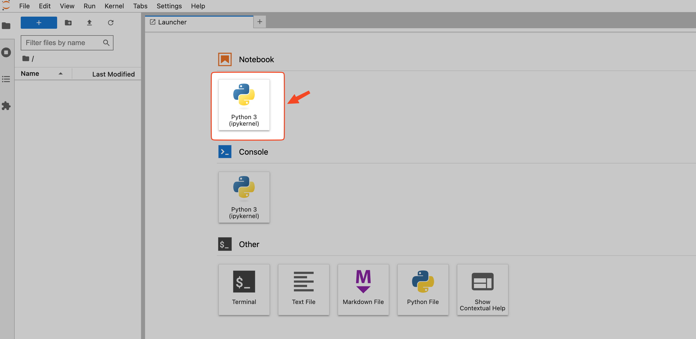
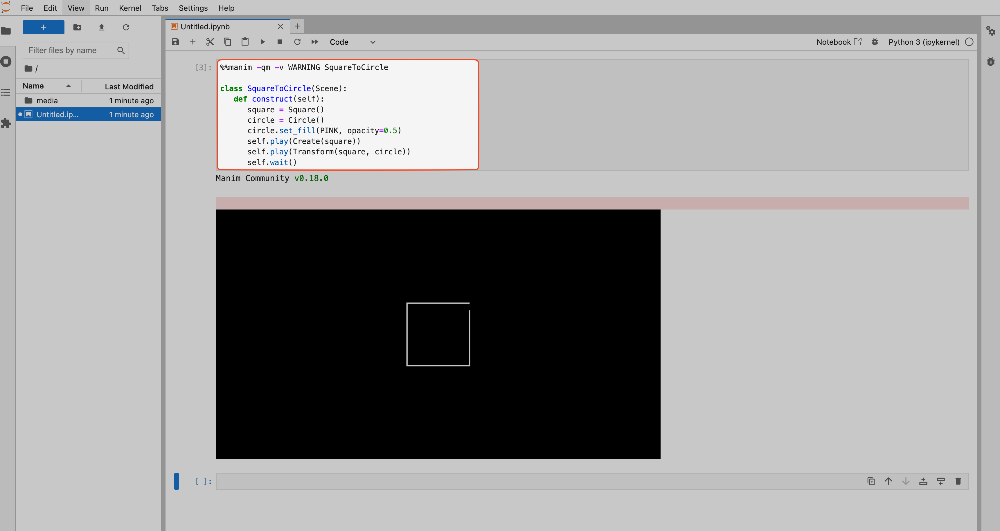

## 0. Manim 是什么？

[Manim](https://www.manim.community/) 是一个用于**创建数学动画的库**，它是由 [3Blue1Brown](https://www.youtube.com/c/3blue1brown) 的[Grant Sanderson @X](https://twitter.com/3blue1brown)开发的。

Manim 的目标是提供一个用于创建数学动画的简单、快速且强大的工具。

它是一个用 Python 编写的开源项目，它的代码托管在 GitHub 上。

## 1. 最简单快速的安装方法： 利用 GitHub Codespaces

### 1). 打开(或者 fork)我配置好的仓库 [wifecooky/manim-devcontainer](https://github.com/wifecooky/manim-devcontainer),

1️⃣ 点击右上角的 `Code` 按钮， 2️⃣ 选择 `Open with Codespaces`，等待构建完成后，就可以在浏览器中使用 Manim 了。



### 2). 测试一下

1️⃣ : 打开 `example_scenes.py` 文件。

2️⃣ : 在 `terminal` 运行 `manim -ql example_scenes.py SquareToCircle`。

3️⃣ : 等待运行完成，就可以在 `media/videos` 目录下看到生成的视频了。



## 2. 本地最快速的安装方法： 利用 Docker

### 0). [安装 Docker](https://docs.docker.com/get-docker/)

已经安装过的请跳过这一步。

### 1). 拉取 [Manim 镜像](https://docs.manim.community/en/stable/installation/docker.html)

```bash
docker pull manimcommunity/manim
```

### 2). 使用 Docker 启动本地 JupyterLab

```bash
docker run -it -p 8888:8888 manimcommunity/manim jupyter lab --ip=0.0.0.0
```

### 3). 打开 JupyterLab 链接并创建一个新的 Notebook





### 4). 测试一下

1️⃣ : 在 Notebook 中运行以下代码

```python
%%manim -qm -v WARNING SquareToCircle

class SquareToCircle(Scene):
   def construct(self):
      square = Square()
      circle = Circle()
      circle.set_fill(PINK, opacity=0.5)
      self.play(Create(square))
      self.play(Transform(square, circle))
      self.wait()
```

:::tip

`%%manim` 是 Manim 的 Jupyter magic 命令，用于链接 [Binder](https://docs.manim.community/en/stable/installation/jupyter.html#binder) 来运行 Manim。

`-qm` 参数表示 quality medium，即生成的视频质量为中等。

`-v WARNING` 参数表示只显示警告信息。
:::



## Reference

[Manim easy Installation for all operating systems (Windows, Linux, Mac OS)](https://www.youtube.com/watch?v=S7DvtP20ggU)

[docker manimcommunity/manim](https://hub.docker.com/r/manimcommunity/manim)
