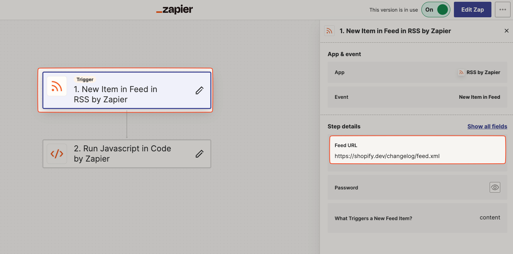
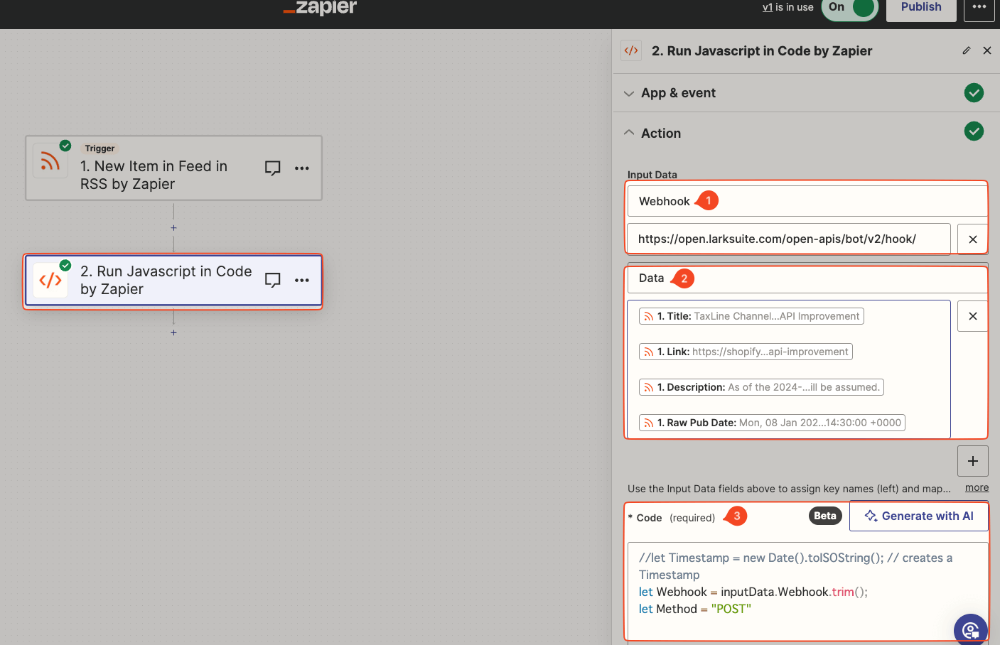

## 背景&目的

项目中使用的第三方服务（Shopify）的 API 隔几个月就会发布新版本。

为了及时对应 API 变化，我们希望在该服务的 API 的 RSS 有更新时，能够及时收到通知。

但是 Lark（飞书）并没有提供 RSS 订阅的功能，所以我们需要通过其他方式实现。


## 实现方法

通过 [Zapier](https://zapier.com/) 将 RSS 新文章通知发送到 Lark（飞书）Webhook。


> Zapier 是一个在线的自动化工作流程工具，可以将不同的应用程序连接起来，实现自动化工作流程。

## 实现步骤

### 0. 前提条件

- Lark（飞书）中创建一个接受通知的 Group，并[设置 Webhook](https://open.larksuite.com/document/client-docs/bot-v3/add-custom-bot)，用于接收通知。

### 1. Zapier 中创建一个 Zap

分 2 步：

- 1️⃣ 添加 **`RSS by Zapier`**, 填入 Shopify API RSS 地址, 用于获取 RSS 新文章通知。(图 1)
- 2️⃣ 添加 **`Code by Zapier`**, 通过编写代码将 RSS 新文章发送到 Lark（飞书）Webhook。(图 2)

  - 如果是付费用户的话，可以使用 `Webhook by Zapier` 替代 `Code by Zapier`，省得写代码。
  - 代码语言支持 JavaScript 和 Python，这里用的是 JavaScript。

> 图 1
> 
> 图 2
> 

图 2 中的设置如下：

- 1️⃣ 添加变量 `Webhook`，用于存放 Lark（飞书）Webhook 地址。
- 2️⃣ 添加变量 `Data`，用于存放 RSS 新文章通知。 具体存放什么东西可以自己选择，这里存放的是 `Title` 和 `Link`等。
- 3️⃣ 代码如下：

```javascript {1-2,6-8,18,21} showLineNumbers
// 获取设置的变量
let Webhook = inputData.Webhook.trim();
let Method = "POST";

// 发送给 Webhook 的 JSON 对象 （注意格式要符合 Lark（飞书）Webhook 的要求）
let JSONObject = {
  msg_type: "text",
  content: { text: inputData.Data },
};

// creates the Method, Headers, and Body of the HTTP POST Request
let Options = {
  method: Method,
  headers: {
    Accept: "application/json",
    "Content-Type": "application/json",
  },
  body: JSON.stringify(JSONObject),
};

const Request = await fetch(Webhook, Options); // HTTP POST Request
const Response = await Request.json(); // HTTP POST Response

output = { Response, Request, Webhook, Method };
```

## References

[Make a HTTP POST Request to Fire a Webhook with Headers and Parameters via a Zap Code Step](https://community.zapier.com/featured-articles-65/make-a-http-post-request-to-fire-a-webhook-with-headers-and-parameters-via-a-zap-code-step-15206)
