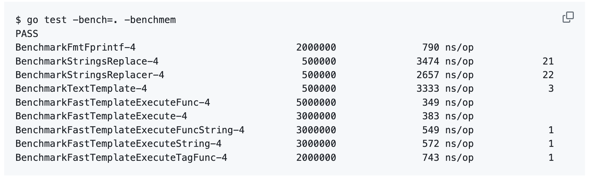

## 背景

在 [labstack/gommon 的代码中](https://github.com/labstack/gommon) 看到了这个库 [valyala/fasttemplate](https://github.com/labstack/gommon/blob/master/log/log.go#L17), 于是就去
调查了一下。

:::tip
labstack 是 [Echo Web Framework](https://echo.labstack.com/) 的 Organization。
:::

## 什么是 fasttemplate

[fasttemplate](https://github.com/valyala/fasttemplate) 是一个高效的 Go 模板引擎，比 Go 标准库的模板引擎 [`text/template`](http://golang.org/pkg/text/template/) 快很多，

而且比 [`strings.Replace`](http://golang.org/pkg/strings/#Replace), [`strings.Replacer`](http://golang.org/pkg/strings/#Replacer) 和 [`fmt.Fprintf`](https://golang.org/pkg/fmt/#Fprintf) 都要快。



具体可以看一下 [fasttemplate 的 benchmark](https://github.com/valyala/fasttemplate?tab=readme-ov-file#fasttemplate)。

## fasttemplate 的使用

### 基础用法

```go
    template := "http://{{host}}/?q={{query}}&foo={{bar}}{{bar}}"
    t := fasttemplate.New(template, "{{", "}}")
    s := t.ExecuteString(map[string]interface{}{
        "host":  "google.com",
        "query": url.QueryEscape("hello=world"),
        "bar":   "foobar",
    })
    fmt.Printf("%s", s)

    // Output:
    // http://google.com/?q=hello%3Dworld&foo=foobarfoobar
```

### 高阶用法

```go
    template := "Hello, [user]! You won [prize]!!! [foobar]"
    t, err := fasttemplate.NewTemplate(template, "[", "]")
    if err != nil {
        log.Fatalf("unexpected error when parsing template: %s", err)
    }
    s := t.ExecuteFuncString(func(w io.Writer, tag string) (int, error) {
        switch tag {
        case "user":
            return w.Write([]byte("John"))
        case "prize":
            return w.Write([]byte("$100500"))
        default:
            return w.Write([]byte(fmt.Sprintf("[unknown tag %q]", tag)))
        }
    })
    fmt.Printf("%s", s)

    // Output:
    // Hello, John! You won $100500!!! [unknown tag "foobar"]
```
