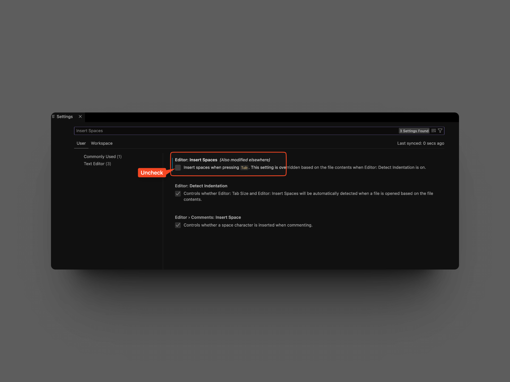

## Problem

I was trying to run a Makefile in VSCode and I got the following error:

```bash
Makefile:4: *** missing separator.  Stop.
```

## Solution

The problem is that the Makefile is using tabs instead of spaces. To fix this, you can:

1. Open the Makefile in VSCode
2. Open the command palette with `Ctrl + Shift + P` or `View > Command Palette`. If you are using a Mac, you can use `Cmd + Shift + P`
3. Search for `Convert Indentation to Tabs`

If you want to prevent this from happening in the future, you can:

1. Open settgings in VSCode with `Ctrl + ,` or `File > Preferences > Settings`. If you are using a Mac, you can use `Cmd + ,`
2. Search for `Insert Spaces`
3. Uncheck the box for `Editor: Insert Spaces`


