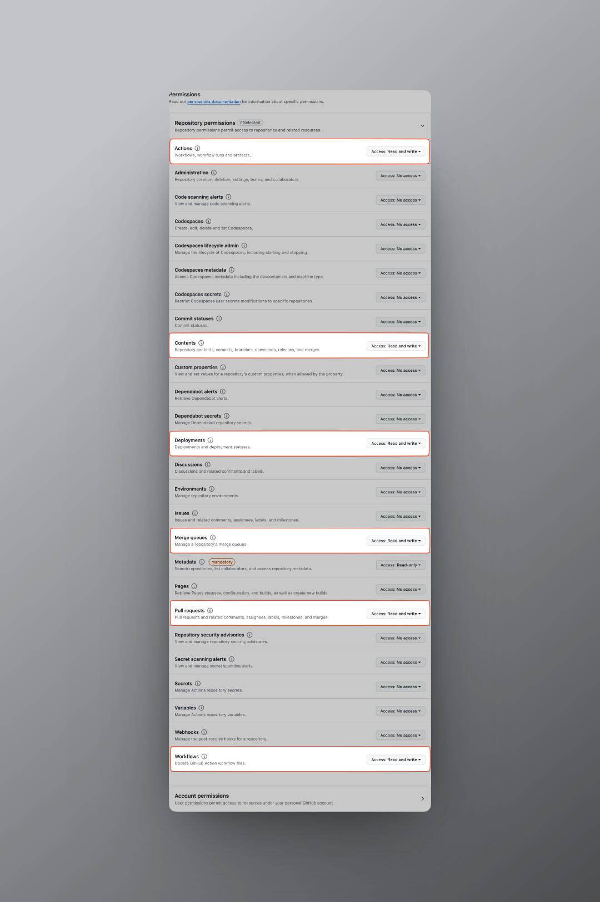

## 背景和需求

我在写博客或者周报的时候，一般会这样管理我的分支：

- 1). 创建带日期的分支，比如 `blog/2024-01-28, weekly/2024-01-28`。
- 2). 然后在这个分支上写好博客或者周报。
- 3). 创建 PR，合并到 main 分支。
- 4). 合并到 main 分支后，会触发 CD 自动部署。

步骤 3) 很容易忘记，所以我想通过 GitHub Actions 来自动化这个过程。

## 方案

创建一个 Github Actions 的 Workflow，每天定时检查分支名，

发现有**当天的日期的分支** `weekly/xxxx-xx-xx` 的时候，自动创建 PR 并合并到 main 分支。

## 实现

### 准备工作

1. 在 Github 中创建一个 [Personal Access Token](https://github.com/settings/tokens) （**PAT**），用于创建和合并 PR。（BTW，到期时间最大只能设置 2 年）
   1.1. 设置 `PAT` 的仓库权限： `Repository access` → `Only select repositories` → 选择你的仓库。
   1.2. 设置 `PAT` 的仓库访问权限： `Permissions` → `Repository permissions`。
   
2. 在仓库中[创建一个 secret](https://docs.github.com/zh/actions/security-guides/using-secrets-in-github-actions#creating-secrets-for-a-repository)，用于存放 Personal Access Token。

### 创建 Workflow

在仓库中创建 `.github/workflows/merge-pr.yml` 文件，内容如下：

```yml {4,22,25-41} showLineNumbers
name: Merge Weekly Posts Branches
on:
  schedule:
    - cron: "00 00 * * *"
  workflow_dispatch:

jobs:
  merge_weekly_branch:
    runs-on: ubuntu-latest

    steps:
      - name: Checkout repository
        uses: actions/checkout@v4

      - name: Set up Git
        run: |
          git config --global user.email "actions@github.com"
          git config --global user.name "GitHub Actions"

      - name: Create and merge PR
        env:
          GITHUB_TOKEN: ${{ secrets.GH_TOKEN }} # Personal Access Token
        run: |
          # Get the current date in the format 'YYYY-MM-DD'
          current_date=$(date +%Y-%m-%d)

          # Construct the branch name
          branch_name="weekly/${current_date}"
          # Fetch the branch to ensure it exists locally
          git fetch origin ${branch_name}

          # Check if the branch exists
          if [[ -n "$(git ls-remote origin $branch_name)" ]]; then
            git checkout ${branch_name}
            # Create a pull request using GitHub CLI
            gh pr create --base main --head $branch_name --title "weekly post PR" --body "This is a PR for weekly post changes."

            # Wait for a few seconds to allow GitHub to process the PR creation
            sleep 15
            # Merge the pull request using GitHub CLI
            gh pr merge --squash
          else
            echo "Weekly branch '${branch_name}' does not exist."
          fi
```
