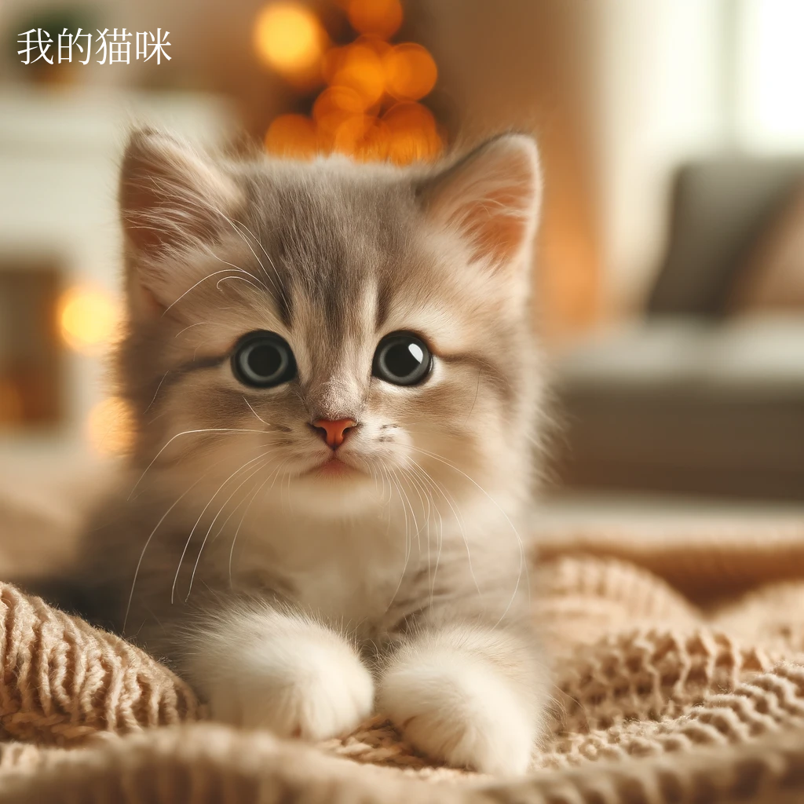

## 背景

使用 ChatGPT 生成带有中文的图片的图片时，中文会出现乱码的问题。本教程将介绍如何解决这个问题。

比如，我让 ChatGPT 生成一个带有中文的图片，输入如下：

```markdown
请生成一张猫的照片，并在照片上加上中文字 “猫咪”
```

生成的图片如下：


## 步骤

### 1. 下载中文字体，比如有名的 Noto Serif SC

下载地址：[Noto Serif SC](https://fontmeme.com/fonts/download/243308/noto-serif-sc.zip)

如果你想显示日语韩语等其他语言，可以下载 [Noto Serif CJK](https://github.com/notofonts/noto-cjk/releases/tag/Serif2.002) 字体。

下载解压后会得到以下几个像 `NotoSerifSC-xxx.otf` 这样的字体文件。

`xxx` 部分表示的是字体的粗细，可以根据自己的需要选择。

这次我们用的是 `NotoSerifSC-Regular.otf`。

### 2. 打开 ChatGPT，上传字体文件，输入你的 prompt

```markdown
请生成一张猫的图片
在图片上加入“我的猫咪” 字样
请使用附件中的字体。
```


点击 3️⃣ 下载图片。

### 3. 生成图片


### 4. 扩展

上面生成的图片，没有指定文字的位置和颜色。现在默认好像是用黑色并显示在图片的底部中间。

如果你想指定文字的位置和颜色，可以在 prompt 中加入更多的信息。

比如：

```markdown
请生成一张小猫的图片，
在图片上的左上角加入“我的猫咪” 文字，文字颜色用白色
文字请使用附件中的字体
```

生成的图片就会是这样：


