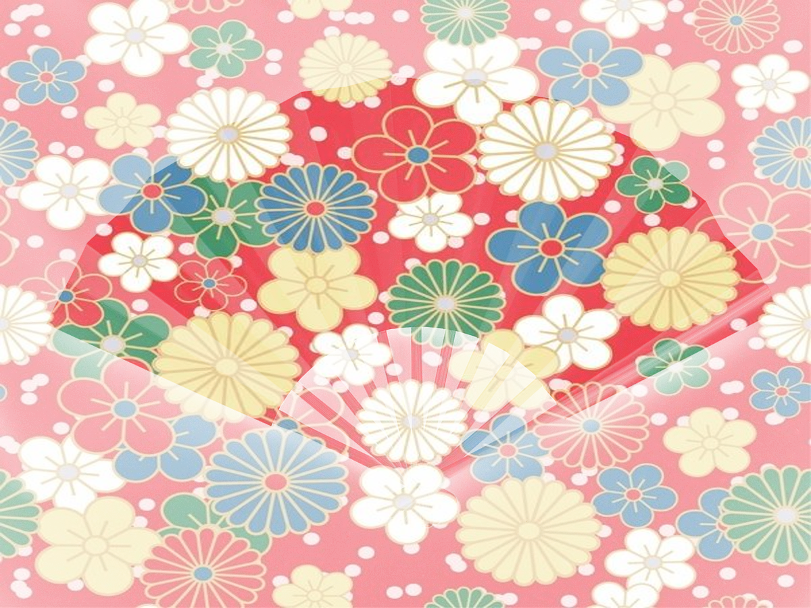

## 需求

把花纹填充到图片中可以让您的图片更具艺术感和创意。

在这篇文章中，我们将介绍如何使用 ChatGPT 来为图片添加花纹和纹理。

比如把下面的花纹填充到扇子图片中：


## 步骤

### 1. 打开 ChatGPT， 在输入框中上传图片。并输入 `@DALL・E` （一个 ChatGPT 的用于生成图片的插件）选中后，输入以下文本：

```text
把图 1 的花纹图片填入图 2 中的扇子中。
```


### 2. 点击“生成”按钮，等待 ChatGPT 生成结果。


## 补充

如果不选择 `@DALL・E` 直接使用 ChatGPT 也可以，但效果好像不如 `@DALL・E`。

下面是不选择 `@DALL・E` 的效果：


