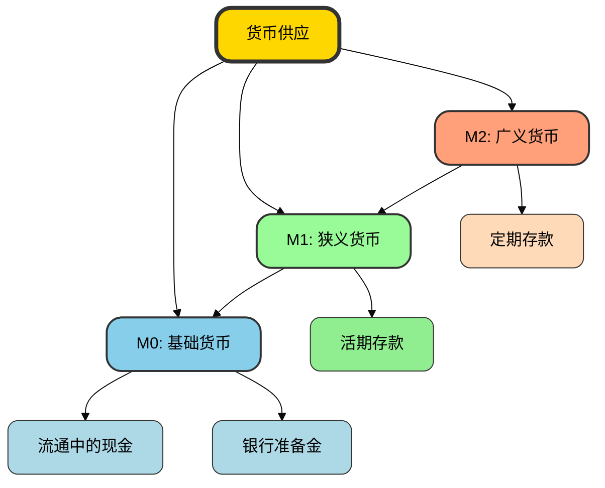

[货币供应量](https://zh.wikipedia.org/zh-cn/貨幣供應量)有 3 个定义，分别是 M0、M1 及 M2，但部分地区会定义为 M1、M2 及 M3。

- M0 = 流通中的现金
- M1 = M0 + 商业银行活期存款，称为狭义货币供应量，又称狭义货币。
- M2 = M1 + 商业银行定期存款，称为广义货币供应量，又称广义货币。

```mermaid
%%{init: {'theme': 'base', 'themeVariables': { 'fontSize': '16px' }}}%%
graph TD
    A[货币供应]
    B[M0: 基础货币]
    C[M1: 狭义货币]
    D[M2: 广义货币]

    A --> B
    A --> C
    A --> D

    B --> E[流通中的现金]
    B --> F[银行准备金]

    C --> B
    C --> G[活期存款]

    D --> C
    D --> K[定期存款]

    %% 应用样式和增加圆角效果
    style A fill:#FFD700,stroke:#333,stroke-width:4px,rx:15px,ry:15px,color:#000
    style B fill:#87CEEB,stroke:#333,stroke-width:2px,rx:15px,ry:15px,color:#000
    style C fill:#98FB98,stroke:#333,stroke-width:2px,rx:15px,ry:15px,color:#000
    style D fill:#FFA07A,stroke:#333,stroke-width:2px,rx:15px,ry:15px,color:#000
    style E fill:#ADD8E6,stroke:#333,stroke-width:1px,rx:10px,ry:10px,color:#000
    style F fill:#ADD8E6,stroke:#333,stroke-width:1px,rx:10px,ry:10px,color:#000
    style G fill:#90EE90,stroke:#333,stroke-width:1px,rx:10px,ry:10px,color:#000
    style K fill:#FFDAB9,stroke:#333,stroke-width:1px,rx:10px,ry:10px,color:#000
```
