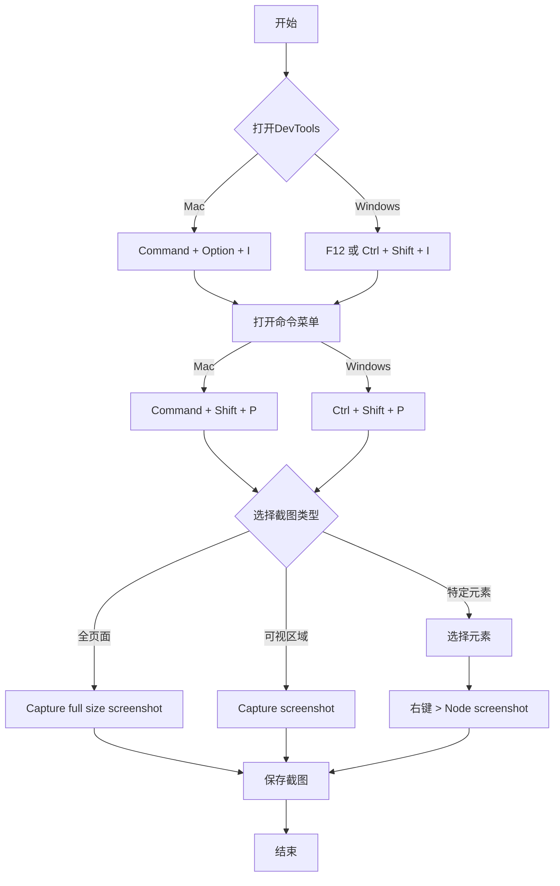

## 简介

- Chrome 浏览器内置强大的截图功能
- 无需外部工具或插件，即可获取各种类型的截图
- 本文将介绍适用于 Mac 和 Windows 用户的操作方法

## 概述

以下流程图展示了使用 Chrome DevTools 进行截图的基本步骤：

## 如何打开 DevTools

有下面几种方法可以打开 Chrome DevTools：（任选一种即可）

1. Mac: `Command` + `Option` + `I`
   Windows: F12 或 `Ctrl` + `Shift` + `I`
2. 在浏览器窗口中右击并选择"检查"
3. Chrome 菜单 > 更多工具 > 开发者工具

## 截图类型和方法

### 1. 全页面截图

- Mac: `Command` + `Shift` + `P`
  Windows: `Ctrl` + `Shift` + `P`
- 输入"Capture full size screenshot"并按 `Enter`

### 2. 可视区域截图

- 打开上述命令菜单，选择"Capture screenshot"

### 3. 特定元素截图

- 点击 DevTools 左上角的元素选择工具（光标图标）
- 在页面上点击目标元素
- 右击元素并选择"Node screenshot"

### 4. 响应式设计测试

- 点击 DevTools 顶部的设备工具栏图标（或 Mac: `Command` + `Shift` + `M` / Windows: `Ctrl` + `Shift` + `M`）
- 选择设备类型或屏幕尺寸
- 使用上述方法进行截图

## 键盘快捷键（Mac / Windows）

- 打开 DevTools: `Command` + `Option` + `I` / `F12` 或 `Ctrl` + `Shift` + `I`
- 打开命令菜单: `Command` + `Shift` + `P` / `Ctrl` + `Shift` + `P`
- 切换设备模式: `Command` + `Shift` + `M` / `Ctrl` + `Shift` + `M`

## 总结

- Mac 和 Windows 用户都能轻松使用, 无需额外软件
- 不仅适用于 Web 开发者，对普通用户也很有用
