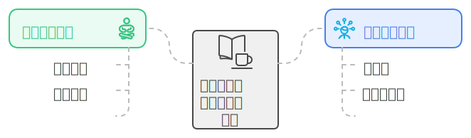

## 前言

估计东京有大约 8,000 家咖啡店。这些咖啡店类型多样，涵盖了从独立的小型咖啡馆到星巴克、Tully's Coffee 和 Doutor 等连锁品牌。东京的咖啡文化非常发达，许多白领、家庭主妇和学生都喜欢在这些咖啡店中放松或工作。包括笔者自己也是如此。😊

本文正是对我此刻在咖啡店中思考的这个问题进行的整理和反思 😄。

## 原因

结合我自身利用咖啡店的经验，可以从以下两个角度展开：心理上的放松 🧘‍♂️ 和集中注意力 🎯。

### 心理上的放松 🧘‍♀️

咖啡店作为一种“第三空间”（即介于家庭和工作场所之间的空间），提供了独特的环境，可以帮助人们从日常压力中解脱出来。这种放松不仅来源于环境的变化，还源于咖啡店的整体氛围：

- 环境氛围 🏠

咖啡店通常拥有舒适的座椅 🛋️、温暖的灯光 💡 和柔和的背景音乐 🎶。这种组合创造了一种温馨的氛围，让人们可以放松身心。在这样一个环境中，人们可以远离家庭琐事或办公室压力，享受片刻的宁静 😌。

- 社交与独处的平衡 🤝

咖啡店提供了一个既能融入社交氛围又能保持个人空间的场所。即使不直接与他人交流，看到周围人的活动也能让人感到安全和舒适 👥。这种轻微的社交联系有助于减轻孤独感，同时又不会打扰到个人的独处时光。

- 心理仪式 🛎️

许多人将去咖啡店看书或工作视为一种心理仪式。这种仪式感让他们感觉自己在为个人时间和精神健康投入精力，从而增加了心理上的满足感 😊。

### 集中注意力 🎯

- 心理上的自律感 ⏳

在咖啡店里，特别是当周围的人也在认真工作或学习时，这种环境会无形中激励个体更加自律 💪。这种自律感不仅提升了注意力，还增强了任务完成的成就感 🏆。

- 分散与专注的微妙平衡 ⚖️

在家，人们容易受到各种干扰，如家务的打断等。而在咖啡店，虽然环境变化较多，但这些变化通常是背景化的，不会直接打扰到个体的任务。这种微妙的分散与专注的平衡反而有助于人们保持长时间的集中 🕒。这点和上面“环境氛围”中提到的原因有重合之处。

- 背景噪音的作用 🎧

研究表明，适度的背景噪音可以提高人们的专注度和创造力 💡。咖啡店的环境噪音，如低语声、咖啡机的运作声，可以形成一种“白噪音”，有效地屏蔽掉更为突兀或分散注意力的声音 🔊。这种白噪音有助于人们进入“心流”状态，从而提高工作或学习效率 📈。实际上，如果家中没有干扰因素，适当的背景噪音在家里也同样有效 🏡。

## 结语 📝

咖啡店作为一个独特的空间，结合了心理放松与专注力提升的优势，成为了许多人工作、学习或阅读的理想之地 📍。在这样一个充满氛围的地方，人们不仅能找到片刻的平静，还能在温暖的咖啡香气中，找到更高效、更愉悦的工作与学习体验 📖😊。
