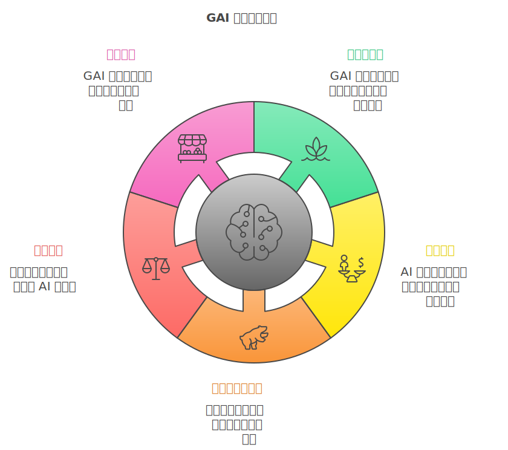
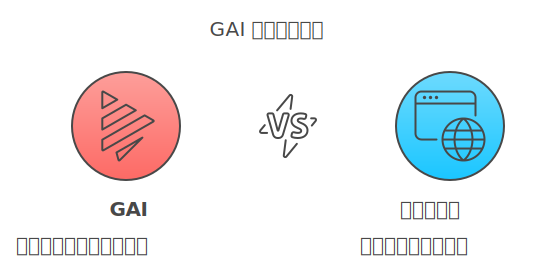

生成式人工智能（GAI）与 2000 年的互联网泡沫的区别

我认为生成式人工智能（Generative AI,简称 GAI）与 2000 年的互联网泡沫在许多方面都有所不同,尽管两者都经历了快速的发展和大量的投资。

以下是一些主要的区别：

1.  **技术成熟度**：

    - **互联网泡沫时期**：在 2000 年,互联网技术还处于初级阶段,许多商业模式尚未验证,大量公司只是凭借一个想法就获得了高额投资。
    - **GAI 现状**：生成式 AI 技术已经有了实质性的突破,例如 OpenAI 的 GPT 系列模型和 DALL·E。这些技术已经在实际应用中展现了价值,如内容创作、辅助编程和客户服务等。

2.  **商业模式和盈利能力**：

    - **互联网泡沫时期**：许多公司缺乏清晰的盈利模式,过度依赖投资者的资金支持。
    - **GAI 现状**：虽然仍有一些炒作成分,但许多 AI 公司已经找到了可持续的商业模式,例如通过订阅服务、API 接口收费等方式实现盈利。

3.  **投资者的成熟度**：

    - **互联网泡沫时期**：投资者对新兴的互联网公司过于乐观,导致估值过高。
    - **GAI 现状**：经过多次科技泡沫的洗礼,投资者更加理性,更注重公司的实际业绩和技术能力。

4.  **监管环境**：

    - **互联网泡沫时期**：监管机构对新兴互联网行业的了解和监管相对滞后。
    - **GAI 现状**：各国政府和监管机构更加积极地参与,对 AI 技术的应用和发展进行指导和规范。

5.  **市场需求和应用场景**：

    - **互联网泡沫时期**：市场对许多互联网服务的需求尚未真正形成。
    - **GAI 现状**：生成式 AI 已经在多个行业产生影响,满足了实际的市场需求。

**总结**：

虽然 GAI 的发展也存在一定的风险和炒作,但总体而言,它基于更成熟的技术,有更清晰的商业模式和实际应用,加上投资者和监管机构的成熟,使其与 2000 年的互联网泡沫有显著区别。然而,仍需警惕过度投资和高估值带来的潜在风险。

