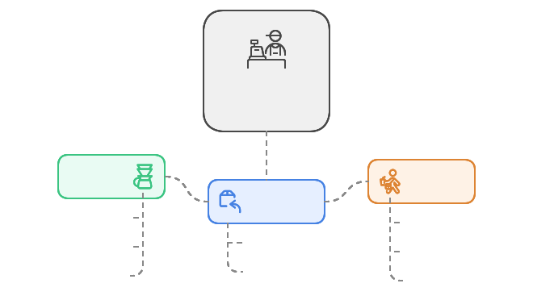

让我为您深入浅出地讲解 Golang 的 Channel 概念。

## 1. 生活类比 🌟

想象一个咖啡店的点单流程：

- Channel 就像咖啡店的取餐窗口
- 咖啡师（生产者）将做好的咖啡放在窗口
- 服务员（消费者）从窗口取走咖啡给客人
- 窗口有限制：最多放 3-4 杯咖啡
- 如果窗口满了，咖啡师需要等待
- 如果窗口空了，服务员需要等待



## 2. 技术定义 📚

Channel 是 Go 语言中的一个核心概念，它提供了 goroutine 之间的通信机制，实现了 CSP（Communicating Sequential Processes）模型。

基础示例：

```go
package main

import (
    "fmt"
    "time"
)

func main() {
    // 创建一个容量为 3 的 channel
    coffee := make(chan string, 3)

    // 生产者 goroutine
    go func() {
        drinks := []string{"拿铁", "美式", "卡布奇诺"}
        for _, drink := range drinks {
            fmt.Printf("咖啡师制作了 %s\n", drink)
            coffee <- drink  // 将咖啡放入 channel
            time.Sleep(time.Second)
        }
        close(coffee)  // 关闭 channel
    }()

    // 消费者（主 goroutine）
    for drink := range coffee {
        fmt.Printf("服务员取走了 %s\n", drink)
    }
}
```

## 3. 核心特性表 📊

| 特性   | 说明                     | 示例                                |
| ------ | ------------------------ | ----------------------------------- |
| 缓冲性 | 可以创建带缓冲的 channel | `ch := make(chan int, 3)`           |
| 阻塞性 | 当 channel 满/空时会阻塞 | 满时发送阻塞，空时接收阻塞          |
| 方向性 | 可以限制 channel 的方向  | `chan<-` (仅发送) `<-chan` (仅接收) |
| 关闭性 | channel 可以被关闭       | `close(ch)`                         |

## 4. 实践案例 💡

让我们实现一个更实用的例子：一个简单的任务处理系统

```go
package main

import (
    "fmt"
    "time"
)

// Task 代表一个待处理的任务
type Task struct {
    ID   int
    Data string
}

// Worker 代表一个工作协程
func Worker(id int, tasks <-chan Task, results chan<- string) {
    for task := range tasks {
        // 模拟处理任务
        fmt.Printf("Worker %d 开始处理任务 %d\n", id, task.ID)
        time.Sleep(time.Second)

        // 发送结果
        results <- fmt.Sprintf("任务 %d 已被 Worker %d 完成", task.ID, id)
    }
}

func main() {
    tasks := make(chan Task, 10)
    results := make(chan string, 10)

    // 启动 3 个 worker
    for i := 1; i <= 3; i++ {
        go Worker(i, tasks, results)
    }

    // 发送 5 个任务
    for i := 1; i <= 5; i++ {
        tasks <- Task{ID: i, Data: fmt.Sprintf("数据-%d", i)}
    }
    close(tasks)

    // 收集所有结果
    for i := 1; i <= 5; i++ {
        fmt.Println(<-results)
    }
}
```

## 5. 最佳实践 ⭐

我来介绍 Golang channel 处理超时的几个常用例子。

1. **使用 time.After**

   - 最简单直接的方法
   - 适合一次性的超时检查
   - 使用 `select` 和 `time.After` 实现

```go
// Example 1: Basic timeout using select and time.After
func example1() {
    ch := make(chan string)

    // Simulate slow operation
    go func() {
        time.Sleep(2 * time.Second)
        ch <- "data"
    }()

    select {
    case result := <-ch:
        fmt.Println("Received:", result)
    case <-time.After(1 * time.Second):
        fmt.Println("Operation timed out")
    }
}
```

2. **使用 context.WithTimeout**

   - Go 推荐的标准方式
   - 可以传递超时信息到多个 goroutine
   - 支持取消操作
   - 资源会自动清理

```go
// Example 2: Using context for timeout
func example2() {
    // Create context with timeout
    ctx, cancel := context.WithTimeout(context.Background(), 1*time.Second)
    defer cancel()

    ch := make(chan string)

    // Simulate slow operation
    go func() {
        time.Sleep(2 * time.Second)
        ch <- "data"
    }()

    select {
    case result := <-ch:
        fmt.Println("Received:", result)
    case <-ctx.Done():
        fmt.Println("Operation timed out:", ctx.Err())
    }
}
```

3. **使用超时通道**
   - 使用专门的超时 channel
   - 更灵活但需要手动管理
   - 适合需要自定义超时行为的场景

```go
// Example 3: Custom timeout channel
func example3() {
    ch := make(chan string)
    timeout := make(chan bool, 1)

    // Set timeout
    go func() {
        time.Sleep(1 * time.Second)
        timeout <- true
    }()

    // Simulate slow operation
    go func() {
        time.Sleep(2 * time.Second)
        ch <- "data"
    }()

    select {
    case result := <-ch:
        fmt.Println("Received:", result)
    case <-timeout:
        fmt.Println("Operation timed out")
    }
}
```

运行这段代码，你会看到三个例子都会因为超时（1 秒）而终止，因为模拟的操作需要 2 秒才能完成。

建议在实际应用中：

- 对于简单场景，使用 `time.After`
- 对于复杂应用，优先使用 `context.WithTimeout`
- 只在特殊需求下使用自定义超时通道

## 6. 常见陷阱 ⚠️

1. 向已关闭的 channel 发送数据会导致 panic
2. 重复关闭 channel 会导致 panic
3. 在没有接收者的情况下关闭 channel 可能导致 goroutine 泄漏
