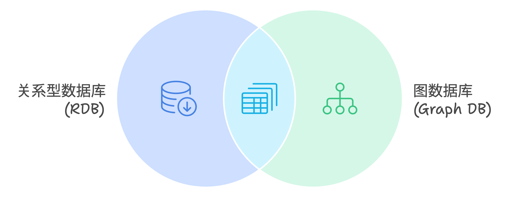
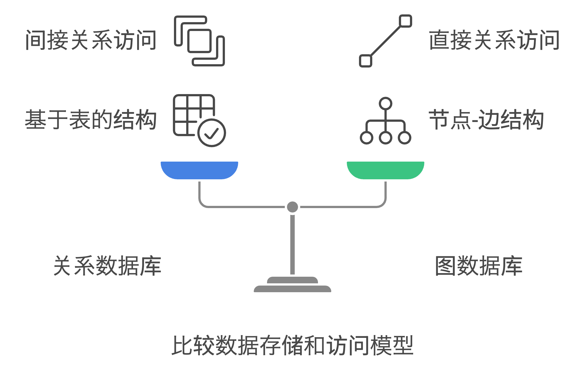
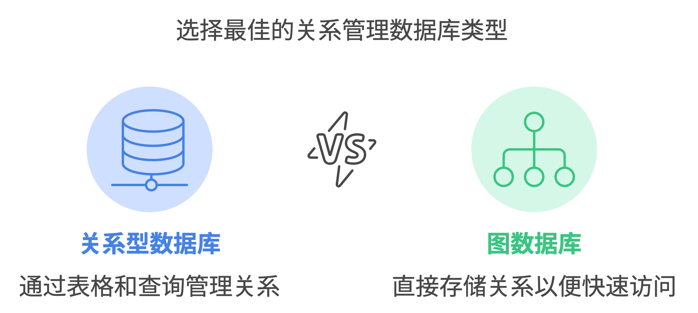

### 1️⃣ **概念上的差异**

- **RDB** 是一种类似于「Excel 表格」的数据管理方式。

  - 例如：用表格记录用户名、年龄等信息。

- **Graph DB** 则更像「关系图」，展示数据之间的连接和关系。
  - 例如：记录人与人之间的关系（朋友、关注等），像画一张有节点和线条的图。

### 2️⃣ **数据的关系表示**

- **RDB**：

  - 数据保存在「表（Table）」中，表与表之间通过「线」来建立关系。
  - 例如：
    - **用户表**：记录名字、年龄等信息。
    - **订单表**：记录用户的订单。
    - 用「ID」把这两个表连接起来，比如某个订单属于哪个用户。

- **Graph DB**：
  - 数据（节点）和关系（边）被直接存储在数据库中。
  - 例如：
    - 用户 A → [关注] → 用户 B
    - 数据和关系一体化存储，关系可以直接使用。

### 3️⃣ **举个例子：记录好友关系**

#### **RDB 的实现**

1. **用户表**：
   | 用户 ID | 名字 |
   |--------|--------|
   | 1 | 小明 |
   | 2 | 小红 |

2. **好友关系表**：
   | 用户 ID | 好友 ID |
   |--------|--------|
   | 1 | 2 |

3. **当查询“小明的好友是谁”时**：
   - 先从好友关系表找到与用户 ID 为 1 的关联，然后到用户表查出对应名字。
   - 这个过程需要一些时间。

#### **Graph DB 的实现**

1. **直接存储数据**：

   - 小明 → [朋友] → 小红

2. **当查询“小明的好友是谁”时**：
   - 直接从小明的节点找到连接的节点，查询速度非常快。

### 4️⃣ **适用场景对比**

| **类型**         | **适合 RDB 的场景**                    | **适合 Graph DB 的场景**                 |
| ---------------- | -------------------------------------- | ---------------------------------------- |
| **应用示例**     | 商品管理、工资计算、预订系统等         | 社交网络、推荐系统、知识图谱等           |
| **关系的复杂度** | 适合关系简单（如一对一、一对多）的数据 | 适合关系复杂（如多对多、多层连接）的数据 |
| **数据结构变化** | 数据结构稳定、变化不频繁时效果较好     | 数据关系经常变化的场景更有优势           |

### 5️⃣ **总结重点**

- **RDB**：通过「表格」管理数据，关系需要通过查询（如 JOIN）计算出来。
- **Graph DB**：直接存储数据之间的「关系」，可以快速访问和分析。

**简单类比：**

- **RDB**：像一本「通讯录」，记录名字和地址。
- **Graph DB**：像一张「关系网」，用线条表示谁和谁是朋友。Graph DB 在分析人与人、物与物之间复杂关系时非常强大，尤其适用于社交网络、推荐系统等场景！😊
