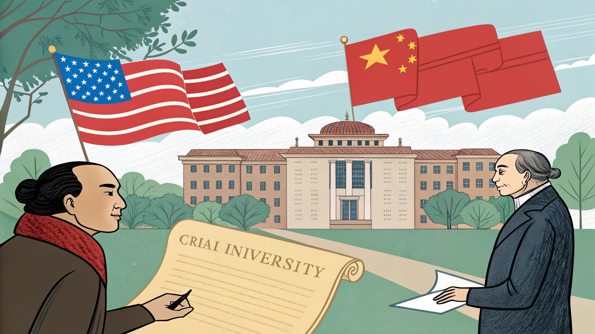

# 美国为何资助清华北大？庚子赔款背后的真相

庚子赔款，这个在中国近代史上留下屈辱记忆的名词，因其天文数字般的赔付金额和八国联军侵华的背景而被中国人所熟知。然而，与我们印象中“列强瓜分、中国受害”略有不同的是，美国却在此之后将相当一部分“应得”的庚子赔款以“教育退还”的形式返还给中国，用于创办、资助多所高校。其中最著名的案例，就是对清华和北大的资助。那么，美国为何要这样做？其中又有哪些不为人知的故事？让我们一起探寻庚子赔款背后的真相。

## 一、庚子赔款：惨痛的历史起点

1900 年，义和团运动爆发，随后八国联军进攻北京。次年，清政府与列强签订了丧权辱国的《辛丑条约》，史称“庚子条约”。中国需向包括美国在内的列强支付总额高达 4.5 亿两白银（当时约合中国财政收入的两倍）的赔款。列强按照各自出兵人数和损失进行分配，美国分得约 3244 万两白银。

在清政府承担沉重经济负担的同时，美国国内对如何使用这笔钱产生了不同意见。虽然美国在军事干预上属于列强之一，但一些美国政客、学者认为，庚子赔款金额过高，且中国在此冲突中也未必是唯一“责任方”。同时，美国有意通过文化与教育的合作在中国建立良好形象，进而扩大自身的影响力。基于这两方面的考量，美国最终选择将其中相当一部分赔款以“教育退还”的方式“返还”中国。

## 二、清华大学：庚款退还的典型案例

### 1. 清华学堂的创立

美国在“庚款退还”政策中作出的最重要决定，就是资助中国学生赴美留学，同时建立一所专门培养留学生的预备学校——清华学堂。1911 年，清华学堂在北京西郊清华园正式成立，它也成为清华大学的前身。

### 2. 留美教育的长远影响

美国将大笔庚子赔款用于支付中国留学生在美的学费和生活费，不仅培养出大批杰出人才，也为中美之间的文化、科技、学术交流搭建了桥梁。日后回国的留学生在政治、经济、教育、科技等领域都作出了巨大贡献，大大推动了中国的现代化进程。

### 3. 清华大学的崛起

在此基础上，清华大学逐步发展为中国的顶尖学府。它不仅吸引到国内外名师，也为后来中国高等教育改革与科学研究树立了标杆。美国对清华大学的资助，成为庚子赔款“教育退还”的最经典、最成功案例。

## 三、美国对北大的资助：教会与捐赠

与清华大学相比，北京大学（以下简称“北大”）的前身是京师大学堂，成立于 1898 年，时间上早于庚子条约。但在此后的发展中，北大也间接受益于美国的教育援助政策。

### 1. 燕京大学的并入

1920 年代，美国教会在华创办了燕京大学。它得到部分美国基金会与庚款退还资金的资助，在人文学科、社会科学和神学研究上卓有成效。1952 年院系调整时，燕京大学并入北大，使北大在文科领域的实力进一步增强。

### 2. 外部捐助与文化交融

美国的罗克菲勒基金会、卡耐基基金会等慈善机构也在不同阶段对北大进行过相关领域的支持。虽然这部分捐赠与庚子赔款并不完全重合，但同样体现了美国通过教育、文化来影响和融入中国的策略。北大因此在国际学术交流中受益匪浅，也为中美间的学术互动提供了平台。

## 四、除了清华和北大，美国还捐赠了谁？

### 1. 浙江大学

虽然美国对浙江大学的资助力度不如清华大学集中和声名远播，但在庚款返还及后续的基金会援助中，浙江大学（尤其在抗战时期）的部分研究设施、学术项目也获得了支持，帮助其在艰难环境下维持教学与科研。

### 2. 金陵大学、圣约翰大学、燕京大学等

美国基督教会在华建立了多所教会学校，其中金陵大学（后并入南京大学）、圣约翰大学（上海）和燕京大学（北京）都曾部分获益于美国的教育援助。除了大学层面，庚子赔款的“教育退还”也涵盖了一些中学教育项目，为基层师范和中小学培养提供了帮助。

## 五、美国“变相退还”的背后逻辑

美国之所以会采用“教育退还”而不是直接把钱交还给清政府，既有道义上的考量，也带有极强的外交意图：

1. **道义与形象：**由于国内部分舆论认为庚子赔款对中国过高、过苛，美国希望通过“退还”以减轻自身在国际社会的道德压力，树立“开明”形象。
2. **培养友好势力：**通过资助教育，培养对美国文化、价值观有认同感的中国精英，便于在未来的国际格局中获得中国的支持与合作。
3. **扩大软实力：**教育是一种最持久、最有效的软实力。美国在华的教育资助塑造了大量精英群体，也为美国赢得了更多的国际发言权和学术影响力。

## 六、其他国家的处理方式

与美国相对积极的“庚款退还”做法不同，其他列强处理庚子赔款的方式并不相同：

- **英国**：部分用于支持香港大学、金陵女子大学（后并入南京大学），但规模不大。
- **法国**：资金主要用于文化和教会教育，虽有一定投入，但并未形成大规模“退还”之势。
- **日本、俄国**：不仅未退还，还将赔款用于扩军或直接侵占中国领土与权益。
- **德国、意大利**：基本据为己有，未见明显退还或教育支持的记录。

## 七、结语：庚子赔款带来的历史反思

庚子赔款无疑是一段令国人痛心的历史，也标志着晚清政府在列强压迫下的丧权辱国。然而，在这笔庞大的赔款使用和分配中，美国的“教育退还”策略客观上推进了中国的现代教育发展。清华、北大等著名学府的崛起，不仅培养了大批学术与社会精英，也为后来的中美文化、学术交流打开了一扇大门。

回望历史，庚子赔款的背后交织着列强瓜分、国弱民穷、国际外交与文化教育等诸多因素。对于中国而言，这既是一次血的教训，也是一次曲折的机遇。美国的捐赠并非“免费午餐”，但不争的事实是，它的确帮助中国建立起了一系列优质高等教育机构。

在当今全球化背景下，如何看待历史，如何处理国际关系与文化交流，仍然值得我们深思。清华和北大，正是这一段历史的最好见证，也承载了百年来中美教育合作与博弈的故事。庚子赔款背后的真相，或许比我们想象中更复杂，而最重要的启示，便是国家的自主发展和对教育的重视才是强国之本。只有在此基础上，中国才能在国际舞台上屹立不倒，拥有更多的话语权与主动权。

## 参考与出处

1. [《辛丑条约》](https://baike.baidu.com/item/辛丑条约)
2. 《清华大学史料选编（1911-1949）》，清华大学出版社
3. 《金陵大学与近代中国教育》，南京大学出版社
4. 《燕京大学校史资料汇编》，北京大学出版社
5. 美国国家档案与记录管理局（NARA）收藏的部分中美外交档案
6. 罗克菲勒基金会、卡耐基基金会官网历史资料
7. 汪朝光, 《庚款与清华: 近代中美关系与教育外交》，社会科学文献出版社

> 以上资料综合自各大出版社与档案馆的历史文献及公开信息，若有不尽完善之处，欢迎指正。
