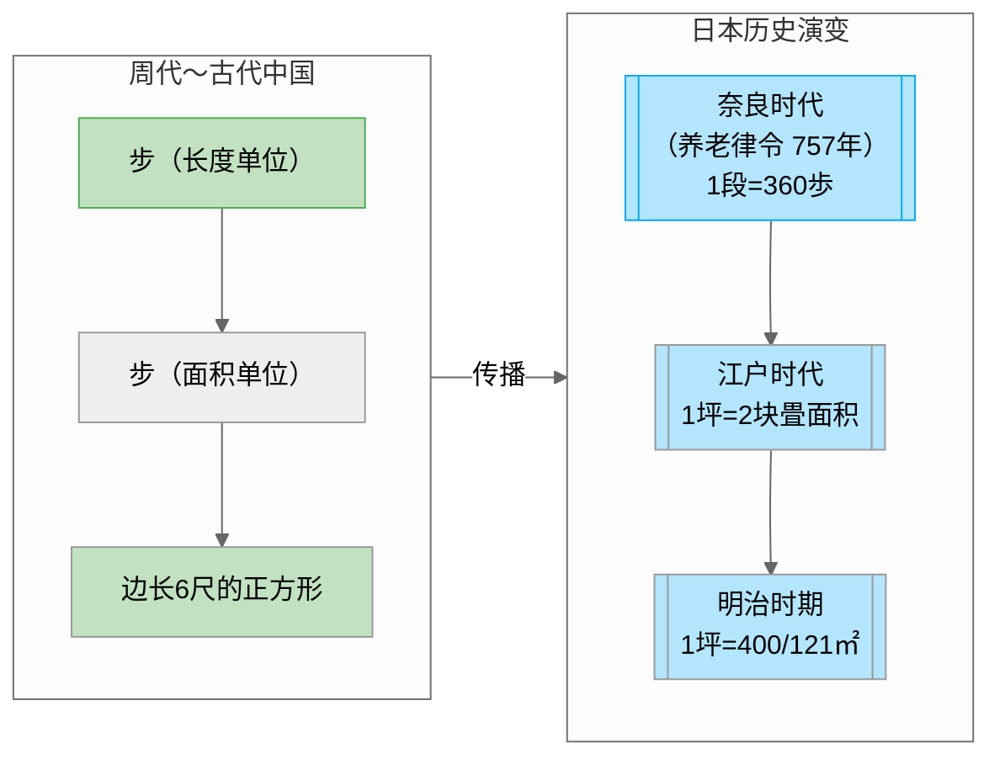

## 【日语】 坪（つぼ）作为面积单位的由来

坪（つぼ）作为面积单位的由来可追溯至中国古代，并在日本历史中经过多次演变与标准化。以下是其起源和发展的关键点：

## 1. 中国起源：从「步」到「坪」

- **「步」的双重含义**：  
  中国周代时期，「步」既是长度单位（成年男子两个步幅的距离），也是面积单位（边长一步的正方形面积）。这一概念奠定了面积测量的基础。
- **单位演变**：  
  随着时间推移，「步」的面积定义逐渐标准化为**边长 6 尺的正方形**，成为古代土地丈量的重要单位。

## 2. 日本的引入与发展

- **奈良时代与《养老律令》**：  
  日本在 757 年制定的《养老律令》中，首次将土地面积单位「步」用于税收计算，规定「1 段=30 步 ×12 步=360 步」。此时「步」的发音为「ひとつほ（hitotsuho）」，被认为是「坪（つぼ）」的语源演变。
- **江户时代的榻榻米关联**：  
  江户时期，1 坪被定义为**2 块标准榻榻米（畳）的面积**，而 2 块榻榻米拼合后形成的正方形边长为 6 日尺（约 1.818 米），进一步强化了坪的实用性。
- **明治时期的标准化**：  
  明治政府统一度量衡，规定 1 日尺=10/33 米，因此 1 坪=6 日尺 ×6 日尺=400/121 平方米 ≈3.305 平方米，此标准沿用至今。

## 3. 与农业和税收的关联

- **太閤検地的影响**：  
  丰臣政权时期的土地丈量改革（太閤検地）中，1 坪被定义为可生产 3 合米（约 450 克）的稻田面积。这一标准将土地面积与粮食产量直接挂钩，强化了坪在农业社会中的功能性。
- **单位层级体系**：  
  日本尺贯法中，坪与其他单位形成层级关系（如 1 町=10 反 ≈1 公顷），便于土地管理与税收计算。

## 4. 现代沿用与文化意义

- **日本的传统延续**：  
  尽管 1966 年日本全面推行公制，但坪仍在建筑和不动产领域广泛使用，尤其在木结构房屋中，因与榻榻米尺寸直接关联，保留了文化惯性。
- **台湾与韩国的传播**：  
  日本殖民时期（1895 年台湾、1910 年朝鲜半岛）引入坪单位，至今两地民间仍普遍使用，尽管官方已改用公制。

## 总结

坪的起源根植于中国古代的「步」，经日本奈良时代的法律化、江户时代的实用化，最终在明治时期完成标准化。其发展历程不仅反映了度量衡的演变，更与农业社会需求、殖民历史及文化认同紧密关联。尽管公制普及，坪作为传统单位仍在特定领域保留生命力，成为东亚地区独特的度量文化符号。
