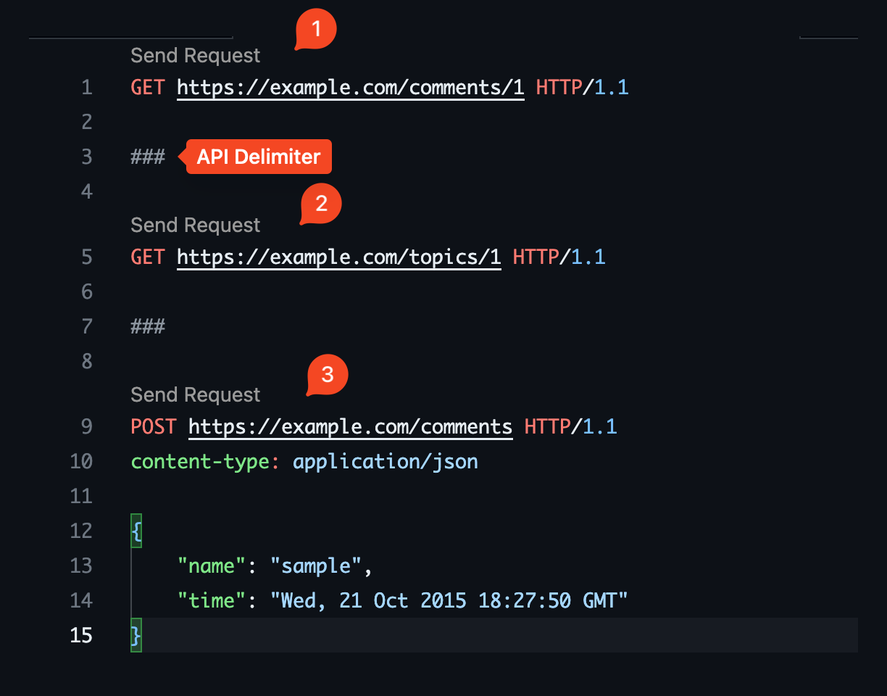

## 资源命名

- 使用**名词**来表示资源，而不是动词

  - 比如 `GET /users` 而不是 `GET /getUsers`

- 使用**复数形式**来表示资源
  - 资源表示的是一类事物，用复数形式来表示更加合理。
  - 比如 `GET /users` 而不是 `GET /user`。
  - 有时候，单数形式可能更易于理解，比如添加一个用户的 API `POST /user`。
    但是，这样的 API 会导致资源命名不一致，而且会增加用户的理解成本。
    个人建议根据 [KISS 原则](https://zh.wikipedia.org/wiki/KISS原则)，使用复数形式 `POST /users` 。

## 数据格式

- 尽量使用 JSON 作为数据交换格式，而非 xml 等等。
  - JSON 是一种轻量级的数据交换格式，易于理解和使用。

## 路径设计

- 路径中尽量包含版本号。
  - 比如 `GET /v1/users` 。
  - 这样可以避免 API 的不兼容性，同时也可以方便的进行版本控制。

## 一些好用的工具和方法

### 编写 API 的工具

- VSCode 插件

  - [redhat.vscode-yaml](https://marketplace.visualstudio.com/items?itemName=redhat.vscode-yaml): YAML 语法高亮和提示(autocompletion)。
  - [OpenAPI (Swagger) Editor](https://marketplace.visualstudio.com/items?itemName=42Crunch.vscode-openapi)
  - [Redocly OpenAPI](https://marketplace.visualstudio.com/items?itemName=Redocly.openapi-vs-code)
    - 除了语法高亮和提示等一些功能外，还可以支持提取(peek) API 中的 request 和 response 成 components。
      
    - 支持多个文件。
    - 自定义规则。（通过配置 `.redocly.yaml`）
    - 带模板
      

- [VSCode Extension: OpenAPI (Swagger) Editor](https://marketplace.visualstudio.com/items?itemName=42Crunch.vscode-openapi)
- [Swagger Editor](https://editor.swagger.io/): 在线编辑 API 文档。
- [Stoplight Studio](https://github.com/stoplightio/studio)。

### 编写 API 的实践

TODO
https://qiita.com/yuya_sega/items/0670bd1e9dd7af567fa1

### 测试 API 的工具

[Postman](https://www.postman.com/) 就不多说了，大家都知道。

- VSCode 插件
  - [VSCode REST Client](https://marketplace.visualstudio.com/items?itemName=humao.rest-client)
    - VS Code 插件，可以直接在 VS Code 中测试 API。
    - 优点： 文本格式，不用切换窗口，方便快捷。
    - 
- [RapidAPI Client](https://marketplace.visualstudio.com/items?itemName=RapidAPI.vscode-rapidapi-client)
  - 不习惯文本格式的可以试试这个。

### 生成代码

## 一些好的设计案例

- [Github gists API](https://developer.github.com/v3/gists)
- [Stripe API](https://stripe.com/docs/api)

## Reference

[Best Practices for Designing a Pragmatic RESTful API](https://www.vinaysahni.com/best-practices-for-a-pragmatic-restful-api)

[翻訳: WebAPI 設計のベストプラクティス](https://qiita.com/mserizawa/items/b833e407d89abd21ee72)

[「WebAPI 設計のベストプラクティス」に対する所感](https://qiita.com/ryo88c/items/0a3c7861015861026e00)

[Microsoft RESTful Web API の設計](https://docs.microsoft.com/ja-jp/azure/architecture/best-practices/api-design)
