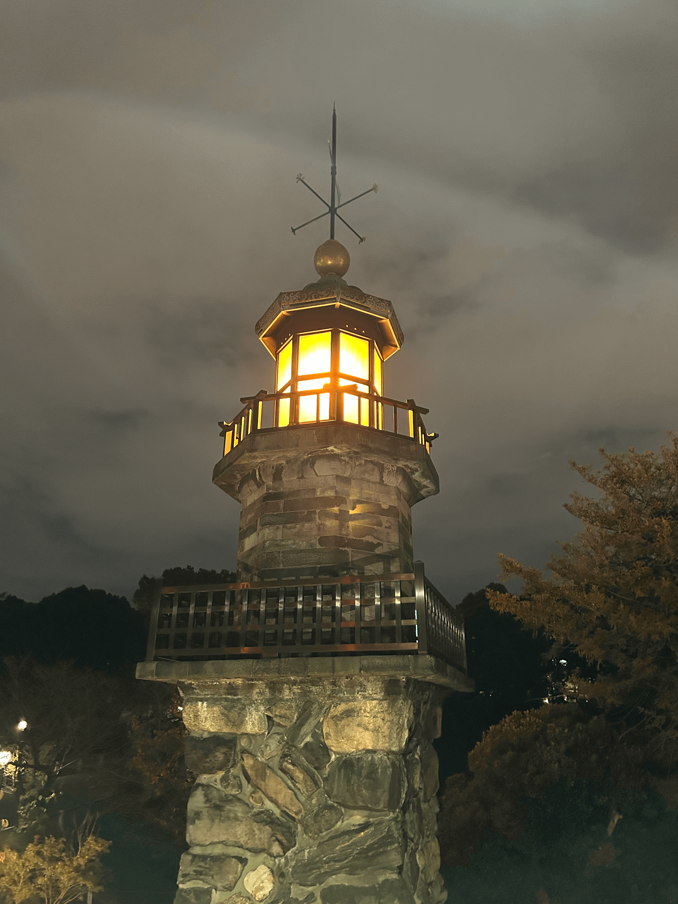

- 封面图: [高燈篭 常燈明台](https://www.google.com/maps/place/%E9%AB%98%E7%87%88%E7%AF%AD+%E5%B8%B8%E7%87%88%E6%98%8E%E5%8F%B0/@35.6947757,139.7487813,3a,75y,90t/data=!3m8!1e2!3m6!1sAF1QipP8gDNc7eDOEp1JJRMd2JkEYbQ45FWcP69NIpD2!2e10!3e12!6shttps:%2F%2Flh5.googleusercontent.com%2Fp%2FAF1QipP8gDNc7eDOEp1JJRMd2JkEYbQ45FWcP69NIpD2%3Dw224-h398-k-no!7i2268!8i4032!4m12!1m2!2m1!1z5Lmd5q615LiLIOODqeODs-ODlw!3m8!1s0x60188c6bb68eb8cd:0x9d258873e70f7002!8m2!3d35.6947757!4d139.7487813!10e5!14m1!1BCgIgAQ!16s%2Fg%2F11c5g40q6j) : 好像是明治时代的招魂灯。



## 工具

### 1. [Raycast](https://www.raycast.com/) 插件

#### 1.1 图片压缩插件

作为图片压缩工具，以前一直用 [tinyPNG](https://tinypng.com/)。

但是每次都要打开网页，然后上传图片，下载，还是有点麻烦的。

所以我找了个它的 `Raycast` 插件 [TinyPNG](https://www.raycast.com/kawamataryo/tinypng) 。

:::note
不过这个插件需要调用 `tinyPNG` 的 API，所以需要注册一个账号获取 API key。

喜欢单独的 App 的话， [**ImageOptim**](https://imageoptim.com/command-line.html) 也是个不错的选择。

它还有个第三方包装的 CLI 工具 [**ImageOptim-CLI**](https://github.com/JamieMason/ImageOptim-CLI),
之后有时间考虑写个 Raycast 的插件调用它应该蛮方便的。
它可以通过 `brew` 和 `npm` 安装， 但是 `brew` 安装方式好像只支持 x86_64，当然可以先安装 `Rosetta` 。
**建议还是用 `npm` 安装**。

```bash
brew install imageoptim-cli
imageoptim-cli: The x86_64 architecture is required for this software.
Error: imageoptim-cli: An unsatisfied requirement failed this build.
```

```bash
npm install -g imageoptim-cli
```

:::

#### 1.2 图片滤镜插件

在找 tinyPNG 插件的时候，发现了一个图片滤镜和格式转换插件 [Image Modification](https://www.raycast.com/HelloImSteven/sips) ，一起分享给大家吧。 😺


### 2. Chrome 插件

#### 2.1 [Vimium](https://chrome.google.com/webstore/detail/vimium/dbepggeogbaibhgnhhndojpepiihcmeb)

像用 vim 一样操作浏览器。

### 3. Terminal(终端)插件

#### 3.1 [fig](https://fig.io/)

一个命令行的自动补全插件，可以自动补全命令，参数，文件名，路径等等。

还支持插件， 配置 dotfiles 仓库。

现在好像已经被 [AWS 收购了](https://fig.io/blog/post/fig-joins-aws)，不知道以后会不会收费。😅

不过，最近**微软也开源了类似的工具** [inshellisense](https://github.com/microsoft/inshellisense), 有兴趣的可以试试。


