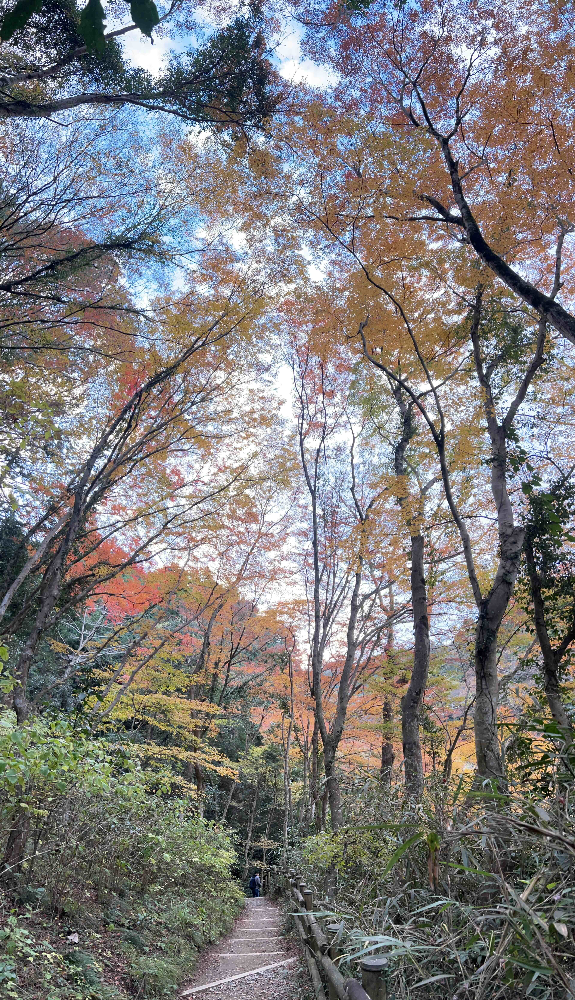

上周太忙（借口 😄），没能写周报，这周继续。

## 封面图 : 东京高尾山的红叶

:::tip
[高尾山](https://ja.wikipedia.org/wiki/高尾山) 是位于东京都八王子市的一座山，海拔 599 米。号称是日本（甚至是世界）最多人登山的山。
登山路线有很多，从山脚到山顶有缆车和缆车，也可以选择徒步。具体可以参考[高尾山登山路线](https://www.takaotozan.co.jp/course/)。
:::

## 一些有趣的新闻

### 1. [SpaceX](https://twitter.com/SpaceX) 又在试飞火箭 🚀 了， 很是壮观

在推特直播，本来很多人关注，何曾想被 OpenAI 的新闻抢了风头。

<blockquote class="twitter-tweet">
View from atop the tower at liftoff <a href="https://t.co/qbXqbXAO8A">pic.twitter.com/qbXqbXAO8A</a>
&mdash; SpaceX (@SpaceX) <a href="https://twitter.com/SpaceX/status/1726666641826857261?ref_src=twsrc%5Etfw">November 20, 2023</a></blockquote>

### 2. [OpenAI](https://twitter.com/openai) 的 CEO [Sam Altman](https://twitter.com/sama) 被自己公司的董事会解雇了

大概的瓜 🍉 是这样的。

OpenAI 的 CEO Sam Altman 在推特（X）上突然发推说被董事会开除了。

然后微软的 CEO [Satya Nadella](https://twitter.com/satyanadella) 就马上把他请到了微软，并说也给其他 OpenAI 的员工保留岗位并提供巨额奖金。

OpenAI 认命了新的 CEO。

OpenAI 的大概 9 成的员工抗议，说 Sam Altman 如果不把 Sam Altman 请回来，就辞职。

隔了一天，OpenAI 的董事会就宣布 Sam Altman 重新担任 CEO。

### 3. 東京ミッドタウン日比谷 的 Magic Time 灯光秀

- 时间：2022/11/17 ～ 2023/2/14

- 地点：[東京ミッドタウン日比谷]((https://www.hibiya.tokyo-midtown.com/jp/event/5874/)

1 楼的广场布置的很漂亮。 推荐去 6 楼会场，有咖啡店，饭店，还有个露天的提供沙发 🛋 观景台。

## 一些有用的工具

### 1. [vavebg](https://vavebg.com/) : AI 生成的壁纸网站

质量很不错，可以看看。

将来 AI 生成的内容会越来越多，大概率会出现一些关于版权问题的争议，甚至会出现一些法律问题。

### 2. 名人的声音合成

[@charliebholtz](https://twitter.com/charliebholtz) 利用 GPT-4V 和 ElevenLabs 的语音克隆技术模仿[大卫·爱登堡（BBC 野生动物纪录片解说）](https://zh.wikipedia.org/zh-cn/%E5%A4%A7%E5%8D%AB%C2%B7%E7%88%B1%E7%99%BB%E5%A0%A1)的声音来解说自己的生活。

大概的流程是这样的：

作者把摄像头捕捉的图像发给 GPT-4 Vision 分析图像并生成文本

→ 通过 ElevenLabs 把文本转换成阿滕伯勒的声音

你可以用同样的方法让志玲姐姐来解说你的生活。😄

作者还在 GitHub 上[开源了代码](https://github.com/cbh123/narrator)，有兴趣的可以看看。

> 具体可以[看这里](https://twitter.com/xiaohuggg/status/1726462766553387285)

### 3. My GPT 制作用的数据爬取工具

开通 ChatGPT Plus 之后，就可以自己训练自己的 GPT 模型了，但是需要自己准备数据。

[gpt-crawler](https://github.com/BuilderIO/gpt-crawler) 可以帮助你爬取指定的网站并生成能上传到 ChatGPT 的数据格式（json 文件）。

### 4. [Screen-to-code](https://github.com/abi/screenshot-to-code)

一个利用 GPT-4 Vision 把截图转换成 HTML/Tailwind CSS 代码的工具。

### 5. 免费的压缩比很高的视频压缩工具 [HandBrake](https://handbrake.fr/)

而且[开源](https://github.com/HandBrake/HandBrake)，支持 Windows，Mac，Linux。

## 日文学习

一些低情商-高情商的日文表达方式对比 😄

> 具体可以截图上的作者的推特。

## 娱乐

- 很多男人的终极梦想？😄 在地下建一个秘密基地

https://twitter.com/cooltechtipz/status/1725733016130249109

> Built The Most Secret Underground Tunnel Shelter.
