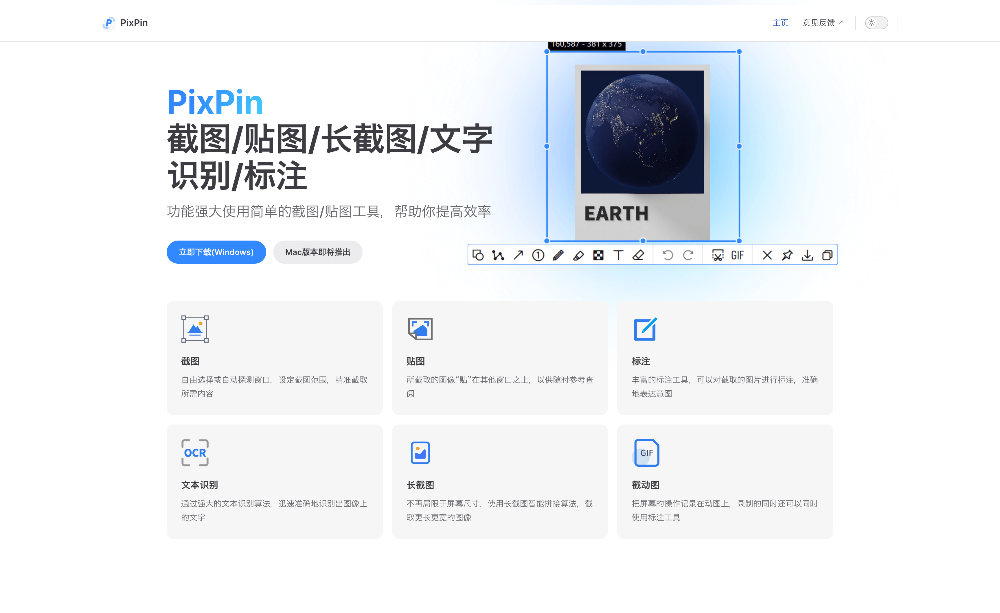
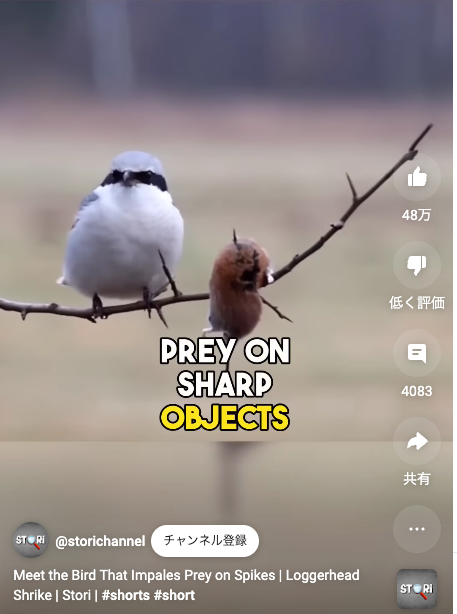

# 2023-12-10

## 封面图 :  

我一直以为这种花是绣球花的一种，但是好像叫做[马缨丹](https://zh.wikipedia.org/zh-cn/馬纓丹), 别名也称为**五色梅、五彩花**。

花落之后会结绿色的果实，成熟后的果实呈黑紫色，**果实与茎叶都含有毒性**。

由于极其粗生，无论雨水充足，抑或干旱地区，都见其影踪，甚至赶绝原生草木，被列为**世界百大外来入侵种**。

## 本周新闻

### 1. [Django 5.0 released](https://docs.djangoproject.com/en/5.0/releases/5.0/)

### 2. 阿里巴巴智能计算研究院发布了[Animate Anyone](https://github.com/HumanAIGC/AnimateAnyone)，一个可以把静态图片和预设动作转换成动画的AI工具

阿里巴巴发布了该工具的论文和演示视频，但是没有开源代码。

结果过了几天，字节（ByteDance）直接就放出了类似的项目并提供了代码和演示。

* 项目及演示：https://showlab.github.io/magicanimate/
* 论文：https://arxiv.org/abs/2311.16498
* 源码：https://github.com/magic-research/magic-animate
* Huggingface在线测试： https://huggingface.co/spaces/zcxu-eric/magicanimate
* Colab在线测试：https://colab.research.google.com/github/camenduru/MagicAnimate-colab/blob/main/MagicAnimate_colab.ipynb

> Reference: https://twitter.com/xiaohuggg/status/1731868943340707855

### 3. 美国国防部长雷蒙多直接点名英伟达，要求英伟达停止向中国出售芯片

美国国防部长雷蒙多警告英伟达等芯片公司，不要企图通过围绕分界线重新设计芯片来向中国出售。


### 4. Meta 开源了它们的样式系统 StyleX

它们整个产品都使用了这套样式系统，包括：Facebook，Instagram，Whatsapp 等。

在官网的文章中，有一篇 [Thinking in StyleX](https://stylexjs.com/docs/learn/thinking-in-stylex/) 详细阐述了为什么 StyleX 会存在，

现在的BEM/Utility Classes 存在的问题以及解决了什么问题，值得大家好好读下。

> [Reference](https://twitter.com/vikingmute/status/1733304660042383659)

## 效率工具

### 1. [Excalidraw](https://excalidraw.com/)

Excalidraw 把他们的文本到图表的功能[开源](https://github.com/excalidraw/excalidraw)了。

举个例子，输入下面的文本，就可以生成下面的图表(付带 Mermaid的code)。

```text
how git work in sequence diagram
```


### 2. Raycast插件： [Year in Progress](https://www.raycast.com/thomas/year-in-progress)

显示今年已经过了多少天，还剩多少天。

时刻提醒自己时间的宝贵。😄


### 3. Better Go Playground: goplay.tools

Golang 官方提供的 [Go Playground](https://play.golang.org/) 不是很好用，比如 format 代码会把 3rd party 包去掉。

[goplay.tools](https://goplay.tools/) 是一个更好用的 Go Playground（[而且开源](https://github.com/x1unix/go-playground)），除了官方的 Go Playground的功能外，还支持了以下功能：

* 支持下载 3rd party 的包
* 可选的编程字体：Fira Code, JetBrains Mono等
* 支持 VIM 模式

### 4. 截图/贴图工具: [PixPin](https://pixpinapp.com/)

截图工具也内卷的厉害😄。

PixPin 是一个截图/贴图工具，现在只支持支持 Windows，Mac版本即将推出。



## 技术知识

### 1. [わかりやすい説明のための 10 の鉄則（中文：简单易懂的表达的 10 条原则）](https://speakerdeck.com/e869120/wakariyasuisetsumei-10-tessoku)

最近 X 上很火的东京大学在读学生写的关于简单易懂的表达的 10 条原则，并出版了书籍。

在大学有效地学习的同时，把自己的心得写成文章和书籍，顺便还能赚钱，真是太棒了。😄

### 2. git支持提交空 commit

原来git 支持提交空 commit，可以用来触发 CI/CD 的工作流。

```bash
git commit --allow-empty -m "Empty commit to trigger workflow"
```

当然还是建议用 gh cli 在本地来触发 CI/CD 的工作流。

```bash
gh workflow run <workflow-name> --ref <branch-name>
```

> Reference: [How to Push an Empty Commit in Git?](https://www.scaler.com/topics/git/git-empty-commit/)

### 3. docker-compose.yml 中重复利用变量

如果你的 docker-compose.yml (>= `v3.4`) 中有很多地方需要用到同一个变量，可以利用 YAML 的 `anchor` 和 `alias` 来实现。

如下面的例子，`MYSQL_DATABASE` 变量在 `db` 和 `backend` 两个服务中都用到了,

我们可以把 `MYSQL_DATABASE` 变量定义在 `x-mysql_database` 中，然后在 `db` 和 `backend` 中用 `*MYSQL_DATABASE` 来引用。

`x-mysql_database` 中的 `&MYSQL_DATABASE` 是 `anchor`，`db` 和 `backend` 中的 `*MYSQL_DATABASE` 是 `alias`。

docker-compose.yml 中以 `-x` 开头的变量，docker 不会去解析其结构，所以即使结构不完整也不会有警告。

```yaml {3-7,13,18} showLineNumbers
version: '3.9'

x-mysql_root_password: &MYSQL_ROOT_PASSWORD "sample"
x-mysql_database: &MYSQL_DATABASE "sample"
x-mysql_user: &MYSQL_USER "sample"
x-mysql_password: &MYSQL_PASSWORD "sample"
x-mysql_host_name: &MYSQL_HOST_NAME "db"

services:
  db:
    image: mysql:8
    environment:
      MYSQL_DATABASE: *MYSQL_DATABASE
    ...
  backend:
    ...
    environment:
      MYSQL_DATABASE: *MYSQL_DATABASE
    ...
```

### 4. Golang 中的 处理钱的库

我们知道在 Golang 中，`float64` 是不适合用来处理钱的，因为 `float64` 会有精度问题。

所以在 Golang 中，如果我们有高精度要求，可以用类似 [shopspring/decimal](https://github.com/shopspring/decimal) 这样的库来处理。

但是，这个库会把数据保存成 `string`，这样在做计算的时候，就需要先把 `string` 转成 `decimal`，然后再做计算。

mercari 为了解决这个问题，开发了 [mercari/go-bps](https://github.com/mercari/go-bps) 这个库, 有需求的朋友可以看看。

> Reference: [料率計算における小数点数の扱いについて](https://engineering.mercari.com/blog/entry/20201203-basis-point/)

### 5. 用 ChatGPT 学习英语

<blockquote class="twitter-tweet"><p lang="zh" dir="ltr">AI英语老师 <a href="https://t.co/l71SvqaCum">pic.twitter.com/l71SvqaCum</a></p>&mdash; 瞎玩菌 (@Blind___Gamer) <a href="https://twitter.com/Blind___Gamer/status/1731307112922566863?ref_src=twsrc%5Etfw">December 3, 2023</a></blockquote> <script async src="https://platform.twitter.com/widgets.js" charset="utf-8"></script>

## 语言学习

### 1. 日语： 栄枯盛衰 (えいこせいすい)

栄枯盛衰 (えいこせいすい) 是日语中的四字熟语，就字面意思 😸。

例子： フロントエンド（技術）は栄枯盛衰早すぎてやばい。
意思： 前端（技术）的兴衰太快了，太可怕了。
> 引用自 同事语录

## 生活趣味

### 1. 日本的[故乡纳税](https://ja.wikipedia.org/wiki/ふるさと納税)

喜欢户外产品的朋友，可以看看 [新潟県 三条市](https://item.rakuten.co.jp/f152048-sanjo/) 的产品。


### 2. Shrike (伯劳鸟🐦‍) 是怎么捕食有毒的猎物的



有一种鸟叫做 Shrike (伯劳鸟🐦‍)，它会把在捕食到有毒的猎物，

会把猎物的身体刺穿到像树枝等尖锐的东西上，等待猎物的毒素挥发掉，再回来吃掉猎物。

> Insect: "I'm toxic"
>
> Shrike: "I know" 👀
>
> Insect: 😨

https://www.youtube.com/shorts/tKmjlR-IRW4

### 3. AI版黄家驹唱 灌篮高手主题曲 "只到世界的尽头"

<iframe width="560" height="315" src="https://www.youtube.com/embed/uCNAvgjaKQw?si=-Nj3MVhbDTM_XxLD" title="YouTube video player" frameborder="0" allow="accelerometer; autoplay; clipboard-write; encrypted-media; gyroscope; picture-in-picture; web-share" allowfullscreen></iframe>

### 4. 艺术之家父母是怎么催孩子结婚的😄


https://youtube.com/shorts/6Bv69KwIXUA?si=VHomTCSDwJkHtpS5