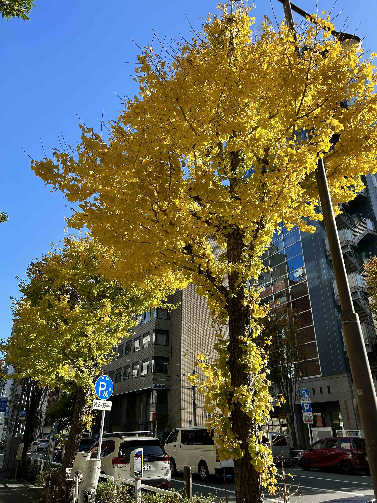
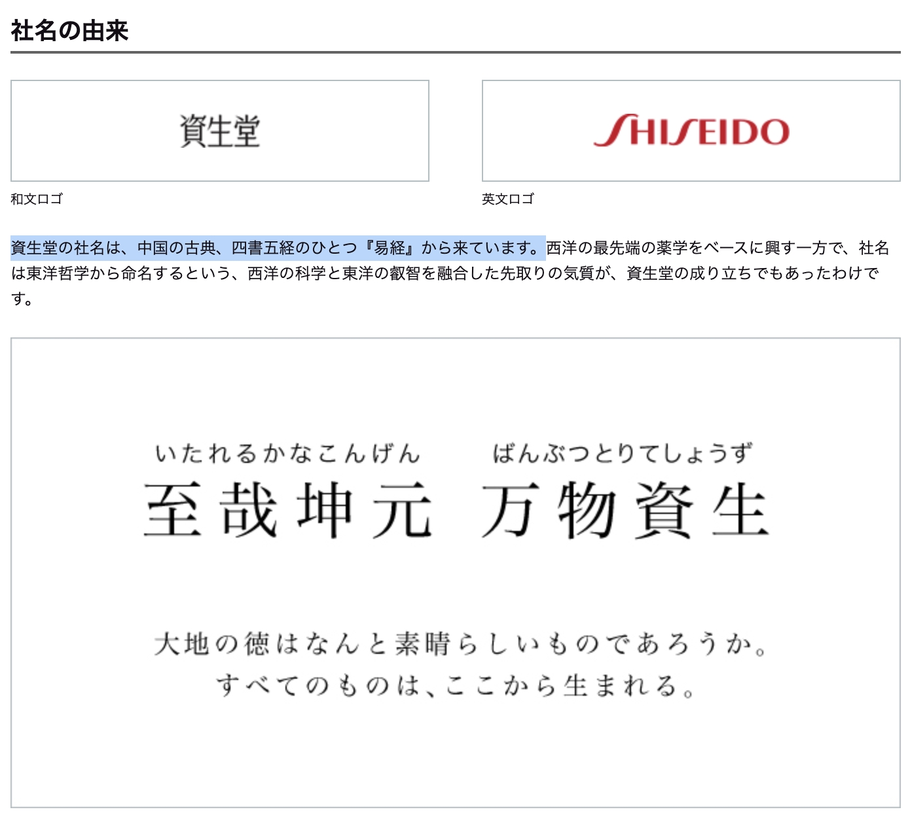

# 2023-12-17

## 封面图 : 东京都的代表之树，银杏树

一到这个季节，银杏树的叶子就会变成金黄色，非常漂亮，就是掉落在地的果实有点臭。

## 本周新闻

### 1. 女神周海媚走了

> 2023 年 12 月 12 日，周海媚工作室官博发文：周海媚因病医治无效，于 2023 年 12 月 11 日去世。

百度百科还有心地把她的页面改成了灰色。

## 效率工具

### 1. [Meta 的图片生成式 AI 工具](imagine.meta.com)

截止（2023-12-09）好像只有美国可以用。

(骗我注册账号，结果注册完了，还是说我不在美国，不能用。 💢 )

### 2. Cocosmos: 一个开源的 3D 宇宙模型

用 Cocos 游戏引擎开发的一个 3D 宇宙模型，可以在浏览器中探索宇宙。

正愁怎么给孩子讲解宇宙的父母可以可以试试这个工具。

- [演示地址](https://cocosmos.online/)
- [作者介绍](https://mp.weixin.qq.com/s/RmKFeaEBpmWWoUg4CgXXFg)

## 技术知识

### 1. [Hello 算法](https://github.com/krahets/hello-algo)

《Hello 算法》：动画图解、一键运行的数据结构与算法教程，支持 Java, C++, Python, Go, JS, TS, C#, Swift, Rust, Dart, Zig 等语言。

### 2. [Python 语言基础 50 课](https://github.com/jackfrued/Python-Core-50-Courses)

Python 语言基础 50 课，全面介绍 Python 语言的基础知识，适合 Python 初学者学习，还有配套 [Bilibili 视频](https://www.bilibili.com/video/BV1FT4y1R7sz/)讲解。

作者骆昊先是制作了 [Python - 100 天从新手到大师](https://github.com/jackfrued/Python-100-Days), 现在又制作了这个 50 课的教程，可以说是非常用心了。

国内的同学可以关注他的知乎号 `Python-Jack` 。

### 3. [ML-For-Beginners 初学者的机器学习课程](https://microsoft.github.io/ML-For-Beginners)

这是微软出的机器学习课程，旨在帮助初学者学习机器学习。

该课程一共 12 周、共 26 课，还有课后作业。

### 4. [System Design 101 系统设计 101](https://github.com/ByteByteGoHq/system-design-101)

ByteByteGo 出品,使用视觉效果和简单术语解释复杂的系统。

准备系统设计面试的同学可以看看。

这是其中一个图，解释了 REST API vs. GraphQL。

### 5. 大厂 AI 实践

《[大厂 AI 实践](https://www.yuque.com/wikidesign/vngzgk)》是一份非常全面的大厂的 AI 文章集合。

## 语言学习

### 1. 煮沸【しゃふつ】(スル名)

> 水などを火にかけて煮立たせること。「消毒のために煮沸する」

原来日文里也有煮沸这个词 😄。不过好像日常生活中不怎么用，一般都说「沸かす」。

## 生活趣味

### 1. [女子排队时礼让孕妇，自己退到队尾又被依次礼让 #暖心 #正能量](https://www.youtube.com/shorts/Aa37JeaqSZY)

我相信这个世界上还是有很多善良的人的。

### 2. 资生堂的名字原来来源于易经

> 引用自[资生堂官网](https://corp.shiseido.com/jp/company/company-name/)

### 3. 每次看 [挨饿德 Ed Stafford](https://baike.baidu.com/item/埃德·斯塔福德/8308056) 在云南的深山里能吃到羊肉串，我就流口水。😄

<iframe width="560" height="315" src="https://www.youtube.com/embed/WgABhhkQ66A?si=S6mARFPxJ1R4oqCU&amp;start=909" title="YouTube video player" frameborder="0" allow="accelerometer; autoplay; clipboard-write; encrypted-media; gyroscope; picture-in-picture; web-share" allowfullscreen></iframe>

### 4. 偷鱼的猫咪

> [Reference](https://twitter.com/tyomateee/status/1734561133195919561)

### 5. 企鹅的同伴意识 😄

一队企鹅从海边回来，另一队企鹅要去看海 ，它们相遇后寒暄一番后分开，

杂乱之中有只企鹅跟错队，另一只赶紧过去喊它归队。

> [Reference](https://twitter.com/hu_lalalalala/status/1734572531242172438)

### 6. 输电线路绝缘措施的演变

> [Reference](https://twitter.com/newsNZcn/status/1734287893110366426)
