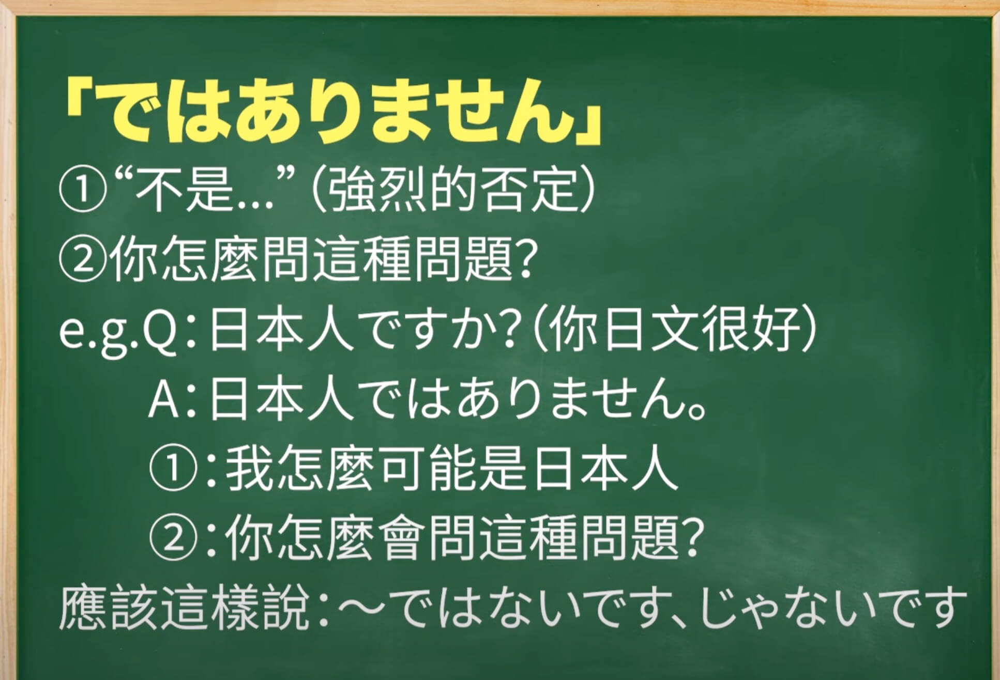
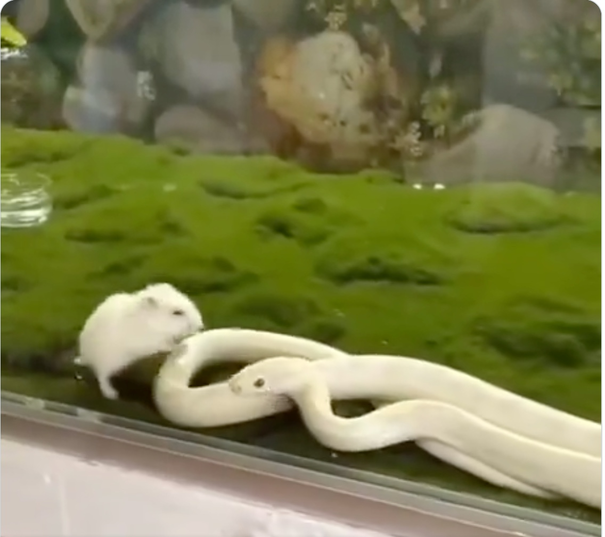
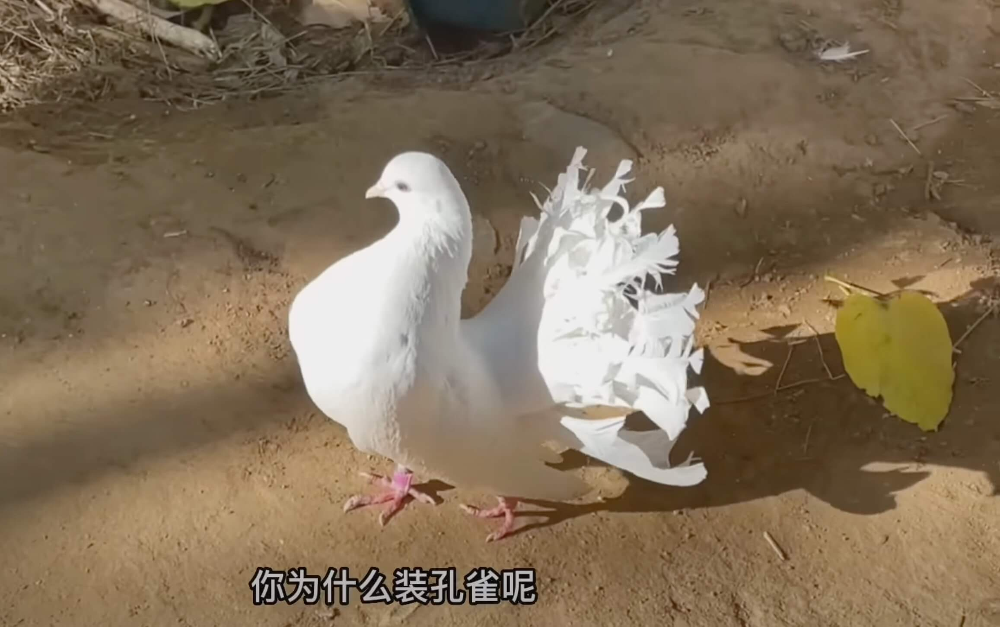

# 2023-12-24

## 封面图 : 公司楼下的红枫树 🍁


## 本周新闻

### 1. ByteDance 发布音乐生成 AI 模型: StemGen

[StemGen](https://julian-parker.github.io/stemgen/): A music generation model that listens (能聆听的音乐生成模型)

### 2. Adobe 和 Figma 决定结束 200 亿美元的收购

Figma CEO Dylan Field 宣布，经过 15 个月的紧张审查，因为看不到监管机构批准该交易的明确途径，今天 Adobe 和 Figma 决定结束他们悬而未决的合并。


### 3. Apple 发布 能在 iPhone 上的运行的 LLM 论文

LLM in a flash:Efficient Large Language Model Inference with Limited Memory.

[论文地址 PDF](https://arxiv.org/pdf/2312.11514.pdf)

## 效率工具

### 1. 把你的手机变成演示文档的遥控器: mobslide

[mobslide](https://github.com/thewh1teagle/mobslide) 可以让你用手机控制电脑上的 Powerpoint / Google Slides。


### 2. SQL 格式化工具: sql-formatter

[SQL Formatter](https://github.com/sql-formatter-org/sql-formatter)是一个用于格式化 SQL 的 JavaScript 库。

也可以当做命令行工具使用。

### 3. 网络诊断工具: trippy

[Trippy](https://github.com/fujiapple852/trippy) 结合了 traceroute 和 ping 的功能，旨在帮助分析网络问题。


### 4. 把照片变成动漫风格的工具： Photo to Anime

[Photo to Anime](https://photo-to-anime.com/zh-Hans) 是一个可以把照片变成动漫风格的工具。支持包括中文的多国家语言。

| Before                            | after                            |
| --------------------------------- | -------------------------------- |
|  |  |

## 技术知识

### 1. LLM Visualization

LLM 算法原理的 3D 可视化，完整的展示了整个 LLM 不同模块内部的运作机制和各模块之间的联系。

想要学习 LLM 算法的同学可以看看这个[3D 演示](https://bbycroft.net/llm)。

> Reference: [X @op7418](https://twitter.com/op7418/status/1735612535909532028)

### 2. Python Why Do

Python How 的教程很多，但是这个 [Python Why](https://github.com/chinesehuazhou/python-whydo) 的教程解释了很多 Python 为什么那样设计的理由，值得一看。

> "Python 为什么"是一系列文章的合集（含翻译），主要关注 Python 的语法、设计、发展、与其它语言的差别等话题，
> 以一个个"为什么"式的问题为切入点，试着展现 Python 的迷人魅力。
>
> 大多数人似乎比较关心"怎么做"（HOW-TO）以及"是什么"（WHAT-IS），
> 因此这类的文章随处可见，同质化极为严重。但是，我更关注的话题是"为什么"（WHY-DO or WHY-NOT-DO），这体现了一种不同的思维方式，它可能偏于务虚，有时候对工作内容不会有实质性的帮助。

### 3. Python 潮流周刊

推荐下这位博主的[《Python 潮流周刊》](https://github.com/chinesehuazhou/python-weekly)，

每周精选最值得分享的文章、教程、开源项目、软件工具、播客和视频、热门话题等内容，可以关注下。

### 4. OpenAI 的提示工程指南

[`@dotey`](https://twitter.com/dotey/status/1736304093621047351) 翻译了 OpenAI 发布的[提示工程指南](https://platform.openai.com/docs/guides/prompt-engineering)，

这份指南分享了如何更有效地利用像如 GPT-4 这样的大语言模型。

### 5. MacBook 上双开 WeChat 的方法

在终端输入下面这行简单的代码就可以在 MacBook 上双开 WeChat 了。

```bash
nohup /Applications/WeChat.app/Contents/MacOS/WeChat > /dev/null 2>&1 &
```

### 6. Python 是如何寻找包的

如果你用 Python 时总是碰到以下问题，那么你可以看看这篇文章。

- 我安装了 `pip` 为什么运行报找不到可执行文件？
- `import module` 为什么报 `ModuleNotFound`？
- 为什么我用 `Pycharm` 能运行在 `cmd` 里运行不了？

[这篇文章](https://frostming.com/2019/03-13/where-do-your-packages-go/)详细介绍了 Python 是如何寻找包的，推荐阅读。

## 语言学习

### 1. 日語单词： 徒花【あだばな】

我只听说过「徒歩 とほ」，没想到还有「徒花 あだばな」这个词。 😅

(1)咲いても実を結ばない花。外見ははなやかでも実質を伴わないもののたとえにもいう。

(2)季節はずれに咲く花。狂い咲き。

(3)祝儀として渡す紙纏頭で、あとで現金にかえるつもりのないもの。(4)咲いてすぐ散る、はかない花。特に、桜の花。

### 2. 英语学习的 Youtube 频道: [@IzzySealey](https://www.youtube.com/@IzzySealey)

Izzy Sealey 是剑桥大学的学生，好像是位华裔，似乎正在学习中文，而且还是位大美女 😄。


### 3. 日语&中文 同形异义词： 手紙

日语和中文有很多同形异义词。

比如「手紙」，日语里「手紙」是指「信 ✉️」，而中文里「手紙」是指「厕纸 🧻」。

### 4. 日语： 「ではありません」不是「ではないです」的敬语形式



> Reference: [@秋山燿平 YouTube](https://www.youtube.com/watch?v=M5xFCDFXYOQ)

## 生活趣味

### 1. 日本小姐姐的登山 Youtube 频道: とよの山遊び

喜欢登山或者户外的朋友可以关注一下这个日本小姐姐 `とよの山遊び` 的[登山频道](https://www.youtube.com/@yama-asobi)。

UP 主每次都把登山的路线以及地图都标注出来，解说的非常清楚详细。

### 2. 蛇的智商有点堪忧啊 😄

就因为老鼠 🐀 和自己的颜色一样，结果一不小心咬到自己的尾巴了。😂



> [视频地址](https://twitter.com/wokanhaoni/status/1735621271675887626)

### 3. 最经典（最琼瑶）的金庸剧？： 94 版倚天屠龙记

可能上周周海媚姐姐去世了我搜索过周海媚姐姐，这周 Youtube 就向我推荐了这个 94 版的倚天屠龙记的解说视频。

没有一点对姐姐不敬的意思，这个视频的解说还是有点搞笑的 🤪。

> [【吐嚎】重溫 1994《倚天屠龍記》！最瓊瑤的金庸劇？！](https://www.youtube.com/watch?v=2uDs1gANTks)

### 4. Christmas Song - "Mary Did You Know" - Sister Duet - Lucy & Martha Thomas

2023 年又快结束了，我的女神 Lucy Thomas 和她的妹妹 Martha Thomas 二重唱为我们带来了[圣诞节的祝福](https://www.youtube.com/watch?v=YNp4BP-QcLY)。#music


### 5. 我鸽子 🐦 也会"开屏"哦



### 6. `Latte` 在意大利语中是"牛奶"的意思

`Latte`，在意大利语中是"牛奶"的意思，所以，[拿铁咖啡](https://zh.wikipedia.org/zh-cn/拿铁咖啡)的真实意思是，牛奶咖啡。

在意大利，如果要喝拿铁咖啡，就要说它的全名 `Caffe Latte` 。

只说 `Latte`，意大利人会给你一杯鲜奶。 😄

> [Reference](https://www.sohu.com/a/350137479_100236155)
