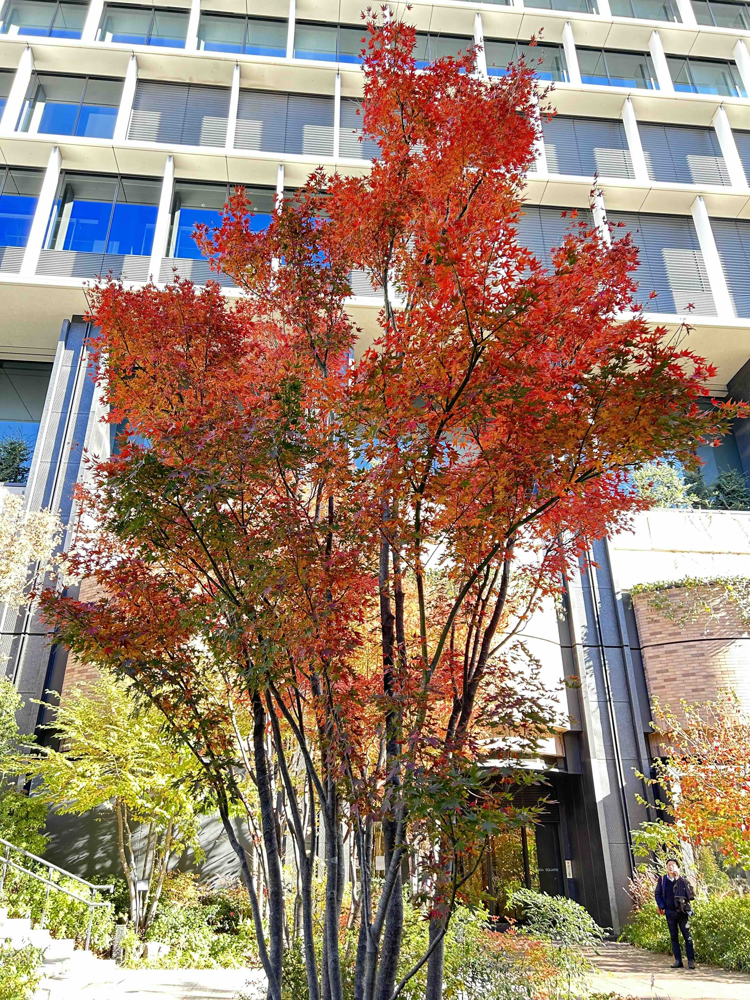

# 2023-12-24

## 封面图 : 

## 本周新闻

### 1. ByteDance 发布音乐生成 AI 模型: StemGen

[StemGen](https://julian-parker.github.io/stemgen/): A music generation model that listens (能聆听的音乐生成模型)

## 效率工具

## 技术知识

### 1. LLM Visualization

LLM 算法原理的 3D 可视化，完整的展示了整个 LLM 不同模块内部的运作机制和各模块之间的联系。

想要学习 LLM 算法的同学可以看看这个[3D 演示](https://bbycroft.net/llm)。

> Reference: [X @op7418](https://twitter.com/op7418/status/1735612535909532028)

### 2. Python Why Do

Python How 的教程很多，但是这个 [Python Why](https://github.com/chinesehuazhou/python-whydo) 的教程解释了很多 Python 为什么那样设计的理由，值得一看。

> "Python 为什么"是一系列文章的合集（含翻译），主要关注 Python 的语法、设计、发展、与其它语言的差别等话题，
> 以一个个"为什么"式的问题为切入点，试着展现 Python 的迷人魅力。
>
> 大多数人似乎比较关心"怎么做"（HOW-TO）以及"是什么"（WHAT-IS），
> 因此这类的文章随处可见，同质化极为严重。但是，我更关注的话题是"为什么"（WHY-DO or WHY-NOT-DO），这体现了一种不同的思维方式，它可能偏于务虚，有时候对工作内容不会有实质性的帮助。

## 语言学习

### 1. 日語： 徒花【あだばな】

我只听说过「徒歩 とほ」，没想到还有「徒花 あだばな」这个词。 😅

(1)咲いても実を結ばない花。外見ははなやかでも実質を伴わないもののたとえにもいう。

(2)季節はずれに咲く花。狂い咲き。

(3)祝儀として渡す紙纏頭で、あとで現金にかえるつもりのないもの。(4)咲いてすぐ散る、はかない花。特に、桜の花。

## 生活趣味

### 1. 日本小姐姐的登山 Youtube 频道: とよの山遊び

喜欢登山或者户外的朋友可以关注一下这个日本小姐姐 `とよの山遊び` 的[登山频道](https://www.youtube.com/@yama-asobi)。

UP 主每次都把登山的路线以及地图都标注出来，解说的非常清楚详细。
