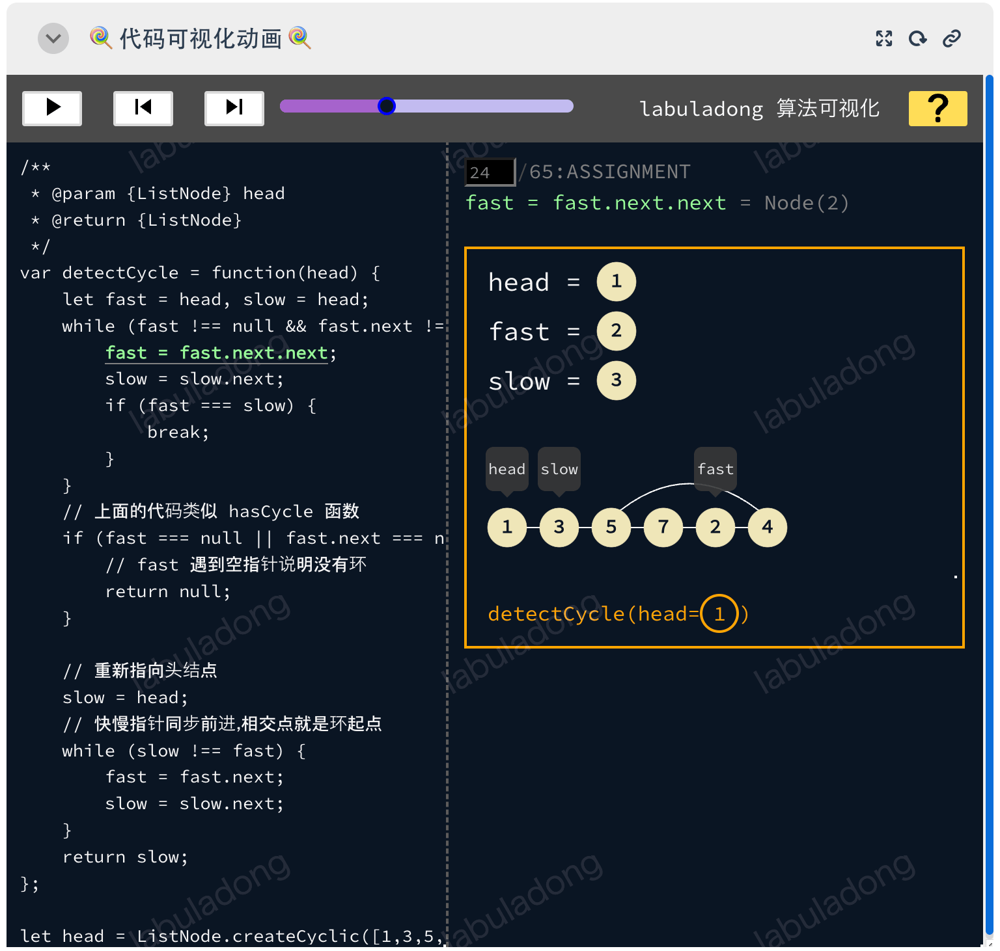
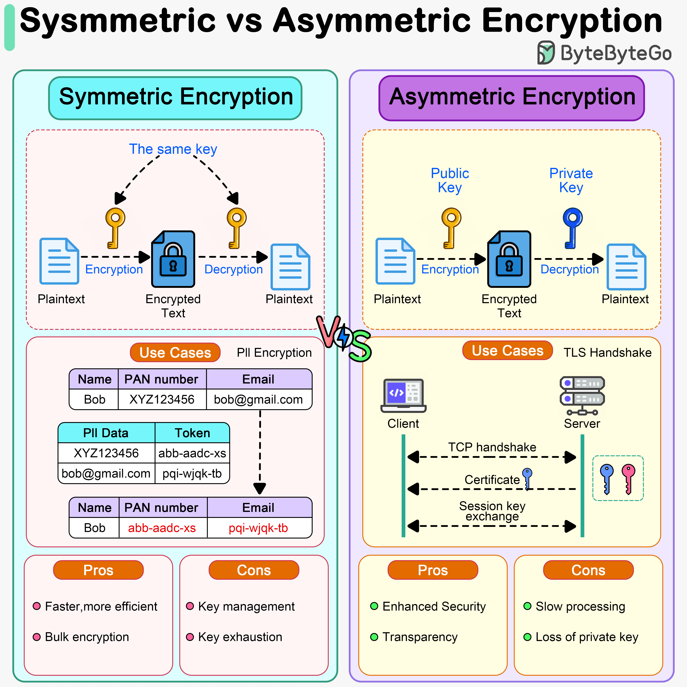

## 封面图 : 公司窗外的富士山

由于家庭方面的原因，离开了之前呆的很舒适的公司，11 月开始在新的公司工作。:smile:

图是新公司的窗外看到的富士山 🗻 ，似乎还不小心拍进了 2 架飞机 ✈️ 。


## 本周新闻

### 1. Midjourney 发布了 V6 版本

Midjourney 发布了 V6 版本, 效果惊艳。

有心网友用普京和特朗普的照片做了个各个版本的对比。:smile:

| v1                                                                         | v2                                                                         | v3                                                                         | v4                                                                         |     |
| -------------------------------------------------------------------------- | -------------------------------------------------------------------------- | -------------------------------------------------------------------------- | -------------------------------------------------------------------------- | --- |
|  |  |  |  |     |

| v5                                                                         | v5.1                                                                       | v5.2                                                                       | v6                                                                         |
| -------------------------------------------------------------------------- | -------------------------------------------------------------------------- | -------------------------------------------------------------------------- | -------------------------------------------------------------------------- |
|  |  |  |  |

> Reference: [X @foxshuo](https://twitter.com/foxshuo/status/1739300109958193501)

还有位朋友，用 Midjourney V6 给 X 友们做了[一系列在电脑前工作的动物头像](https://hylarucoder.notion.site/MJv6-b74005d168644677a8c124f82758c6a5)，甚至可爱。


## 效率工具

### 1. 日语学习工具： 通过漫画学习惯用句

[かくなび](https://kaku-navi.com/) 这个网站提供了一些可爱的漫画来解释日语中的惯用句，

可以帮助日语初学者更好的理解日语中的惯用句。

比如下面这个漫画，解释了「**耳を疑う**」这个惯用句的意思。


### 2. 旧照片修复工具： PASD

> Pixel-Aware Stable Diffusion for Realistic Image Super-Resolution and Personalized Stylization

[PASD](https://github.com/yangxy/PASD) 能提高图像分辨率的同时保持或增强图像的真实感。

可以用它来进行旧照片修复，将照片转换为动漫风，和图像上色等。

下面是一些效果图。

- 旧照片修复

  

- 动漫风

  

- 图像上色

  

### 3. 阿里巴巴又出新工具了： AnyDoor

AnyDoor 是一种基于扩散的图像生成器，它的主要功能是将目标对象（例如一个人或一个物品）无缝地插入到新的场景中，而且可以在用户指定的位置进行插入。

由香港大学、阿里巴巴集团以及蚂蚁集团，共同开发！

论文地址: [AnyDoor: Zero-shot Object-level Image Customization](https://arxiv.org/abs/2307.09481)

效果可以看[这里](https://twitter.com/xiaohuggg/status/1682721078718906368)。

也可以在 [HuggingFace 上体验下](https://twitter.com/wifecooky/likes)。

### 4. 使用 AR(增强现实)二维码数字化餐厅菜单: [AR Code](https://ar-code.com/blog/digitalizing-restaurant-menus-with-augmented-reality-qr-codes)

扫描 AR QR 码（增强现实快速响应码的缩写）允许用户将交互式 3D 内容无缝集成到他们的即时环境中。


> [Reference: X @xiaohuggg](https://twitter.com/xiaohuggg/status/1739259052448944139)

### 5. [OctoSQL](https://github.com/cube2222/octosql): 用 SQL 文法查询 csv, json 文件

```bash
octosql "SELECT * FROM ./myfile.json"

octosql "SELECT invoices.id, address, amount
         FROM invoices.csv JOIN db.customers ON invoices.customer_id = customers.id
         ORDER BY amount DESC"
```


## 技术知识

### 1. 数据结构与算法教程: hello-algo

[数据结构与算法教程](https://www.hello-algo.com/) 讲解了数据结构与算法的基础知识, 图文搭配，浅显易懂。

### 2. labuladong 的算法小抄: [fucking-algorithm](https://github.com/labuladong/fucking-algorithm)

> 总共 60 多篇原创文章，都是基于 LeetCode 的题目，涵盖了所有题型和技巧，而且一定要做到举一反三，通俗易懂，绝不是简单的代码堆砌，后面有目录。

通过刷 LeetCode 的题目来学习数据结构和算法。

配有可交互的代码可视化动画，推荐。



### 3. Top 9 Engineering Blogs?


- Netflix TechBlog
- Uber Blog
- Cloudflare Blog
- Engineering at Meta
- LinkedIn Engineering
- Discord Blog
- AWS Architecture
- Slack Engineering
- Stripe Blog

> Reference: [bytebytego](https://blog.bytebytego.com/i/140010110/top-engineering-blog-favorites)

### 4. 对称加密和非对称加密的区别 (Symmetric encryption vs asymmetric encryption)



> Reference: [bytebytego](https://blog.bytebytego.com/i/140010110/symmetric-encryption-vs-asymmetric-encryption)

## 语言学习

### 1. [日语] 漢字的演变动画, 可以给小孩子看看

作者根据 [字通 @白川 静](https://www.amazon.co.jp/字通-白川-静/dp/4582128041) 这本书，

把日本小学生一年级到四年级要学的汉字制作成了演变动画。

比如下面这个是「**鳥**」这个字的演变过程。


还有，这个是「**皿**」这个字的演变过程。


> [引用链接](https://www.morinogakko.com/classroom/sakuraKoukaiyouPe-ji/kanjinooboekata_koukai/3nen/itiran/sara-sara_1.html)

### 2. [English] Cool as a cucumber

这个短语的意思是「**非常冷静**」，「**镇定自若**」。

（不是像黄瓜 🥒 一样酷 😄）


> Generated by [Bing](https://www.bing.com/create)

### 3. [日语] コンパチ

「**コンパチ**」是「**コンパチブル （compatible）**」的缩写，意思是「**兼容**」。

强大的「和製英語」:cry:

> 「コンパチブル」の略。機器・装置を取りかえても同じように作動すること。互換性があること。

例句： この機器は、コンパチブルな機器と交換しても同じように作動する。

## 生活趣味

### 1. 小高姐又出新菜单了： [水晶牛肉冻](https://www.youtube.com/watch?v=0FouGA9yJqQ)

### 2. 手工制作：[做一个菠萝](https://twitter.com/newsNZcn/status/1739157534030864395)

### 3. 三五环 Podcast No.134 : [用户变多的小红书，如何解决社区氛围问题](https://podcasts.apple.com/jp/podcast/no-134-用户变多的小红书-如何解决社区氛围问题/id1475113228?i=1000639731562)

做产品开发和知识分享的朋友，可以听听这期 Podcast。

作者刘飞分享了自己对知乎，小红书等一些平台特性的一些思考。

### 4. 女神 Lucy Thomas 翻唱了 A Whiter Shade Of Pale

<iframe width="560" height="315" src="https://www.youtube.com/embed/02a0l2UhsXQ?si=xG789LMFl86Xtkg8" title="YouTube video player" frameborder="0" allow="accelerometer; autoplay; clipboard-write; encrypted-media; gyroscope; picture-in-picture; web-share" allowfullscreen></iframe>
