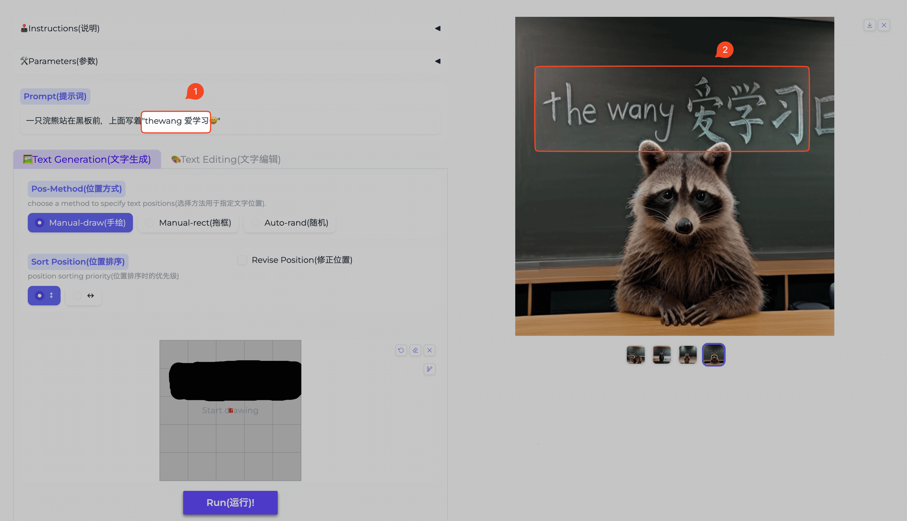

## 封面图 : 2024 年龙年快乐 🐲

> 朋友家蹭饭图 😄

## 本周新闻

### 1. 2024/01/01 日本石川县近海发生 7 级地震

截止 2024 年 1 月 2 日 15 時 05 分 (UTC+9) 为止，确认石川县内 30 人死亡。:pray:

> Ref: [【速報中 被害状況】 地震 石川県内で 30 人死亡確認](https://www3.nhk.or.jp/news/html/20240102/k10014306401000.html)

关于 zhe 次地震的详细情况，可以[看这里](https://earthquake.usgs.gov/earthquakes/eventpage/us6000m0xl/executive)

### 2. 2024/01/02 日本航空的飞机和海上保安厅的飞机在相撞

> Ref: [速報】羽田空港で日本航空機が炎上　海保の機体と衝突か　乗客・乗員は全員脱出](https://news.yahoo.co.jp/articles/87f5a37a479c6b7f5ac4da1271b56fdcea4c0d05)

## 效率工具

### 1. [USGS 地震信息网站](https://earthquake.usgs.gov/earthquakes/map/?extent=-80.81689,-29.17969&extent=84.5747,465.82031&range=search&baseLayer=ocean&search=%7B%22name%22:%22Search%20Results%22,%22params%22:%7B%22starttime%22:%222023-01-01%2000:00:00%22,%22endtime%22:%222024-01-01%2023:59:59%22,%22minmagnitude%22:4.5,%22orderby%22:%22time%22%7D%7D)，可以查看全球的地震信息。

比如可以查看过去发生 4.5 级以上地震的地方。

### 2. [Raycast Extension] Color Picker

[Color Picker](https://www.raycast.com/thomas/color-picker) 是一个 Raycast Extension，可以快速选择和管理颜色（Pick and organize colors）。

### 3. [Raycast Extension] Pika

[Pika](https://www.raycast.com/rishi/pika) 是一个美化屏幕截图的 Raycast Extension，可以快速添加阴影、边框、背景等。

### 4. [Raycast Extension] CSS.GG

[CSS.GG](https://www.raycast.com/astrit/css-gg) 是一个 Raycast Extension，可以快速复制 CSS, SVG 图标。

### 5. 阿里巴巴开发的 AnyText

[AnyText](https://github.com/tyxsspa/AnyText) 解决了图像生成时的文字变形乱码问题。

- [GitHub](https://github.com/tyxsspa/AnyText)
- [论文: AnyText: Multilingual Visual Text Generation And Editing](https://arxiv.org/abs/2311.03054)
- [HuggingFace Demo](https://huggingface.co/spaces/modelscope/AnyText)

还支持编辑现有的图片上的文字。

> Ref: [@xiaohuggg](https://twitter.com/xiaohuggg/status/1742749153267257699)

## 技术知识

### 1. React 重构了官方文档

React 重构了官方文档，新文档中把很多容易[踩的坑用例子](https://react.dev/learn/escape-hatches)的形式展示出来，非常棒。

## 语言学习

### 1. [日语] 鬱勃【うつぼつ】

看着以为是一个消极的词，实际上是一个积极的词。:smile:

(タリ形動)内にこもっていた意気が高まって外にあふれ出ようとするさま。
また、意気が盛んなさま。

意思： 旺盛的，充沛的，热情的

例：～鬱勃たる闘志｜旺盛的斗志．～鬱勃たる野心｜野心勃勃．

## 生活趣味

### 1. 动画示意：收割机的工作原理

> Ref: [收割机的工作原理](https://twitter.com/newsNZcn/status/1740523514875252815)

### 2. 葵花籽 + 土豆 = 刺猬

> Ref: [动画 @X](https://twitter.com/newsNZcn/status/1741873047261564954)

### 3. 指导生活的算法

- **37%规则**：最优停止理论，又叫秘书问题、找对象算法、苏格拉底找麦穗的科学解法

行动分为两个阶段，第一阶段挑选，第二个阶段决策。

两个阶段的衔接点是 37%，比如当你走完麦田的 37%，后面只要出现比之前更好的麦穗，就果断拿下。

对于期限明确，选择众多的场景尤其适用。比如找对象、买房子。

- **15.87%学习甜蜜点** ([The Eighty Five Percent Rule for Optimal Learning](https://www.biorxiv.org/content/10.1101/255182v1.full))])

又叫最佳练习准确率 85%。学习一个东西太难容易陷入恐慌区，太容易会没有进步。

这个研究发表在自然杂志，对模型训练实验和生物学习做了大量实验，

每次加入 15.87%的新陌生数据，剩下约 85%是见过的数据，模型的学习速度最快。

> Ref: [X @fuxiangPro](https://twitter.com/fuxiangPro/status/1742448244423360647)
