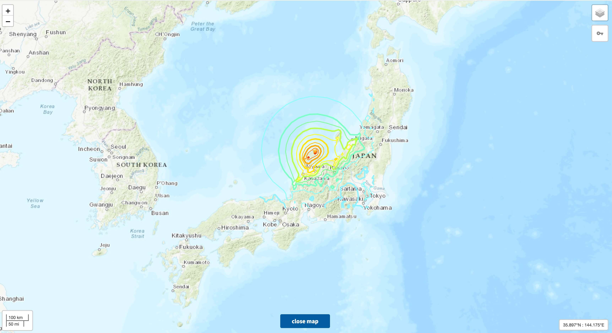
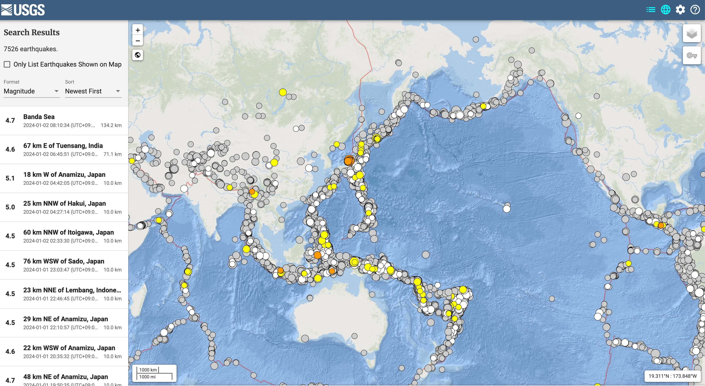
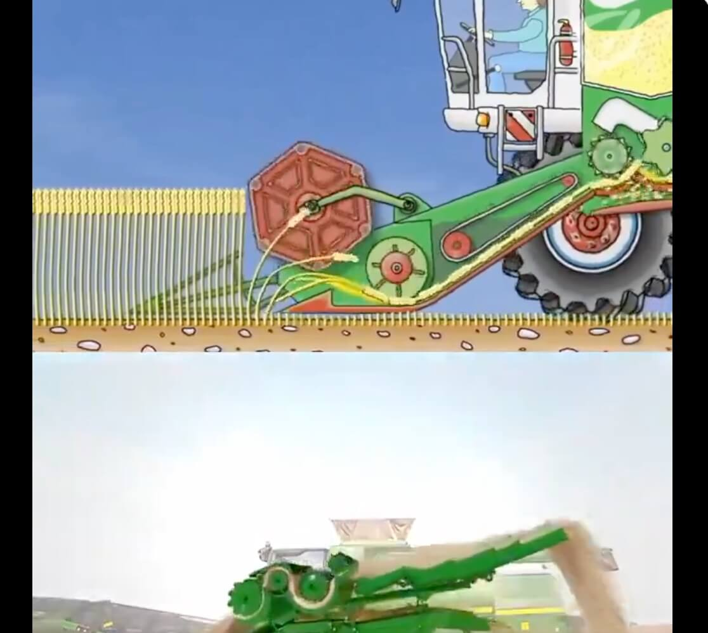

## 封面图 : 2024 年龙年快乐 🐲

> 朋友家蹭饭图 😄

## 本周新闻

### 1. 日本石川县近海发生 7 级地震

截止 2024 年 1 月 2 日 15 時 05 分 (UTC+9) 为止，确认石川县内 30 人死亡。:pray:

> Ref: [【速報中 被害状況】 地震 石川県内で 30 人死亡確認](https://www3.nhk.or.jp/news/html/20240102/k10014306401000.html)

关于 zhe 次地震的详细情况，可以[看这里](https://earthquake.usgs.gov/earthquakes/eventpage/us6000m0xl/executive)

## 效率工具

[USGS 地震信息网站](https://earthquake.usgs.gov/earthquakes/map/?extent=-80.81689,-29.17969&extent=84.5747,465.82031&range=search&baseLayer=ocean&search=%7B%22name%22:%22Search%20Results%22,%22params%22:%7B%22starttime%22:%222023-01-01%2000:00:00%22,%22endtime%22:%222024-01-01%2023:59:59%22,%22minmagnitude%22:4.5,%22orderby%22:%22time%22%7D%7D)，可以查看全球的地震信息。

比如可以查看过去发生 4.5 级以上地震的地方。

## 技术知识

## 语言学习

### 1. [日语] 鬱勃【うつぼつ】

看着以为是一个消极的词，实际上是一个积极的词。:smile:

(タリ形動)内にこもっていた意気が高まって外にあふれ出ようとするさま。
また、意気が盛んなさま。

意思： 旺盛的，充沛的，热情的

例：～鬱勃たる闘志｜旺盛的斗志．～鬱勃たる野心｜野心勃勃．

## 生活趣味

### 1. 动画示意：收割机的工作原理

> Ref: [收割机的工作原理](https://twitter.com/newsNZcn/status/1740523514875252815)

