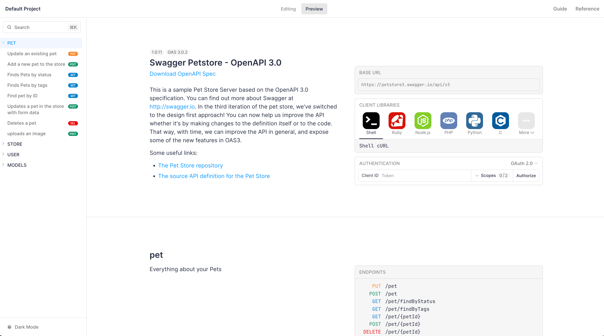
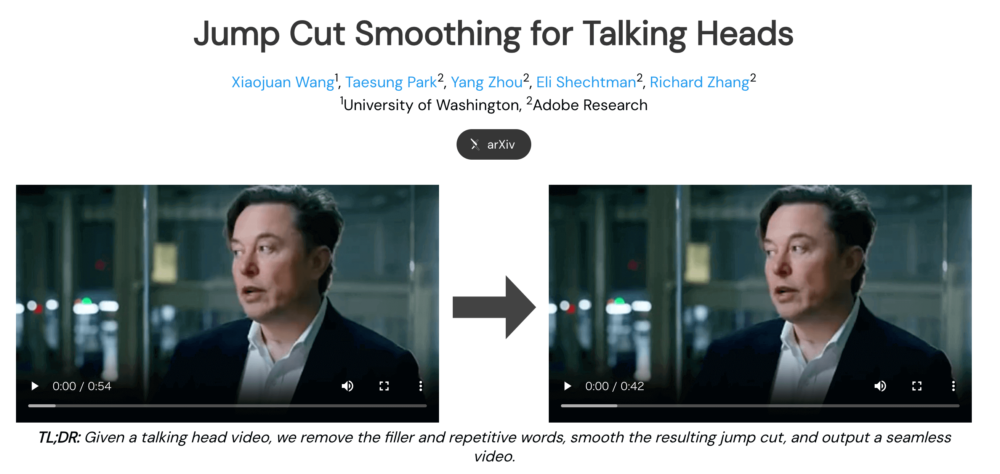
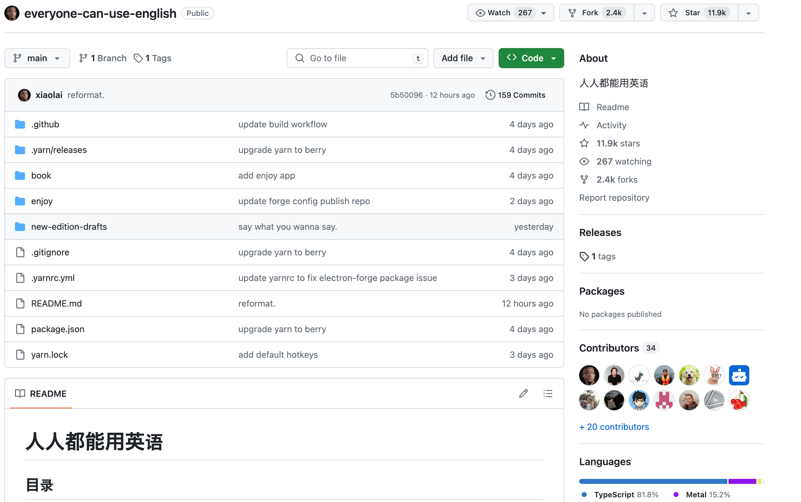

## 封面图 : 新年的第一碗兰州拉面

## 本周新闻

### 1. 像买股票一样买比特币: 比特币现货 ETF

比特币现货 ETF 通过，加密行业开启新篇章。

北京时间 1 月 11 日凌晨 4 时，美国证券交易委员会（SEC）同时通过了 11 支现货比特币 ETF。

> [Reference](https://new.qq.com/rain/a/20240111A01RJ500)

## 效率工具

### 1. Swagger/OpenAPI 文档编辑/查看工具: [scalar](https://github.com/scalar/scalar)

Scalar 不仅支持 API 文档预览和编辑，还能作为文档组件嵌入各种前端框架（React/Vue/Express...）。

### 2. VSCode 插件: [Markdown Preview Enhanced](https://marketplace.visualstudio.com/items?itemName=shd101wyy.markdown-preview-enhanced)

Markdown Preview Enhanced 是一款功能强大的 Markdown 插件，支持渲染数学公式、mermaid.js 的流程图，甘特图，时序图等。

并且可以导出渲染结果成 HTML、PDF、图片、eBook, Pandoc 等, 还支持切换黑白等主题。

### 3. 浏览器扩展插件: Katakana Terminator 片假名终结者 (カタカナターミネーター)

如果你对类似 `リレーショナルデータベース` 这样的日语外来语感到困惑，这款浏览器扩展插件可以帮助你。

[Katakana Terminator](https://greasyfork.org/zh-CN/scripts/33268-katakana-terminator) 在**网页中的日语外来语上方标注英文原词**。

### 4. 自动删除视频中的说话停顿: Jump Cut Smoothing

[Jump Cut Smoothing for Talking Heads](https://jeanne-wang.github.io/jumpcutsmoothing/) 能自动删除视频中的说话停顿、填充词（如 "嗯", "啊" 等）, 并通过补帧的方式让视频看起来更加流畅。

- [项目及演示](https://jeanne-wang.github.io/jumpcutsmoothing/)
- [论文](https://arxiv.org/abs/2401.04718)

### 5. [Python] Python linter and code formatter, written in Rust: Ruff

[Ruff](https://docs.astral.sh/ruff/) 是一个 Python 代码格式化工具，使用 Rust 编写，速度很快。

### 6. [Chrome Extension] [Youtube 中文配音](https://chromewebstore.google.com/detail/youtube中文配音/oglffgiaiekgeicdgkdlnlkhliajdlja)

这个插件能够将 Youtube 视频中的语音内容实时转录成你中文语音，支持英语、德语、日语、法语、西班牙语等多种常见语种。

作者特别优化了一些技术类视频，想看 YouTube 上的技术视频的同学，可以试试这个插件。

:::tip 引用
这里再给大家推荐一批我们预处理过的免费学习频道（这些我们都做了优化的视频，效果极佳！）

https://www.youtube.com/@mitocw
这是 MIT 的免费公开课，内容涵盖面超广，已经包含 7000+视频，里面一定有你感兴趣的话题！

https://www.youtube.com/@java
Java 官方频道，涵盖 Java 平台、OpenJDK 和 Java 生态系统的最新学习内容，1000+视频，我们都做了优化！

https://www.youtube.com/@IBMTechnology
该频道提供关于科技领域的大量教育内容：包括人工智能、自动化、网络安全、数据科学、DevOps、量子计算等各种前沿领域，目前有 700+视频，我们都做了优化。

https://www.youtube.com/@SpringSourceDev
专注分享 Spring 框架技术的频道，内含 1300+视频，我们也都做了优化！

https://www.youtube.com/@DevoxxForever
各种技术大会中的干货内容，内含 3000+视频，之前也转载过相关前沿演讲，非常值得追！

https://www.youtube.com/@edurekaIN/playlists
1 个 IT 课程的平台，里面有 9000 多部视频。。各种技术的应该就都有了~

https://www.youtube.com/@cs50
CS50 是哈佛大学对计算机科学和编程艺术的公开免费课程，质量非常高，相当推荐。

https://www.youtube.com/@stanfordonline/featured
斯坦福在线是斯坦福大学工程学院的学术和专业教育门户，由斯坦福大学各学校和单位提供。内涵强大的学位课程、学分教育、专业证书课程以及免费开放的内容由斯坦福大学教师开发，使您能够扩展知识、推进职业发展并改善您的生活。
:::

具体信息可以看它的[官方网站](https://www.youtube-dubbing.com/)。

## 技术知识

### 1. AWS 2024 总结（日文）by ClassMethod

[【2024 年】AWS 全サービスまとめ](https://dev.classmethod.jp/articles/aws-summary-2024/)

## 语言学习

### 1. 用了这些高级词后，我的英语开挂了

[英语兔](https://www.youtube.com/@yingyutu) 整理的一些高级词汇，推荐给有小孩的家长吧 :smile:, 写作的时候可以用到。

- 视频地址：[YouTube](https://www.youtube.com/watch?v=a8McQKeVhOg)

- PDF 下载地址：[夸克网盘](https://pan.quark.cn/s/49bf94047def)

### 2. [日语] エポニム (Eponym)

エポニム (Eponym) 是指以人名命名的词语，比如 `牛顿力学`、`爱因斯坦相对论`、`达尔文进化论` 等。

### 3. [英语] 李笑来的 [人人都能用英语 everyone-can-use-english](https://github.com/xiaolai/everyone-can-use-english?tab=readme-ov-file)

李笑来把他的英语学习经验都写在这个仓库里了，有兴趣的同学可以看看。

而且看日期最近的提交，他还在不断更新。

## 生活趣味

### 1. 新疆阿勒泰

[Links TV](https://www.youtube.com/@linksphotograph) 拍的新疆阿勒泰的视频，很美。

<iframe width="560" height="315" src="https://www.youtube.com/embed/xdQZdRosthE?si=EqPT_8JXI6LN8CyX" title="YouTube video player" frameborder="0" allow="accelerometer; autoplay; clipboard-write; encrypted-media; gyroscope; picture-in-picture; web-share" allowfullscreen></iframe>

### 2. [推荐书籍] [Atomic Habits](https://jamesclear.com/atomic-habits)

中文的简体和繁体版本的书名分别是《[掌控习惯](https://book.douban.com/subject/34326931/)》和《[原子習慣](https://book.douban.com/subject/33536171//)》。

习惯形成需要 4 步：**提示 → 渴求 → 反应 → 奖赏**。

美国著名习惯研究专家、习惯学院创始人詹姆斯•克莱尔根据习惯形成的 4 个步骤，

总结了相对应的培养习惯的 4 大定律：

让它显而易见；

让它有吸引力；

让它简便易行；

让它令人愉悦。

本书通过这 4 大定律、56 个具体案例，帮助你快速养成良好的习惯，同时利用这 4 大定律的反面，可以帮助你戒除不良的习惯。
