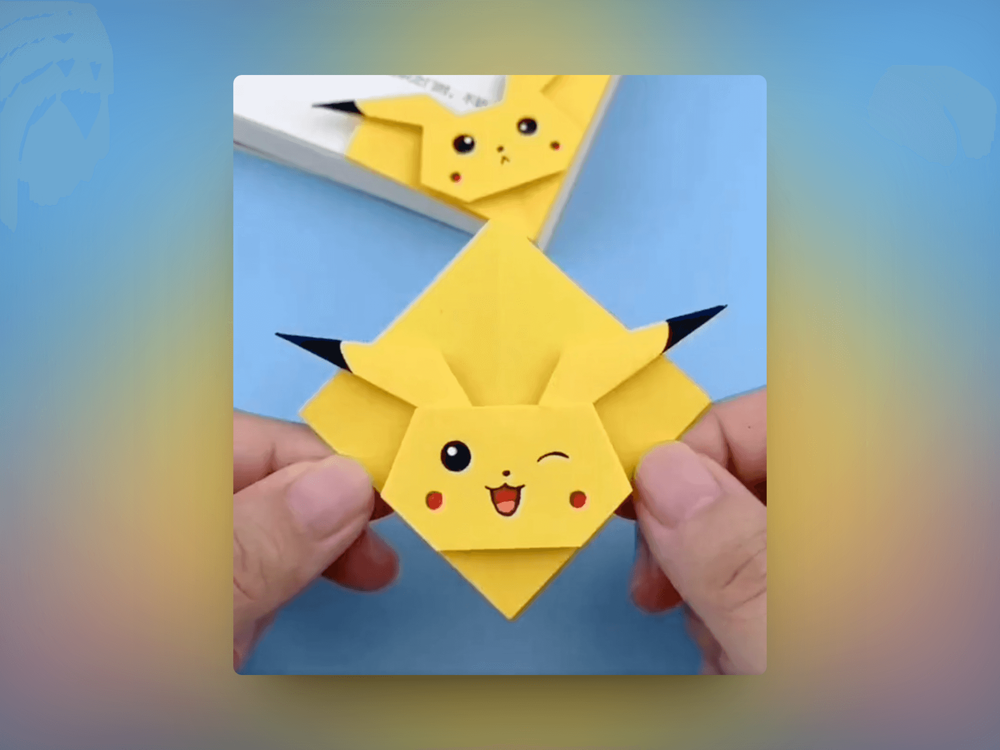
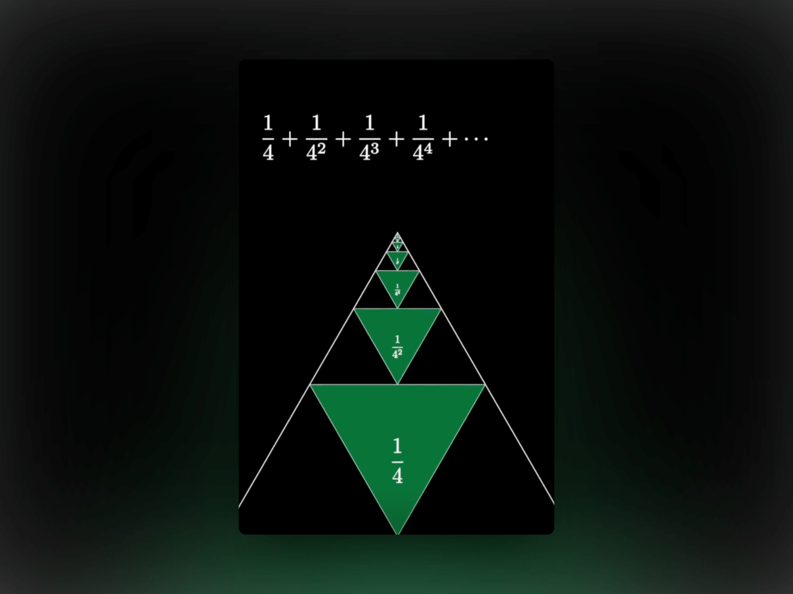

## 封面图 : 日比谷公園

[日比谷公園 🏞️ ](https://www.tokyo-park.or.jp/park/format/index037.html) 位于皇宫旁边，已经有 [120 年的历史](https://www.tokyo-park.or.jp/special/hibiyapark120years/)了。

图片来自于推特 [都立日比谷公園(Hibiya Park, Tokyo) 園長の採れたて情報 @ParksHibiya](https://twitter.com/ParksHibiya/status/1746382380074438851) 的截图。

## 本周新闻

### 1. 微软市值超过苹果，成为全球市值第一大公司

## 效率工具

### 1. 在线图片背景装饰工具： Shots.so

[Shots.so](https://shots.so/) 是一个在线图片背景装饰工具，可以帮助你快速的给图片添加背景，比如添加手机壳、电脑桌面、电视机、浏览器等等。

还能根据提供的图片中的颜色自动生成背景图。本周的封面图就是使用 Shots.so 生成的。

### 2. 移除音乐中人声的 AI 工具：vocalremover

[vocalremover](https://vocalremover.org/zh/splitter-ai) 是一个在线的 AI 工具，可以移除音乐中的人声，只保留背景音乐。

## 技术知识

### 1. [Golang] 计算字符串中的字符数的库：[rivo/uniseg](https://github.com/rivo/uniseg)

该库可以很方便的计算字符串（包含表情符号）中的字符个数。

## 语言学习

### 1. 练习英语口语的三步法，出自 300 万订阅的老师

[English Speaking Success @YouTube](https://www.youtube.com/@EnglishSpeakingSuccess)

### 2. [日语] パレイドリア

パレイドリア【pareidolia】: 一种心理现象，指的是在模糊的图像中看到熟悉的事物。

## 生活趣味

### 1. 皮卡丘书签折纸（Pikachu Bookmark Origami）

> Reference: [Pikachu Bookmark Origami @X](https://twitter.com/awkwardgoogle/status/1746306132174360723)

### 2. 通过产生静电来点燃燃气灶

> Reference: [Igniting gas stove by generating static energy @X](https://twitter.com/engineers_feed/status/1746168130685079599)

### 3. 如何证明 `1/4 + 1/16 + 1/64 + ... = 1/3`

> Reference: [@MathVisualProofs @YouTube](https://www.youtube.com/shorts/a41V8L5nNIU)

### 4. 能进行光合作用的生物: 叶羊

[叶羊（leaf sheep）](https://en.wikipedia.org/wiki/Costasiella_kuroshimae) 是一种能进行光合作用的生物，

它的身体上有很多绿色的小颗粒，这些小颗粒就是叶绿体，能够进行光合作用。

> Reference: [叶羊（leaf sheep） @X](https://twitter.com/newsNZcn/status/1747729251145781631)
