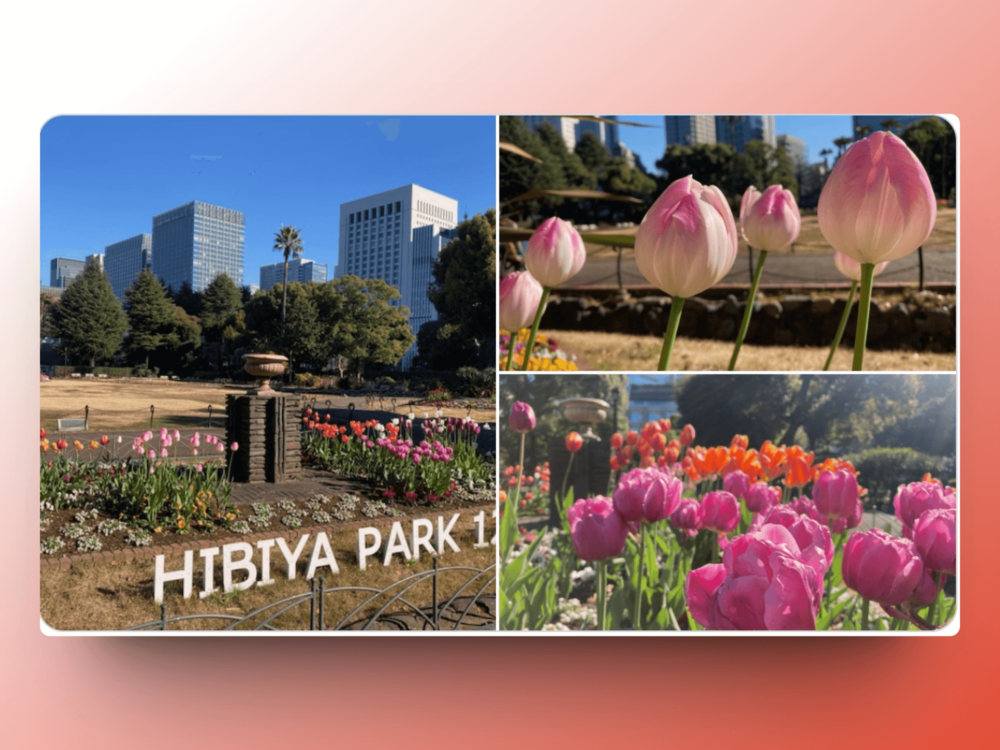

## 封面图 : 日比谷公園

[日比谷公園 🏞️ ](https://www.tokyo-park.or.jp/park/format/index037.html) 位于皇宫旁边，已经有 [120 年的历史](https://www.tokyo-park.or.jp/special/hibiyapark120years/)了。

图片来自于推特 [都立日比谷公園(Hibiya Park, Tokyo) 園長の採れたて情報 @ParksHibiya](https://twitter.com/ParksHibiya/status/1746382380074438851) 的截图。

## 本周新闻

## 效率工具

### 1. 在线图片背景装饰工具： Shots.so

[Shots.so](https://shots.so/) 是一个在线图片背景装饰工具，可以帮助你快速的给图片添加背景，比如添加手机壳、电脑桌面、电视机、浏览器等等。

还能根据提供的图片中的颜色自动生成背景图。本周的封面图就是使用 Shots.so 生成的。

## 技术知识

### 1. [Golang] 计算字符串中的字符数的库：[rivo/uniseg](https://github.com/rivo/uniseg)

该库可以很方便的计算字符串（包含表情符号）中的字符个数。

## 语言学习

## 生活趣味
