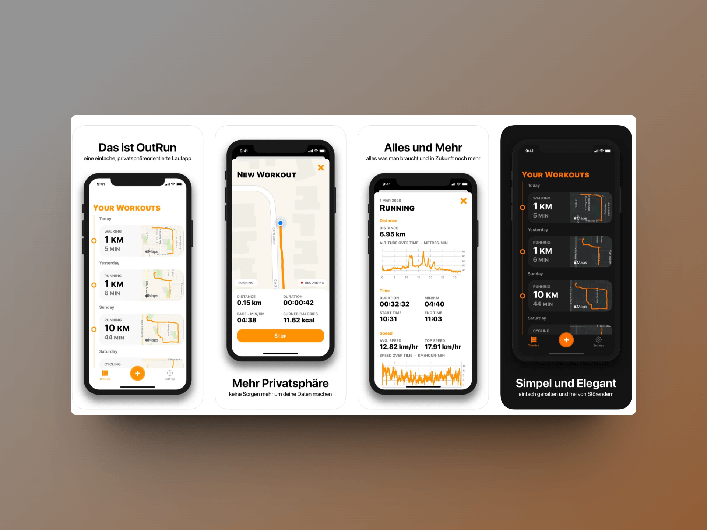
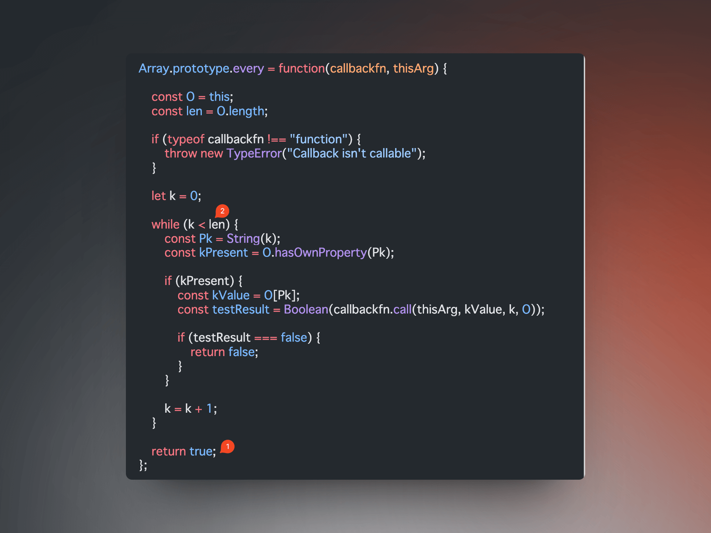

## 封面图 : 拍摄于上海爱琴海购物中心


## 本周新闻

## 效率工具

### 1. Outrun - 一个免费的无广告的跑步计划应用

[Outrun](https://apps.apple.com/cn/app/outrun/id1477511092) 是一个简单的跑步计划应用，免费，无广告。

生命在于运动，不要一味的沉迷于工作，适当的运动，可以让你的身体更加健康，也可以让你的大脑更加清醒。



### 2. 公司 Logo SVG 收集网站 ： [SVGL](https://svgl.vercel.app/)

### 3. CSS 动画生成器: [animotion.dev](https://animotion.dev/)


### 4. 人像生成工具

[sinqi.tools](https://sinqi.tools/zh/avatar) 提供的人像生成工具，基于 [Open Peeps](https://www.openpeeps.com/) 这个免费的手绘插画库。


## 技术知识

### 1. 万字文章深入解读，让用户养成使用习惯的产品逻辑

UX 设计师 [胡三七](https://www.zcool.com.cn/u/23589606) 在站酷上分享了[一篇文章](https://www.zcool.com.cn/work/ZNjczMDA1NzY=.html)，产品经理的朋友们可以看看。

### 2. 用 Bert Vits2 来炼雷军雷总的声音, 比雷军还“雷”😄

Bert Vits2 太牛了，找时间试试看。

> 视频: [用 Bert Vits2 来炼雷军雷总的声音 @X](https://twitter.com/huangyun_122/status/1748659011900035571)

### 3. JavaScript 陷阱： `every()` 方法对于空数组总是返回 `true`

```js {4} showLineNumbers
function isNumber(value) {
  return typeof value === "number";
}
[].every(isNumber); // true
```

#### 原因

- `every()` 方法默认返回 `true`。
- 在遍历数组时查找到不满足条件的元素才返回 `false`，如果数组为空，那么就不会执行判断逻辑，直接返回默认值 `true`。



> Reference: [JavaScript WTF: Why does every() return true for empty arrays?](https://humanwhocodes.com/blog/2023/09/javascript-wtf-why-does-every-return-true-for-empty-array/)

## 语言学习

### 1. [日语] 盲判【めくらばん】

意思： 指不看内容就盖章，盲目盖章，盲目判断。 "判" 在日语中是印章的意思。

例句： 盲判を押す。

> 文書の中身を検討もしないで承認の印を押すこと。また、その判。

## 生活趣味

### 1. 李飞飞的新书 《The Worlds I See》「我看见的世界」

对 AI 科学家[李飞飞](https://zh.wikipedia.org/wiki/李飛飛)自传新书《The Worlds I See》[采访的播客](https://www.xiaoyuzhoufm.com/episode/65a902ef8a47fd30c098ece9)。

这本书以细腻的笔触回顾了李飞飞一家从中国成都到美国生活，她的成长与科学探索经历，以及她见证的 AI 发展历程。

这本新书的英文版正式发布于 2023 年 11 月，很快登顶美国亚马逊最佳自传回忆录的排行榜，评是 4.7 分。

被奥巴马、Pixar 创始人、领英创始人等众多大咖推荐。


> Reference: [李飞飞 - 维基百科，自由的百科全书](https://zh.wikipedia.org/wiki/李飛飛)

### 2. [豆瓣 2023 年度电影榜单](https://movie.douban.com/annual/2023/)


### 3. 以前靠信息不对称赚钱，现在靠什么赚钱？

随着网络时代的发展，商品已经透明化，靠信息不对称赚钱的时代已经过去，那么现在靠什么赚钱?

针对[知乎上的这个提问](https://www.zhihu.com/question/268481226) 很多人给出了不同的答案，汇集了 1000+ 的赞同。
