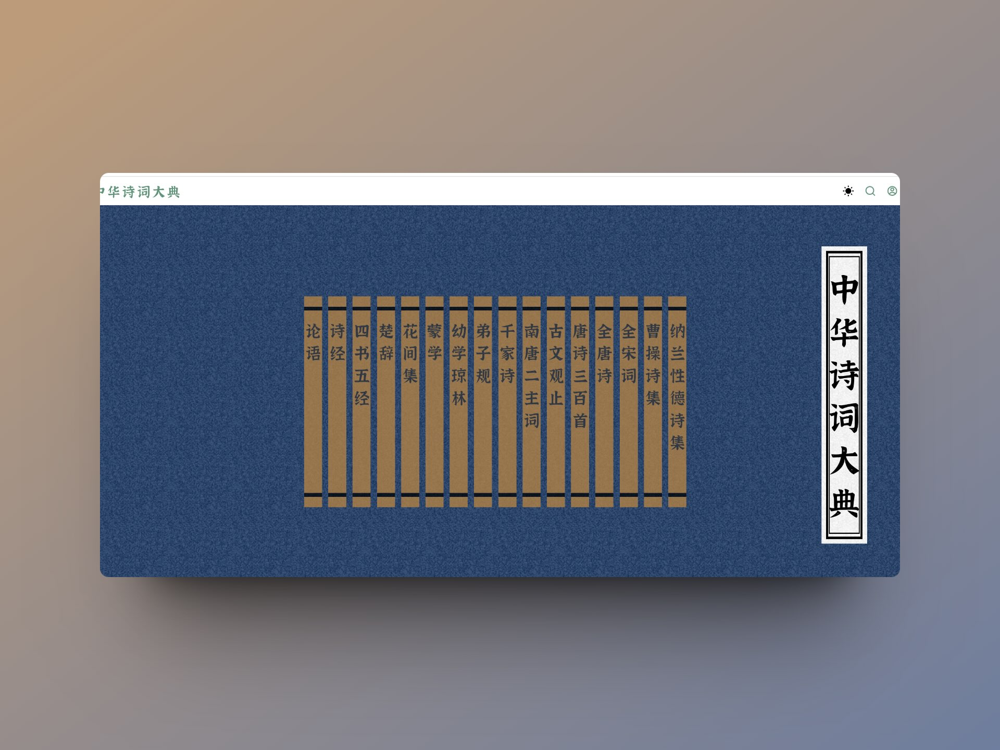

## 封面图 : 拍摄于杭州河坊街上的朱炳仁铜雕艺术博物馆（江南铜屋）前

> 今天 2 月 4 日，是立春。

## 效率工具

### 1. [中华诗词大典](https://chinese-poetry.netlify.app/)

网站做得简洁漂亮，支持搜索，而且作者把[网站开源](https://github.com/KonghaYao/classic-poetry)了，致敬 🫡

内容也比较全，从论语、诗经、楚辞 到 全唐诗、全宋词。

BTW, 其数据来源于[中华古诗词数据库 chinese-poetry/chinese-poetry](https://github.com/chinese-poetry/chinese-poetry)

### 2. AI 绘画 Prompt 的生成工具: 魔导绪论

[魔导绪论](https://magic-tag.netlify.app/)是一个 AI 绘画 Prompt（魔咒，也是文生图输入的文本） 生成工具！

作者还贴心的提供了教程：[魔导绪论教程](https://magic-tag.notion.site/magic-tag/ee1a0ab136724eb183a29d1fcc56a3d2)

魔导绪论的理念:

- Keep It Simple, Stupid! 保持简单！
- Coding Magic Prompts! 像写代码一样写魔咒！
- Imagination Fly with You! 让想象力和你一起飞！

### 3. 霞鹜文楷轻便版（Lite 版）

为便于开发者将字体嵌入软件中，[霞鹜文楷](https://github.com/lxgw/LxgwWenKai)提供了[精简版（Lite 版）](https://github.com/lxgw/LxgwWenKai-Lite)。

与霞鹜文楷完整版相比，精简版剔除完整版增补的一些较不常用的汉字及谚文字符，适合嵌入于 APP 中。

如果在网站中使用，可以用这个 webfont 版本，里面提供了 [CDN 的方案](https://github.com/chawyehsu/lxgw-wenkai-webfont?tab=readme-ov-file#use-cdn)。

可以在[这里在线测试](https://chawyehsu.github.io/lxgw-wenkai-webfont/)效果。

### 4. 字体： LXGW Neo XiHei / 霞鹜新晰黑

[霞鹜新晰黑](https://github.com/lxgw/LxgwNeoXiHei?tab=readme-ov-file)是一款基于 [IPAex 黑体](https://moji.or.jp/ipafont/) 的中文开源字体，是将日本写法的字体改造成中国大陆规范写法的尝试。

而且还是支持希腊语，俄语，越南语等多国语言。

## 技术知识

### 1. [书籍] LLMs-from-scratch: 从零开始实现大语言模型

[LLMs-from-scratch](https://www.manning.com/books/build-a-large-language-model-from-scratch) 教你如何从零开始制作一个类似于 ChatGPT 这样的大语言模型。

> Implementing a ChatGPT-like LLM from scratch, step by step

作者把书中的代码开源在了 GitHub 上：[LLMs-from-scratch](https://github.com/rasbt/LLMs-from-scratch)。

### 2. "给新人程序员的一些建议"

也当作技术知识放在这里吧，毕竟一开始有好的姿势，后面才能走得更远。😄

"[给新人程序员的一些建议](https://icodeit.org/2017/07/tips-for-newbies/)" 是从业 10 多年的老程序员给新人程序员的一些建议，值得一看。

[作者](https://twitter.com/JuntaoQiu)还出过一些书，比如 [Test-Driven Development with React](https://link.springer.com/book/10.1007/978-1-4842-6972-5), [可维护的 React](https://leanpub.com/maintainable-react-cn)

## 语言学习

### 1. 据说是中国程序员容易发音错误的单词集合 😄

- 网站: [chinese-programmer-wrong-pronunciation](https://cpwp.netlify.app/)
- GitHub: [chinese-programmer-wrong-pronunciation](https://github.com/shimohq/chinese-programmer-wrong-pronunciation?tab=readme-ov-file)

## 生活趣味

### 1. 人脑是个 LFU 的内存

曾经获得的知识，技能，经验，一旦用不上，很快就会忘，只剩下残存的印象。所以一定要持久化，需要的时候能快速找到曾经内化的东西。

> 来源于：[一个程序员的成长思考（持续更新）](https://juejin.cn/post/7098906738077728799)

[LFU（Least Frequently Used）](https://en.wikipedia.org/wiki/Least_frequently_used)是一种缓存淘汰算法。
顾名思义，LFU 算法的思想是：如果一个数据在最近一段时间很少被访问到，那么可以认为在将来它被访问的可能性也很小。 因此，当空间满时，最小频率访问的数据最先被淘汰。
