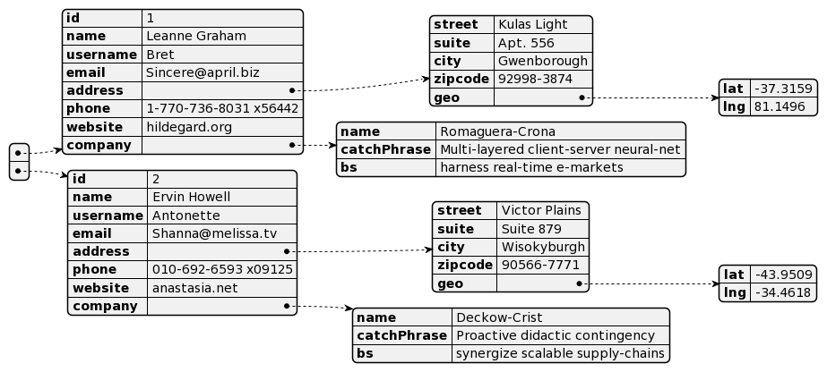
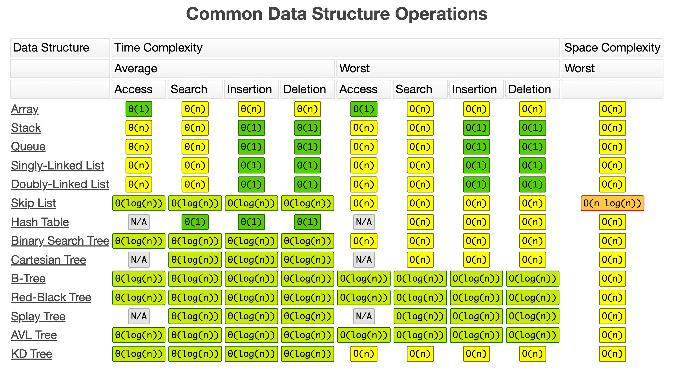

## 封面图 : 千岛湖美味米羹

疫情以来一直没能回老家过年，今年换了个公司，可以在国内远程工作，于是提早一个多月就回国了。

每年过年妈妈都会做米羹，还把锅巴给我留着 😄。


## 本周新闻

### 1. 苹果发布 Vision Pro，瞬间被抢光 😄

## 效率工具

### 1. PlantUML: 画图工具

[PlantUML](https://plantuml.com/zh/) 是一个开源项目，可以通过简单的文本描述画出流程图、时序图、类图等。

自从 [GitHub 支持 Mermaid](https://docs.github.com/ja/get-started/writing-on-github/working-with-advanced-formatting/creating-diagrams) 之后, 就转用 Mermaid 画图了。

但是 Mermaid 和 PlantUML 相比，有些功能还不是很完善。

比如 PlantUML 🈶️ 展示 `json` 数据的结构图的语法，而 Mermaid 则没有。




<details>
<summary>图中的JSON数据</summary>

> 数据来源于 [JSONPlaceholder](https://jsonplaceholder.typicode.com/users)

```json
[
  {
    "id": 1,
    "name": "Leanne Graham",
    "username": "Bret",
    "email": "Sincere@april.biz",
    "address": {
      "street": "Kulas Light",
      "suite": "Apt. 556",
      "city": "Gwenborough",
      "zipcode": "92998-3874",
      "geo": {
        "lat": "-37.3159",
        "lng": "81.1496"
      }
    },
    "phone": "1-770-736-8031 x56442",
    "website": "hildegard.org",
    "company": {
      "name": "Romaguera-Crona",
      "catchPhrase": "Multi-layered client-server neural-net",
      "bs": "harness real-time e-markets"
    }
  },
  {
    "id": 2,
    "name": "Ervin Howell",
    "username": "Antonette",
    "email": "Shanna@melissa.tv",
    "address": {
      "street": "Victor Plains",
      "suite": "Suite 879",
      "city": "Wisokyburgh",
      "zipcode": "90566-7771",
      "geo": {
        "lat": "-43.9509",
        "lng": "-34.4618"
      }
    },
    "phone": "010-692-6593 x09125",
    "website": "anastasia.net",
    "company": {
      "name": "Deckow-Crist",
      "catchPhrase": "Proactive didactic contingency",
      "bs": "synergize scalable supply-chains"
    }
  }
]
```

</details>

### 2. MacBook Dock 栏的赛博烟花 🎇

新年快乐! 有位网友制作了一个播放烟花的小工具，效果不错。

远在他乡不能回家过年放烟花的朋友，就在电脑上[放个烟花](https://github.com/Lakr233/Firework)吧。😄


## 技术知识

### 1. [Golang] 字节开源的 mock 利器 mockey

[mockey](https://github.com/bytedance/mockey) 是字节开源的一款简单易用的 Golang 打桩工具库，

能够快速方便地进行函数、变量的 mock，目前在字节跳动各业务的单元测试编写中应用较为广泛，其底层是通过运行时改写函数指令实现的猴子补丁（Monkey Patch）。

使用方法可以参考这篇文章 [解析 Golang 测试（12）- 字节开源的 mock 利器 mockey](https://juejin.cn/post/7159568574699274248)

### 2. 常用数据结构和算法的时间复杂度

[这个网站](https://www.bigocheatsheet.com/) 收集了常用数据结构的各种操作的时间复杂度。



### 3. Next.js + TypeScript + Tailwind CSS 的开发环境

[这篇文章（日文）](https://zenn.dev/yoshinoki/articles/next-ts-tailwind-setting) 详细介绍了如何搭建 Next.js + TypeScript + Tailwind CSS 的开发环境。

## 生活趣味

### 1. MuscleWiki - 肌肉锻炼网站

[这个网站](https://musclewiki.com/) 是一个肌肉锻炼网站，可以很清楚看到你想锻炼的地方应该怎样来练习。


### 2. 元素周期表 Pro

[这个网站](https://periodic-table.pro/zh)，通过可视化的方式来展示元素周期表, 高颜值，推荐给有小孩的爸爸妈妈吧 😄。


