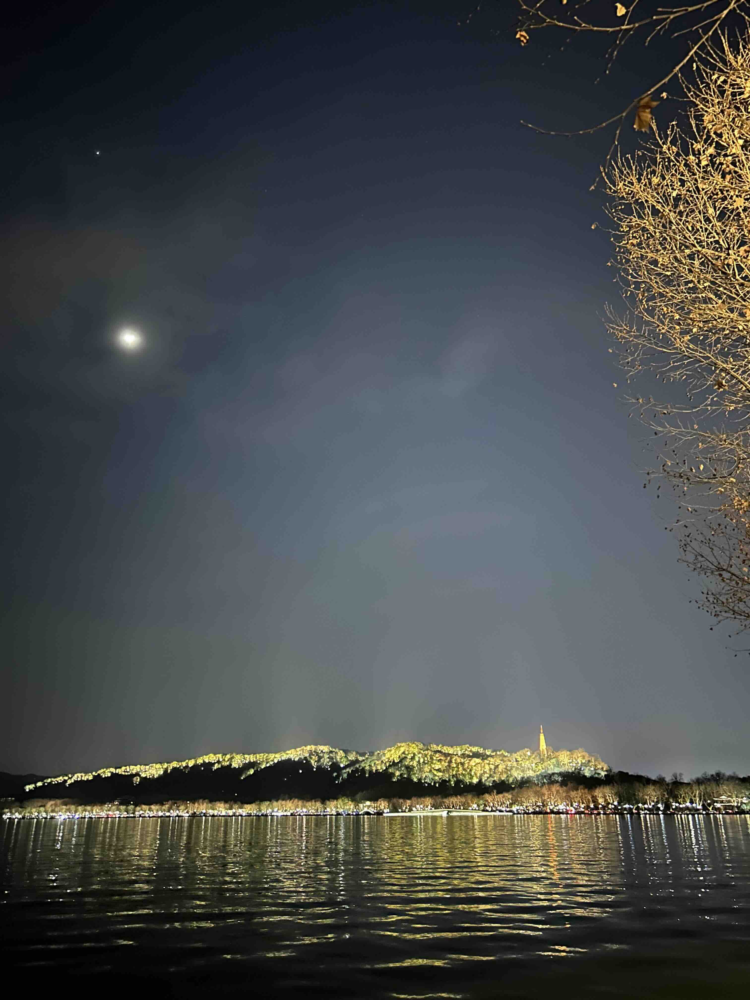
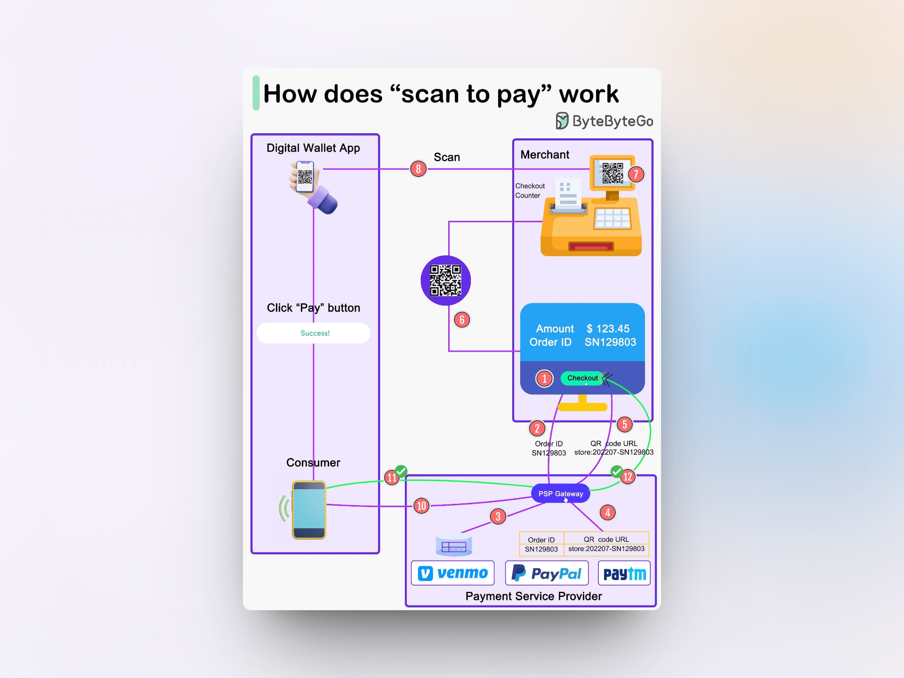

## 封面图 : 拍摄于西湖边

## 本周新闻

### 1. NVIDIA 市值已超过亚马逊和谷歌

截至 2024 年 2 月 12 日，全球市值排行如下：

1. 微软 (Microsoft)：`$3.115` 万亿
2. 苹果 (Apple)：`$2.904` 万亿
3. 沙特阿美 (Saudi Aramco)：`$2.034` 万亿
4. NVIDIA：`$1.831` 万亿
5. Alphabet (谷歌的母公司)：`$1.820` 万亿
6. 亚马逊 (Amazon)：`$1.803` 万亿
7. Meta (Facebook 的母公司)：`$1.217` 万亿

## 效率工具

### 1. 网站配色预览工具： Realtime Colors

[Realtime Colors](https://www.realtimecolors.com/dashboard?colors=050315-fbfbfe-2f27ce-dedcff-433bff&fonts=Poppins-Poppins) 是一个网站配色预览工具，可以实时预览网站的配色方案。

## 技术知识

### 1. 扫码支付的原理

> Reference: [How does scan to pay work?](https://twitter.com/alexxubyte/status/1757068554145575301)

## 语言学习

### 1. [日语] 筍生活【たけのこせいかつ】

筍生活【たけのこせいかつ】是日本的俚语，意思是「剥筍生活」。

指的是像剥筍皮一样，一点一点地卖掉周围的衣物、家具等，勉强维持生活的状态。

中文里面好像没有类似的词语。家徒四壁？ 😸

> たけのこの皮を一枚ずつ剥ぐように、身の回りの衣類・家財などを少しずつ売って食いつないでいく生活。

### 2. 月夜の蟹 🦀【つきよのかに】

月夜の蟹【つきよのかに】是日本的俚语，「月夜的螃蟹」。

指的是没有肉的螃蟹，也就是没有实际内容的东西。

来源于螃蟹怕月光 🌔 不敢吃东西，所以就没有肉。（不知真假 😄）

> 《月夜には蟹は月光を恐れて餌  (えさ)  をあさらないので肉がつかないといわれるところから》

## 生活趣味

### 1. [X (Twitter)] 编辑你的感兴趣的标签 🏷

可以[在这里](https://twitter.com/settings/your_twitter_data/twitter_interests)编辑你感兴趣的标签，X 会根据你的选择推送相关的内容。

这样可以让你的时间线更加符合你的兴趣。

### 2. 让自己进步的方法：不断暴露自己的缺点

“个人风格，更可能来自于你的缺点。而不是优点。别藏，藏不住。你什么短，你就露什么，最后你藏不住的那玩意儿，就形成风格了。” by 李诞

### 3. 为人之道

开始让人舒服的，或许是言语，但后来让人舒服的一定是人品，生活不全是利益，更多的是相互成就，彼此温暖。 by 杨绛

### 4. 飞机相亲位

飞机上座位对着空姐，也叫飞机相亲位。

选坐这些位置，
波音 737、738 机型，选 39L 座位，
空客 330、331、332 机型，选 61L 座
如果不是上面的机型，试一下选 47B、47C、47J、47K、48A、48L

这些座位靠着应急出口，对面就是空姐的休息区。

> Reference: [飞机相亲位](https://twitter.com/swyxy4484/status/1756554700462215475)
