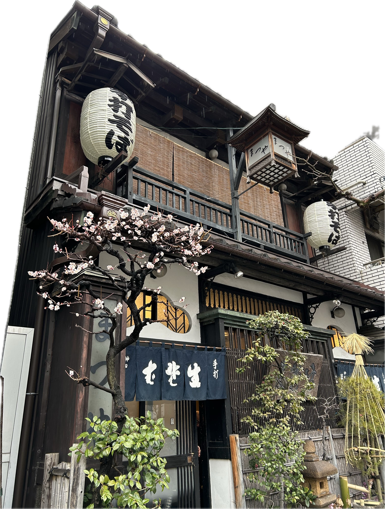
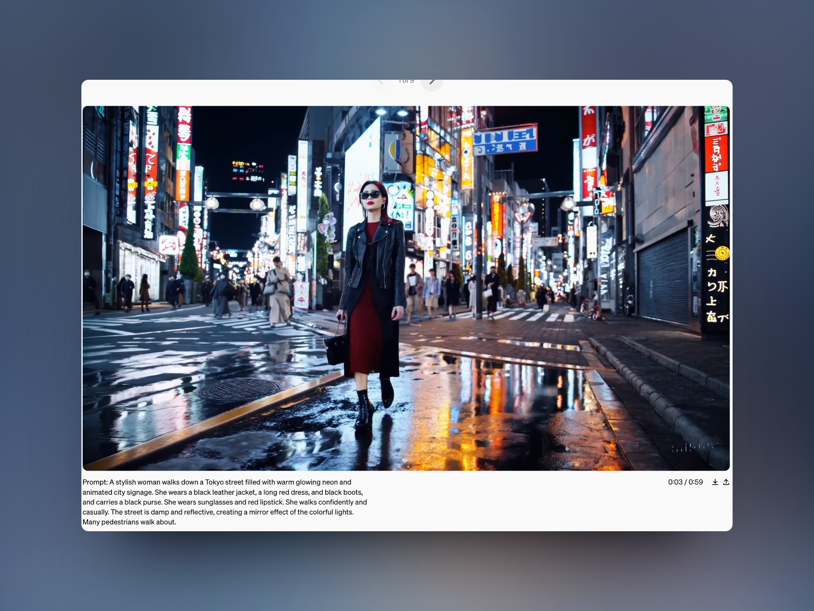
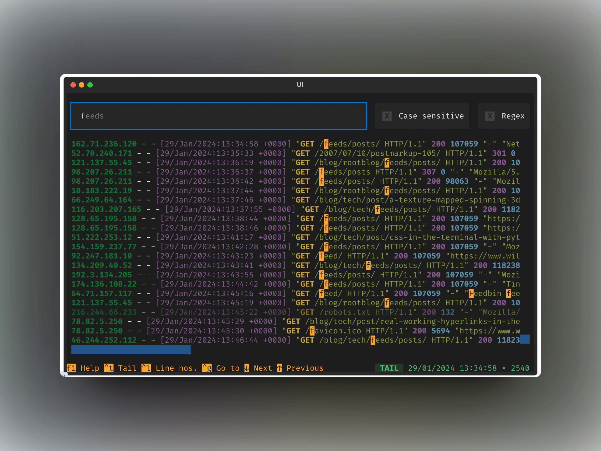
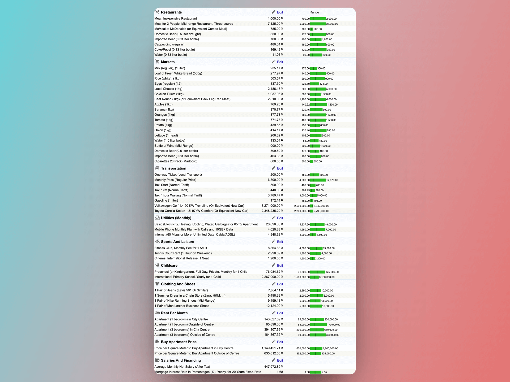

## 封面图 : 东京神田的一家传统和食餐馆前的桃花？



## 本周新闻

### 1. OpenAI 发布了视频生成 AI 模型 Sora

[Sora](https://openai.com/sora) 可以根据文本描述生成视频。

生成的视频效果非常逼真和连贯，而且视频时长可以达到 1 分钟。



BTW，Sora 的发音和日文中的「空」的发音相同，不知道是不是取名自此。

就是苍井空老师的那个`空` 😄， 我在 X 上搜索 Sora，X 就向我推荐了苍老师 [蒼井そら(SOLA AOI) @aoi_sola](https://twitter.com/aoi_sola)

截图为证 😅：


### 2. Google 发布了 AI 对话模型 Gemini 1.5

[Google 发布了 AI 对话模型 Gemini 1.5](https://japan.googleblog.com/2024/02/gemini-15.html) 。

Gemini 1.5 支持高达 100 万 token 的上下文。（Google 称在测试环境中尝试了 1000 万 token 的方案）

不过，由于 OpenAI [Sora](https://openai.com/sora) 的发布，Gemini 1.5 的消息并没有引起太多关注。:sweat_smile:

## 效率工具

### 1. [Toolong](https://github.com/Textualize/toolong): 用于查看、跟踪、合并和搜索日志文件（以及 JSONL）的终端应用程序

Toolong 可以通过自动检测时间戳合并日志文件，并且支持自动打开 .bz 和 .bz2 文件进行高亮显示。

它出自于 [Textualize.io](https://github.com/Textualize), Textual (一个用于 Python 的快速应用程序开发框架) 的开发组织。



## 技术知识

### 1. [2024 年 React 趋势](https://sorrycc.com/react-trend-2024/)

[React Trends in 2024](https://www.robinwieruch.de/react-trends/) 的中文翻译版，对 2024 年 React 的趋势进行了总结。

内容包括：

```text
1、astro + astro starlight 用于文档
2、supabase、clerk、lucia 用于身份验证
3、tRPC + Prisma 用于全栈应用
4、RSC 只有 Next.js 和 Waku，性能上有优势但不多
5、TanStack Router 是类型安全的路由库
6、打包工具看 TurboPack 和 Vite
7、React Compiler 让我们告别 memo、useCallback 和 useMemo
8、Biome 和 oxc 值得期待
9、shadcn/UI 流行
10、StyleX 编译时 CSS-in-JS 方案，解 SSR 性能问题
```

### 2. Sora 学习手册

有网友制作了 [Sora 学习手册](https://yunyinghui.feishu.cn/wiki/BaCEwe3AliqYERkc9dVcfW0BnXg)，真是及时（肝）啊。:bow: :saluting_face:

### 3. JPEG 凭什么称霸互联网 30 多年？

柴知道出品的 [JPEG 凭什么称霸互联网 30 多年？](https://www.youtube.com/watch?v=NpbhFTmUvts) 视频清晰易懂地解释了 JPEG（jpg） 的原理和优势。

## 语言学习

### 1. 有趣的伪中国语

推特上看到的有趣的伪中国语 😄：

单词都是日文，但是语法和词序是中文。可能是中国人日本人都能看懂的一种语言。:sweat_smile:

> 我到着中国,常時満腹,我腹爆発。
> 中国人全員親切,中国良国。 #偽中国語
> Reference: [Twitter](https://twitter.com/mkmk4577/status/1758789215612195215)

## 生活趣味

### 1. 东京的生活成本 Cost of Living in Tokyo

这个网站统计了[包括东京](https://www.numbeo.com/cost-of-living/in/Tokyo)在内的一些主要城市的日常生活成本。


