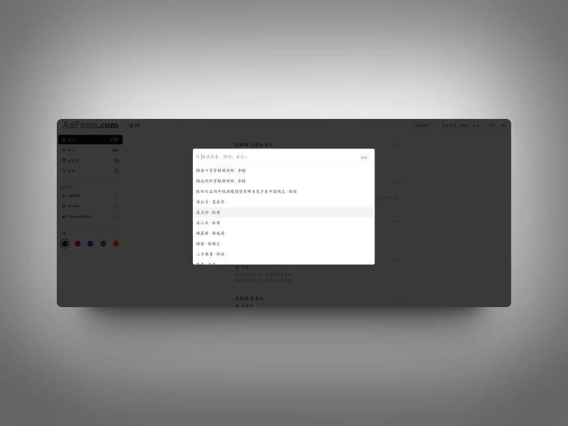

## 封面图 : 桃花@东京

## 效率工具

### 1. AsPoem: 现代化中国诗词学习网站

[AsPoem](https://aspoem.com/) 是一个诗词网站，网站的设计很简洁，可以让人专注于诗词的阅读。 #诗词

支持作者，诗词，名句的搜索，并且为诗词添加了标签 🏷，比如你可以通过“雪 ⛄” 标签来搜索相关的诗词。

而且作者还把网站给开源了，可以在 [GitHub](https://github.com/meetqy/aspoem) 上找到源码。

### 2. 财报日历订阅生成器

财报日历订阅生成器是一个用于生成财报日历订阅链接的工具。

目前只支持美国市场的当前前后 30 天的财报日历。

作者[开源了代码](https://github.com/jason5ng32/OhEarningsCal)，有兴趣的可以自己魔改下 😄

### 3. OpenAI 的音乐生成模型：Jukebox

OpenAI 在 2019 年 8 月份就推出了他们的一音乐生成模型：Jukebox。

他们把生成的音乐放在了 [SoundCloud](https://soundcloud.com/openai_audio) 上，可以听听看, 至少对于我这种音乐素人看来质量很不错。

而且据说 Jukebox 2 也快发布了，到时候和视频生成模型的 [Sora](https://openai.com/sora) 一结合，不是天下无敌了哈 😄。

## 技术知识

### 1. [书籍] 版面设计的原理

《[版面设计的原理](https://book.douban.com/subject/6718283/)》从建立条理、添加变化、强调重点、设计技巧和设计中的色彩几个方面将自己实际操作经验与心得全部记录下来。以系统化的内容向读者说明自己所建立的“设计原理”的基本原则，为设计入门奠定了扎实的基础。

书中没有太多不实用的理论.而是提供具体可遵循的原理和实际案例，让设计新手的设计质量大幅提升：同时也提醒对设计心怀憧憬的人们：任何设计都不是随意完成的，而是存在着既定的原理只有掌握了这些原理，才能够做出好的设计作品。

前端和设计的朋友可以看看这本书，对于版面设计有很多启发。

### 2. 李笑来的新书《一千小时》

李笑来的新书《[一千小时](https://1000h.org/)》，直接引用下书中的一段话：

> 用你的注意力填满一千小时就能练成任何你所需要的技能……
> 所谓努力无非就是短时间内足量重复。 — 李笑来

网站也做得简洁漂亮，值得一看。

## 语言学习

### 1. [日语] ダニングクルーガー効果【Dunning-Kruger effect】

ダニングクルーガー効果【Dunning-Kruger effect】是指认知心理学中的一种现象，指的是能力低下者对自己的能力反而评价过高的现象。

> 〔心〕未熟あるいは能力の低い個人が、自らの容姿や発言・行動などを実際よりも高く評価してしまう認知バイアス。
> 自己の愚かしさを認識するメタ認知（公正かつ冷静な振り返り）ができないことによって生じる。

> [Reference](https://twitter.com/BotHakase/status/1763746075305980289)
> Wikipedia: [ダニング・クルーガー効果](https://ja.wikipedia.org/wiki/ダニング＝クルーガー効果)

## 生活趣味

### 1. 日本爱知先的桃源乡： 川売 梅の里

<iframe width="560" height="315" src="https://www.youtube.com/embed/kKc5OIq0tjU?si=fDKQfX45M49JAnVX" title="YouTube video player" frameborder="0" allow="accelerometer; autoplay; clipboard-write; encrypted-media; gyroscope; picture-in-picture; web-share" allowfullscreen></iframe>
