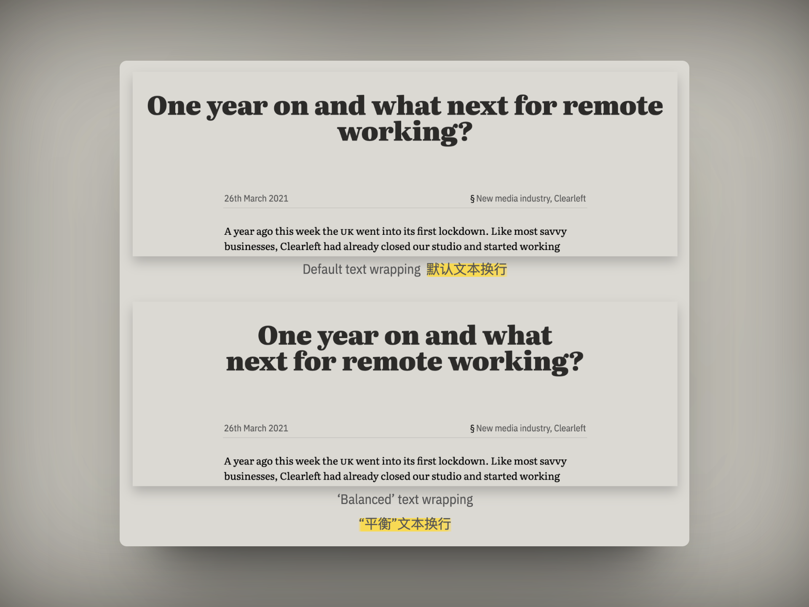

## 封面图 : 拍摄于东京神保町的一家咖啡店


> 小知识： 巴西的日文汉字是「[伯剌西爾](https://ja.wikipedia.org/wiki/%E3%83%96%E3%83%A9%E3%82%B8%E3%83%AB#:~:text=%E6%97%A5%E6%9C%AC%E8%AA%9E%E3%81%AE%E8%A1%A8%E8%A8%98,%E8%A1%A8%E8%A8%98%E3%81%95%E3%82%8C%E3%82%8B%E3%80%82)」简称「伯国」，不过现在日常生活中一般用假名「[ブラジル](https://ja.wikipedia.org/wiki/ブラジル)」显示。
> 这家咖啡店应该有点历史了 😄

## 本周新闻

### 1. 马斯克起诉 OpenAI，称其违背开源承诺，并在 X 上讽刺 OpenAI 应该改名为 ClosedAI 😄


### 2. 鸟山明先生去世

2024 年 3 月 1 日，鸟山明（wiki：[鳥山明](https://ja.wikipedia.org/wiki/鳥山明)）先生去世，享年 68 岁。

鸟山明是日本著名的漫画家，代表作品有《七龙珠》、《Dr. Slump》等。

有心的中国网友制作了一个视频，以表达对鸟山明先生的怀念之情。
视频中是鸟山明先生作品中的一些角色对他的告别。

井上雄彦先生也在推特上[发表了对鸟山明先生的追悼之情](https://twitter.com/inouetake/status/1765964394373234841)。


> Reference: [Twitter(X)](https://twitter.com/shi_shang_/status/1766259798969082030)

## 效率工具

### 1. 开源的云相册软件, 替代 Google Photos and Apple Photos

[Ente](https://github.com/ente-io/ente), 一个开源的云相册软件，可以替代 Google Photos 和 Apple Photos。
支持端到端加密，可以在自己的服务器上部署。


### 2. 字节和北大一起做的这个古籍网站「识典古籍」

[识典古籍](https://www.shidianguji.com/)，是字节和北大一起做的这个古籍网站，里面有很多古籍书籍，可以在线阅读。


### 3. 买票神器 12306spy

从 12306 购票, 从 A 点到 B 点没有票, 但是可以补票或者多买一段票.

比如一列车有 100 站, 我上车的站点是 50 , 终点站是 80. 需要保证我能上车,可以这样操作 :

- 补票类型 : 可以买 50-70 的票, 然后再补 70-80 的票
- 多买一段票 : 买 20-80 的票, 或者 20-90, 这样多买了一段票, 但是保证了我能上车.
- 多买且补票 : 买 20-70 的票, 然后再补 70-80 的票

[12306spy 这个开源项目](https://github.com/elroy93/12306spy)，你只需要输入你的出发站和终点站，然后它会自动帮你查询 **你可以上车的票**。


但是需要自己 docker 部署，有点 IT 基础知识的人可以尝试一下。

### 4. 制作地图移动轨迹的工具 travelboast

[travelboast 这个工具](https://travelboast.com/) 可以制作地图移动轨迹，可以用来记录自己的旅行轨迹。

我觉得谷歌地图可以内置这个功能，然后支持发布到 YouTube 或者朋友圈，或者会很有意思。

## 技术知识

### 1. [CSS] 标题排版新属性： `text-wrap:balance`

目前在 chrome canary 中已经支持了这个属性， 来实现标题的平衡排版。



```text
h1, h2, h3, h4, h5, h6, caption, figcaption {
    text-wrap:balance;
}
```

> Reference: [An end to typographic widows on the web](https://clagnut.com/blog/2424)

### 2. How to test for Safari on Windows (在 Windows 上测试 Safari)

[这篇文章](https://james.darpinian.com/blog/safari-on-windows)介绍了如何在 Windows 上测试 Safari 浏览器。

## 语言学习

### 1. [日文] 天泣【てんきゅう】

没有云却下雨。

> 雲がないのに降る雨。
