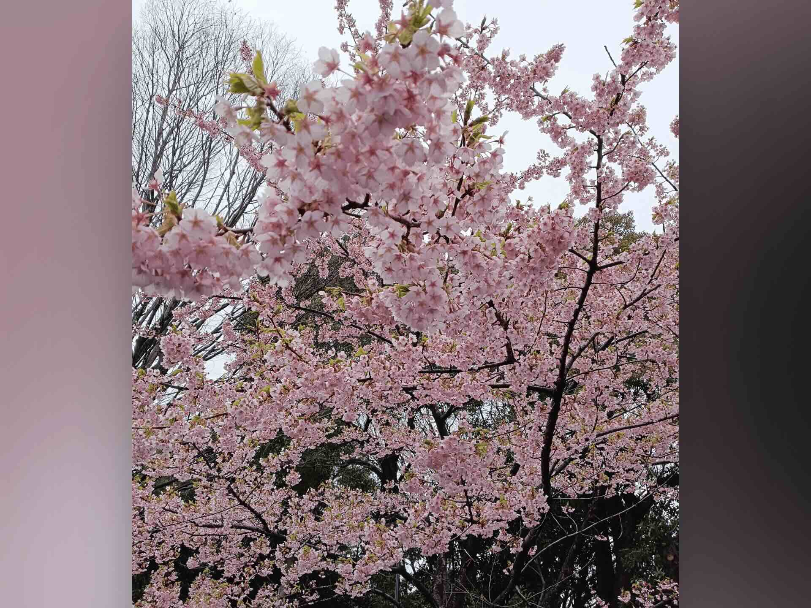
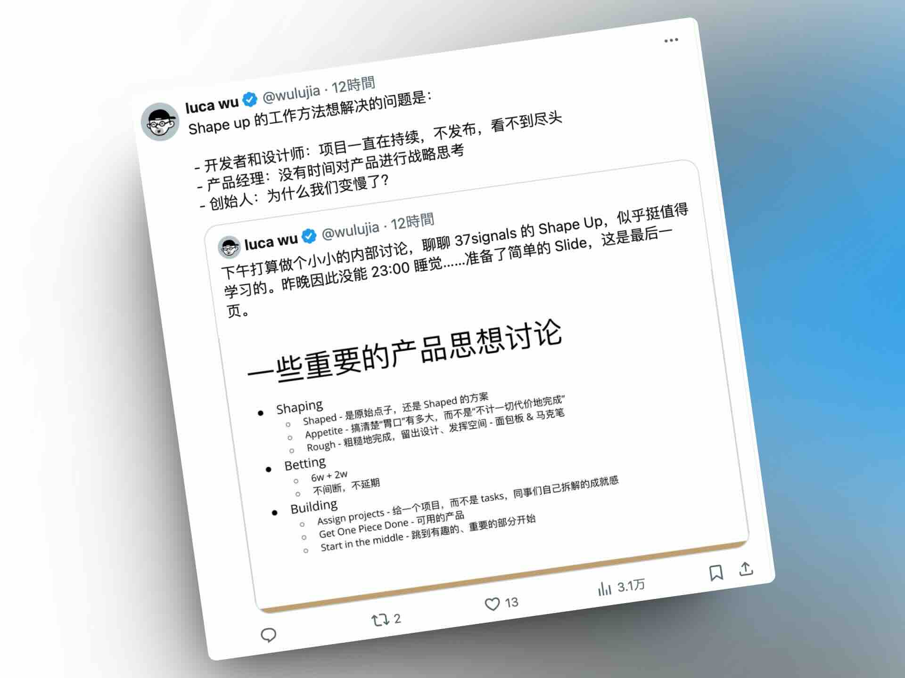

## 封面图 : 九段下的【寒樱】🌸

九段下的几棵寒樱已经快开始掉了，其他的染井吉野还是花蕾状态。

## 效率工具

### 1. AI 抠图工具：[remove.bg](https://removebg.one/)

这类的免费工具已经很多，但是 remove.bg 的效果很不错，而且没有广告 😄。

### 2. 强大且免费的文件分析工具：[SpaceSniffer](http://www.uderzo.it/main_products/space_sniffer/)

出品自最近在中国 AI 界很火的 [月之暗面（moonshot）](https://www.moonshot.cn/)。

BTW, 这里有一期关于月之暗面的创始人[杨植麟](https://kimiyoung.github.io/)的 podcast 访谈：

[和杨植麟聊大模型创业这一年：人类理想的增量，有概率的非共识和 Sora](https://www.xiaoyuzhoufm.com/episode/65e16b5b6144a933b1d968b5)

### 3. 一个免费的 AI 音乐生成工具： [Riffusion](https://www.riffusion.com/)

输入歌词，它会生成相应的带人声的歌曲，效果还不错。目前好像只支持英文。

## 技术知识

### 1. NVIDIA 的 CUDA 编程简单介绍视频

视频通俗易懂地介绍了 GPU 和 CPU 的区别，以及 CUDA 编程的基本概念。

[来自于 X @lxfater](https://twitter.com/lxfater/status/1768267426234560765)

### 2. [日文] 日本自然语言处理协会的年大会资料

原来日本自然语言处理协会的年大会资料都是公开的，有兴趣的可以看看。

2024 年的资料： [言語処理学会第 30 回年次大会(NLP2024)](https://www.anlp.jp/proceedings/annual_meeting/2024/index.html)

### 3. 一本推荐给 PM 和 Leader 的书： 来自于 37signals 的 【Shape Up】

这本书是免费的，你可以[在线读](https://basecamp.com/shapeup)。

### 4. python 书籍推荐： Python 工匠

[《Python 工匠》](https://github.com/piglei/one-python-craftsman) 来自一位 Pythonista 的编程经验分享，内容涵盖编码技巧、最佳实践与思维模式等方面。

作者把这本书开源在了 GitHub 上，你可以直接阅读。

## 语言学习

### 1. [English] 一个英语学习的网站：[Earthworm](https://earthworm.cuixueshe.com/)

一个开源（[@Github](https://github.com/cuixueshe/earthworm) 的网页英语学习工具，通过连词造句的方式，经过不断重复练习英语。

循序渐进，适合英语初学者。

## 生活趣味

### 1. 在互联网时代：怎么创建自己的频道

> 来自于 [@levidingX](https://twitter.com/levidingX/status/1768431960328945835)

### 2. [投资] 查看期货,外汇的看盘网站：[TradingHero](https://www.tradinghero.com/)

金十数据官方出品, 界面几乎和 TradingView 一样。😄

### 3. 广为人知的乔布斯的照片的背后的故事

> Reference: [The story behind the image of Steve Jobs](https://profoto.com/int/profoto-stories/albert-watson-steve-jobs)
